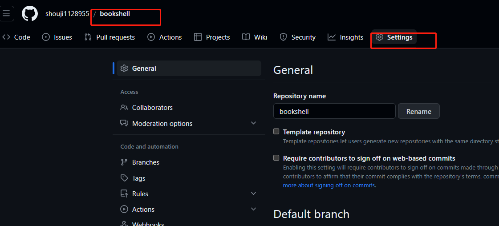
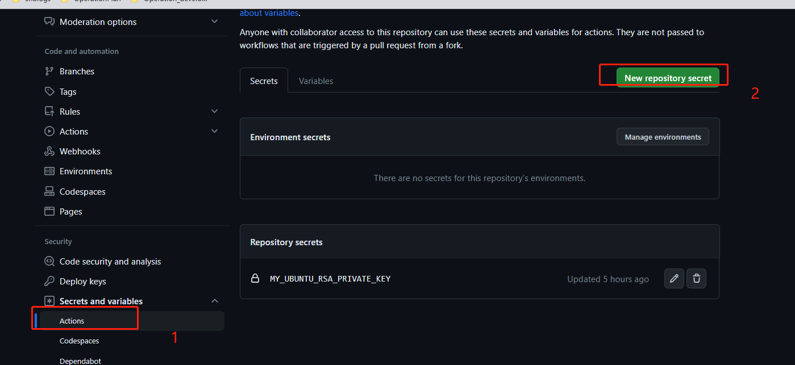
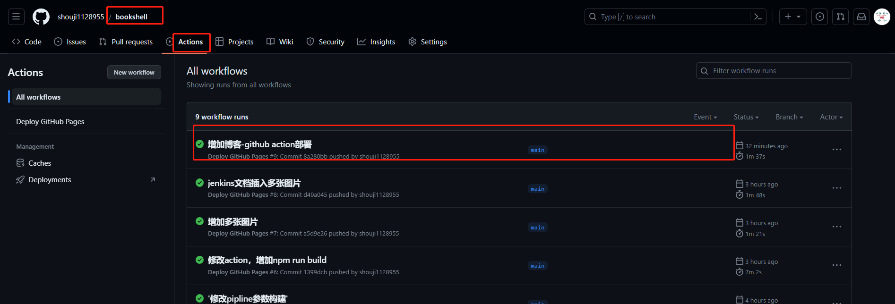

<!--truncate-->

##  概述

  笔者之前一直在使用wordpress记录自己工作中的点点滴滴，分享自己的所感所触，但是随着日积月累，发现效率很低，对于管理自己的笔记非常不方便。因为我们有时候都是多种场景，比如，我们工作使用markdown来写作，但是写完之后需要同步到wordpress,这个需要花费很多的时间。特此，笔者通过网友介绍发现facebook旗下的docusaurus非常不错。因为它可以实现通过markdown来写作，然后一键push到github进行项目保存，然后通过github的action来实现一键部署到多种场景,如下图。
 


当然，也可以部署到自己的服务器。
由于笔者自己测试后，如果部署到github中的page中，由于网络原因，访问速度很慢，尤其加载图片，如果自己买了云服务器，当然可以部署到自己的云服务器中，接下来，我就是使用这种方式来部署自己docusaurus。


:::tip

Some **云服务器购买方式--->  推荐购买阿里云，腾讯云的轻量级服务器，费用比较低。** 

:::


## 1、创建action

下面跟着我一步一步操作如何实现部署，废话不多说，直接上菜。

首先在仓库的根目录下，创建 .github/workflows/main.yml 文件，这就是 GitHub Actions 功能的配置文件，用于告诉 GitHub 要做哪些事情，写入以下内容

### 1.1 创建action文件


```shell
.github/workflows/main.yml

name: Deploy GitHub Pages

# 触发条件：在 push 到 master 分支后
on:
  push:
    branches:
      - main

# 任务
jobs:
  build-and-deploy:
    # 服务器环境：最新版 Ubuntu
    runs-on: ubuntu-latest
    steps:

      # 1、拉取代码
      - name: Checkout
        uses: actions/checkout@v2
        with:
          persist-credentials: false

      # 2、生成静态文件
      - name: Build
        run: |
          npm install
          npm run build
                    
      # 执行 ls -l 命令
      - name: List files
        run: ls -l  && pwd

      # 3、部署到 somenzz.cn 服务器
      - name: rsync deployments
        uses: burnett01/rsync-deployments@4.1
        with:
          # 这里是 rsync 的参数 switches: -avzh --delete --exclude="" --include="" --filter=""
          switches: -avzh  --delete
          path: ./build/
          remote_path: /apps/liteshell/
          remote_host: xxx.abc.com
          remote_port: xxxx
          remote_user: root
          remote_key: ${{ secrets.MY_UBUNTU_RSA_PRIVATE_KEY }}
```

### 1.2 创建secret私钥文件

创建私钥文件

输入 ssh-keygen 只有一路回车
```shell
[root@110 ~]# ssh-keygen 
Generating public/private rsa key pair.
Enter file in which to save the key (/root/.ssh/id_rsa): 
/root/.ssh/id_rsa already exists.
Overwrite (y/n)? y
Enter passphrase (empty for no passphrase): 
Enter same passphrase again: 
Your identification has been saved in /root/.ssh/id_rsa.
Your public key has been saved in /root/.ssh/id_rsa.pub.
The key fingerprint is:
SHA256:ldbpGCcTXoR3ETFCIGM15FFRzpFmkXTOECtgg0VOtgg root@110
The key's randomart image is:
+---[RSA 2048]----+
|      E +*/*B+%O.|
|       o.@.@.=*O |
|        . %.=++ o|
|         o B .   |
|        S . .    |
|                 |
|                 |
|                 |
|                 |
+----[SHA256]-----+
[root@110 ~]# 

```
:::danger

Some **公钥和私钥必须成对，必须保存好公钥和私钥，公钥是需要放到云服务器中，私钥是需要放在github的secret中，否则会出现登录不了的情况**

:::

然后取出公钥

```shell
[root@110 ~]# cat /root/.ssh/id_rsa.pub  
ssh-rsa AAAAB3NzaC1yc2EAAAADAQABAAABAQC2/QQTQyV0YFwbs9wTwJE9S6telGKtL9eTJVPluDQX4vEZq7u72xGLtrmug1Ax9Nxe53tOvIT8y5c5CNydBQssmrSIg57gy8L0Bnk1+J78wGKAawz0xz6ifTGET3XkAlvCesxBs/WkpVuQXcploG3jXwZJdKct7Nz8Y28Rbx0Re+Lgd+zEbqLiWUijdsjFab8mUg9k+5o2QTBU8YZQKyEwQ2etzjuE6mlh+EXepSbendVV4mNFqV/6Iuyy8ppyHkq/6MkPwewRLxm1h0w410YWWYrNJui2disx060PRYYmSAvM3sgfotgZg0wXHtART+v/VB/rmvMQW7qT/ShrEyF7 root@110
```


### 1.3实现对公钥上传到云服务器


对于拿出来的公钥实现在服务器授权(需要部署的云服务器)

1. 登录云服务器，创建如下文件

```shell
touch /root/.ssh/authorized_keys

然后把上面的公钥放入到下/root/.ssh/authorized_keys文件中，保存即可
```

2. 方式2 
```shell
ssh-copy-id -i -P xxxx root@xxx.xx.xx.xx
```


## 2、github配置私钥

### 2.1、创建ssh私钥环境变量
MY_UBUNTU_RSA_PRIVATE_KEY： SSH私钥文件内容

```shell
          path: ./build/
          remote_path: /apps/liteshell/
          remote_host: xxx.abc.com
          remote_port: xxxx
          remote_user: root
          remote_key: ${{ secrets.MY_UBUNTU_RSA_PRIVATE_KEY }}
```

需要注意的是，MY_UBUNTU_RSA_PRIVATE_KEY是服务器的s私钥文件。那具体的创建方式如下




然后按照下面的方式进行修改即可





然后生成MY_UBUNTU_RSA_PRIVATE_KEY环境变量


##  3、实现部署

### 3.1、创建部署目录

登录云服务器创建静态站点
```shell
mkdir -p /apps/liteshell/
mkdir -p /var/log/liteshell/

docker run -it -d  -p 28080:80  \
--name zlq-nginx-liteshell  -m 400M --memory-reservation 200M  \
--cpus=0.8 -v /apps/liteshell/:/usr/share/nginx/html/ \
-v /var/log/liteshell/:/var/log/nginx/ \
--restart=always  nginx
```

### 3.2、提交代码

```shell
$ git add --all
$ git commit -m "add article"
$ git push
```
 然后push到仓库
 观察action变化

### 3.3、查看actiong构建过程



## 最后的话

GitHub 的 Actions 除了支持 push 触发，也支持 schedule 触发，这就可以玩出很多花样了，比如你可以在仓库中写一个脚本，然后编写 workflow 让 GitHub 每天定时执行，相当于免费获得了服务器的计算资源，可以参考阮一峰老师的文章GitHub Actions 教程：定时发送天气邮件 (opens new window), 对于没有服务器跑定时任务的人来说真的是一大福利。

本文讲述了如何编写 workflow，让 GitHub Actions 自动化部署静态博客，可以让程序员专心的写博客，无需处理重复的部署操作，提升写作效率。在这里抛砖引玉，供各位博客大佬参考使用，不写博客，也可以修改下，变成自己的部署工作流。最后，GitHub Actions 是一个 CI/CD（持续集成/持续部署）工具，值得每一个程序员学习使用。


如果要学习 GitHub Actions 来实现自己的部署流程，以下学习资源供你参考：

GitHub Actions 入门教程 http://www.ruanyifeng.com/blog/2019/09/getting-started-with-github-actions.html (opens new window)。

GitHub Actions 官方文档 https://docs.github.com/en/actions (opens new window)。

GitHub Actions 官方插件市场https://github.com/marketplace?type=actions (opens new window)。

awesome-actions https://github.com/sdras/awesome-actions (opens new window)。


网友博客参考: 
```shell
https://somenzz.gitee.io/auto-deploy-blog-by-github-actions.html#_2%E3%80%81secrets-gitee-rsa-private-key
```
蚂蚁大象博客
https://blog.ljbmxsm.com/docs/others/blog-building/