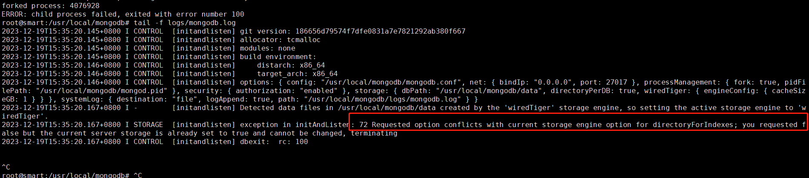
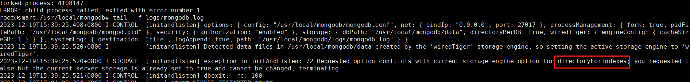
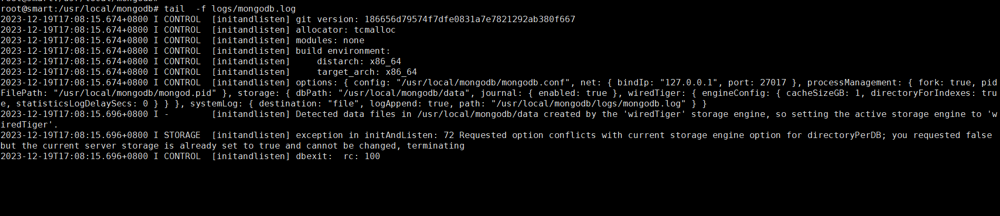
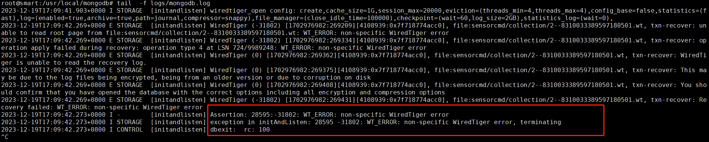
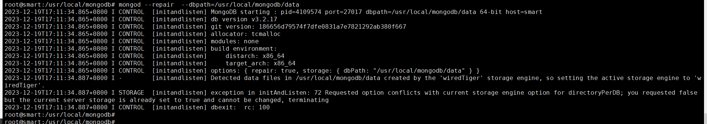
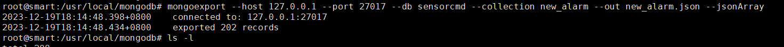
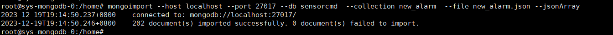
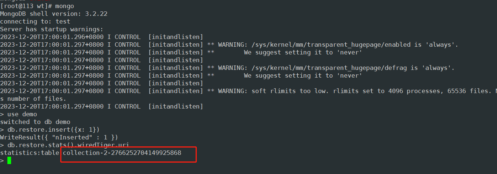
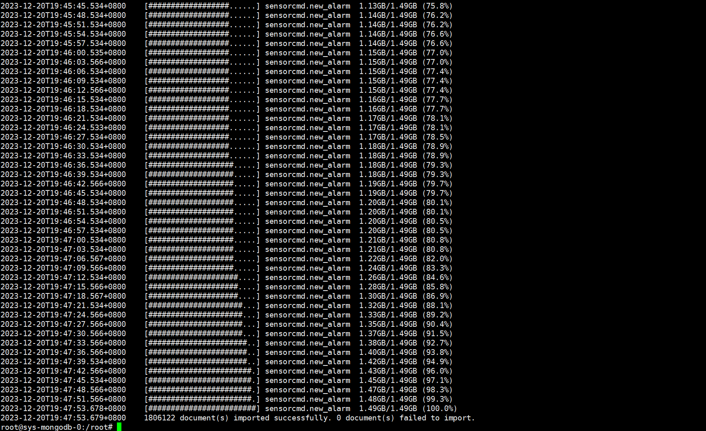

## 分析问题现状

mongo版本： 3.2.17

故障， 服务器宕机之后，重启mongdb会报错，因为是生产环境，所有的配置都是固定的，多次修改配置无效之后，决定将文件系统数据同步到测试环境实现验证




报错提示：  72 Requested option conflicts with current storage engine option for directoryForIndexes; you requested false but the current server storage is already set to true and cannot be changed, terminating 

原因：   使用directoryForIndexes`选项与您当前的数据布局冲突且无法更改：因为server启动的时候请求的为false,但是本地数据默认设置为true. 

因为是在容器中，生产环境我尽量保证数据不被损坏。然后下面导入到新环境


新的解决方案就是尝试修复数据，我们需要将生产的文件系统数据先备份然后导出


## 部署mongodb

### yum 方式

```shell
sudo tee /etc/yum.repos.d/mongodb-org-3.2.repo <<EOF
[mongodb-org-3.2]
name=MongoDB Repository
baseurl=https://repo.mongodb.org/yum/redhat/\$releasever/mongodb-org/3.2/x86_64/
gpgcheck=1
enabled=1
gpgkey=https://www.mongodb.org/static/pgp/server-3.2.asc
EOF
```

安装MongoDB：

```shell
sudo yum install -y mongodb-org
```


1. 上述命令将安装MongoDB包及其相关工具。
2. 启动MongoDB服务

```shell
sudo systemctl start mongod
```


### 二进制方式

官网下载地址：`https://www.mongodb.com/try/download/community`

```shell
wget https://fastdl.mongodb.org/linux/mongodb-linux-x86_64-3.2.17.tgz

tar xf mongodb-linux-x86_64-3.2.17.tgz
mv  mongodb-linux-x86_64-3.2.17 /usr/local/mongodb

```

创建数据与日志存放目录

```shell
mkdir  /usr/local/mongodb/data
mkdir /usr/local/mongodb/logs
```


```shell
echo 'export PATH=$PATH:/usr/local/mongodb/bin' >>/etc/profile
source  /etc/profile
#测试
root@smart:/usr/local/mongodb# mongo -version
MongoDB shell version: 3.2.17
root@smart:/usr/local/mongodb#
```


创建配置文件mongodb.conf

这里直接拷贝yum方式部署之后的文件

```shell
[root@clickhouse001 ~]# cat /etc/mongod.conf 
# mongod.conf

# for documentation of all options, see:
#   http://docs.mongodb.org/manual/reference/configuration-options/

# where to write logging data.
systemLog:
  destination: file
  logAppend: true
  path: /var/log/mongodb/mongod.log

# Where and how to store data.
storage:
  dbPath: /var/lib/mongo
  journal:
    enabled: true
#  engine:
#  mmapv1:
#  wiredTiger:

# how the process runs
processManagement:
  fork: true  # fork and run in background
  pidFilePath: /var/run/mongodb/mongod.pid  # location of pidfile

# network interfaces
net:
  port: 27017
  bindIp: 127.0.0.1  # Listen to local interface only, comment to listen on all interfaces.


#security:

#operationProfiling:

#replication:

#sharding:

## Enterprise-Only Options

#auditLog:

#snmp:

```


修改之后将文件放到 /usr/local/mongodb/mongodb.conf 

```shell
root@smart:/usr/local/mongodb# cat /usr/local/mongodb/mongodb.conf 
# for documentation of all options, see:
#   http://docs.mongodb.org/manual/reference/configuration-options/

# where to write logging data.
systemLog:
  destination: file
  logAppend: true
  path: /usr/local/mongodb/logs/mongodb.log

# Where and how to store data.
storage:
  dbPath: /usr/local/mongodb/data
 journal:
    enabled: true
#  engine:
#  mmapv1:
# how the process runs
processManagement:
  fork: true  # fork and run in background
  pidFilePath: /usr/local/mongodb/mongod.pid  # location of pidfile

# network interfaces
net:
  port: 27017
  bindIp: 0.0.0.0  # Listen to local interface only, comment to listen on all interfaces.
```


## 数据恢复

将生产环境的data文件系统数据拷贝到  /usr/local/mongodb/data/ 目录下（打包此处忽略）

```shell
tar xf ~/sys-mongodb-data-claim-20231119.tar.gz  -C  /usr/local/mongodb/data/
```

然后启动，观察日志

```shell
/usr/local/mongodb/bin/mongod -f /usr/local/mongodb/mongodb.conf  #启动服务
```




需要修改配置文件增加字段： directoryForIndexes: false ，因为曾经的数据是为true,现在应该是服务启动的时候默认为false .需要手动增加配置

修改后：  增加以下几个字段

  wiredTiger:
      engineConfig:
          cacheSizeGB: 1
          directoryForIndexes: true    
          statisticsLogDelaySecs: 0


```shell
root@smart:/usr/local/mongodb# cat /usr/local/mongodb/mongodb.conf 
# for documentation of all options, see:
#   http://docs.mongodb.org/manual/reference/configuration-options/

# where to write logging data.
systemLog:
  destination: file
  logAppend: true
  path: /usr/local/mongodb/logs/mongodb.log

# Where and how to store data.
storage:
  dbPath: /usr/local/mongodb/data
  journal:
    enabled: true
#  engine:
#  mmapv1:
  wiredTiger:
      engineConfig:
          cacheSizeGB: 1
          directoryForIndexes: true    
          statisticsLogDelaySecs: 0
# how the process runs
processManagement:
  fork: true  # fork and run in background
  pidFilePath: /usr/local/mongodb/mongod.pid  # location of pidfile

# network interfaces
net:
  port: 27017
  bindIp: 0.0.0.0  # Listen to local interface only, comment to listen on all interfaces.
```


重启服务

```shell
mongod  --shutdown  --dbpath /usr/local/mongodb/data/
/usr/local/mongodb/bin/mongod -f /usr/local/mongodb/mongodb.conf

```

继续查看日志，继续报错： 




这个时候提示directoryPerDB 为true, 所以我们也需要修改为true,默认看日志是false

然后修改配置文件  directoryPerDB: true

```shell
root@smart:/usr/local/mongodb# cat /usr/local/mongodb/mongodb.conf 
# for documentation of all options, see:
#   http://docs.mongodb.org/manual/reference/configuration-options/

# where to write logging data.
systemLog:
  destination: file
  logAppend: true
  path: /usr/local/mongodb/logs/mongodb.log

# Where and how to store data.
storage:
  dbPath: /usr/local/mongodb/data
  directoryPerDB: true
  journal:
    enabled: true
```


启动服务,查看日志




看起来 MongoDB 在启动时遇到了与 WiredTiger 存储引擎相关的问题。具体而言，错误消息显示了有关无法读取根页面以及日志文件可能受到加密或来自旧版本的问题的错误。 数据已经出现损坏，需要我们修复

修改的方式，使用--repair




似乎这个报错跟前面想相同，可能需要指定配置文件尝试


提示报错， 不能开启journaling配置，需要注释掉配置文件中此项

```shell
storage:
  dbPath: /usr/local/mongodb/data
  directoryPerDB: true
  #journal:
   # enabled: true
```


然后继续操作


根据提示，数据修复成功!


## 数据导出导入

数据导出：

```shell
mongoexport --host 127.0.0.1 --port 27017 --db sensorcmd --collection new_alarm --out new_alarm.json --jsonArray
```





导出说明：

--host：MongoDB服务器的主机名或IP地址。
--port：MongoDB服务器的端口号，默认为27017。
--db：要导出的数据库名称。
--collection：要导出的集合名称。
--out：导出数据的输出文件路径。
--jsonArray：将每个文档导出为JSON数组的元素，而不是多个独立的JSON文档。


数据导入到生产环境

```shell
mongoimport --host localhost --port 27017 --db mydb --collection users --file users.json --jsonArray
```




## 问题：

经过上面一番捯饬，数据都导入成功了，但是数据是还原了很少的一部分，很多的数据还是丢失了。 。所以，以上这种情景并不能还原所有的数。下面，通过第三方工具实现对数据的恢复


## WT工具恢复mongod数据


### WT安装

```shell
需要的环境： 
 操作系统:  centos7
 mongod版本: 3.2.17
```


依赖安装

 ```shell
 yum install -y epel-release libtool automake snappy snappy-devel lz4 lz4-devel zstd zstd-devel libzstd-devel zlib zlib-devel git make vim-common
 ```


安装源码-需要借助其他工具

```shell
git clone https://github.com/wiredtiger/wiredtiger.git
```


根据所使用的MongoDB版本，应该选择正确的`wt`分支。例如我当前使用的`MongoDB 3.2.17`，那么同样应该选择WiredTiger的相应tag MongoDB 3.2.17

```shell
[root@113 wt]# git tag | grep 3.2.17
mongodb-3.2.17
[root@113 wt]# git checkout tags/mongodb-3.2.17 -b v3.2.17
```


### 编译源码

```shell
sh autogen.sh
./configure --disable-shared --with-builtins=lz4,snappy,zlib,zstd
make -j $(nproc)
make install
```


## 通过wt恢复数据


启动Mongodb ，安装mongod参考 yum部署方式


任意创建一个集合，我们将把数据恢复到这个集合中：





collection-2-2766252704149925868 即我们要使用的目标文件名。此时应:

81--1313801531657640813.wt : 我们从生产环境出现问题的wt文件中导入到现在的测试环境，然后进行修复


```shell
rm -f   collection-2-2766252704149925868.wt
mv 81--1313801531657640813.wt  collection-2-2766252704149925868.wt

```

### 修复

让wt帮我们修复文件(非常重要的一步)

```shell
systemctl  stop mongod

wt salvage file:collection-2-2766252704149925868.wt
chown mongod.mongod collection-2-2766252704149925868.wt

systemctl  start mongod
```


验证数据没有问题后，然后导出数据

```shell
mongoexport --host 127.0.0.1 --port 27017 --db demo --collection restore --out new_alarm20231220out.json --jsonArray
```


在导入到生产环境中去

```shell
mongoimport --host localhost --port 27017 --db sensorcmd  --collection new_alarm --file new_alarm20231220out.json --jsonArray
```

