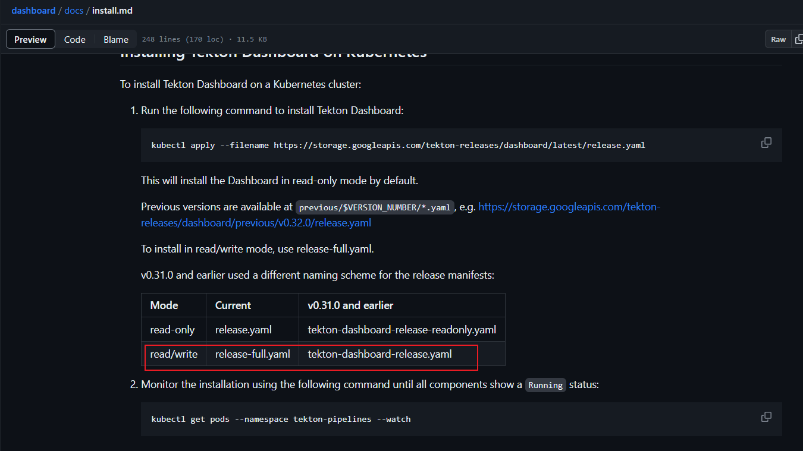
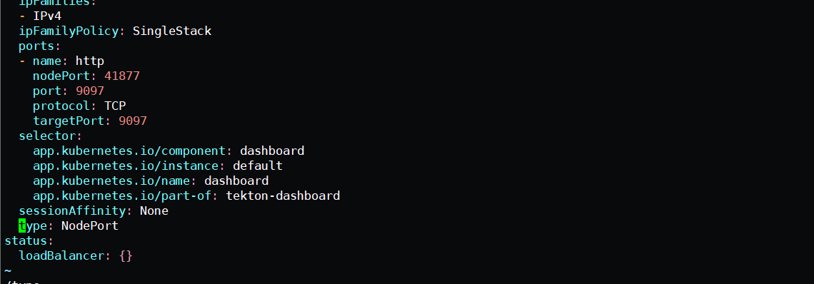

npm 安装指定阿里云
>npm install --save @docusaurus/plugin-content-docs  --registry=https://registry.npmmirror.com


参考官方，有只读和读写模式两种

官方安装文档： 

https://github.com/tektoncd/pipeline/blob/main/docs/install.md





目前我这边已经同步到github.

安装版本:   dashboard  0.32.1 

controller:  0.41.0


目前镜像已经替换为阿里云镜像

```shell
kubeclt apply -f  https://raw.githubusercontent.com/shouji1128955/bookcode/main/kubernetes/tekton/tekton-pipeline-release.yaml

kjubectl  apply  -f  https://raw.githubusercontent.com/shouji1128955/bookcode/main/kubernetes/tekton/release-full.yaml
```


然后需要对service进行修改为nodePort 方式进行访问

```shell
kubectl  edit svc tekton-dashboard  -n tekton-pipelines
```





验证安装


```shell
s-master:~/tekton# kubectl  get service  -n tekton-pipelines
NAME                                TYPE        CLUSTER-IP      EXTERNAL-IP   PORT(S)                              AGE
tekton-dashboard                    NodePort    10.102.87.91    <none>        9097:41877/TCP                       22m
tekton-pipelines-controller         ClusterIP   10.108.43.105   <none>        9090/TCP,8008/TCP,8080/TCP           28d
tekton-pipelines-webhook            ClusterIP   10.97.167.64    <none>        9090/TCP,8008/TCP,443/TCP,8080/TCP   28d
tekton-triggers-controller          ClusterIP   10.104.231.2    <none>        9000/TCP                             6d2h
tekton-triggers-core-interceptors   ClusterIP   10.109.59.53    <none>        8443/TCP                             6d2h
tekton-triggers-webhook             ClusterIP   10.99.38.160    <none>        443/TCP                              6d2h
root@k8s-master:~/tekton# kubectl  get  pods    -n tekton-pipelines
NAME                                                 READY   STATUS    RESTARTS      AGE
tekton-dashboard-86dc7648d5-zp4kn                    1/1     Running   0             23m
tekton-pipelines-controller-6bcb64d9b9-stpbm         1/1     Running   30 (8h ago)   28d
tekton-pipelines-webhook-787486d884-x2v7b            1/1     Running   28 (8h ago)   28d
tekton-triggers-controller-74dccbdd79-cslr8          1/1     Running   7 (8h ago)    6d2h
tekton-triggers-core-interceptors-579b9cd556-mdb4v   1/1     Running   7 (8h ago)    6d2h
tekton-triggers-webhook-86d487889-h6xg9              1/1     Running   7 (8h ago)    6d2h
```


