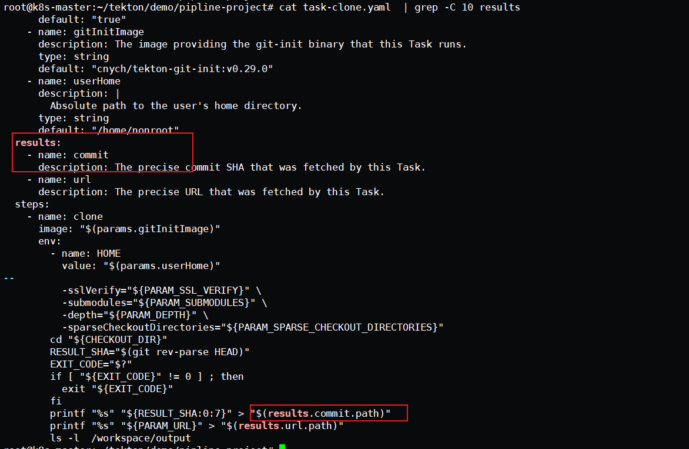
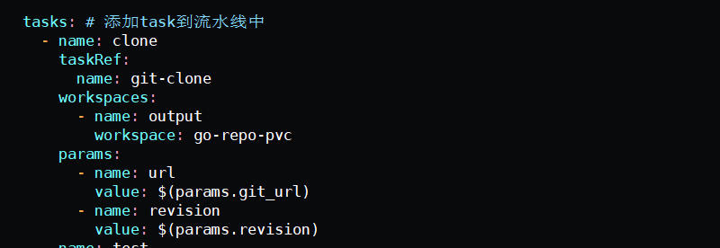
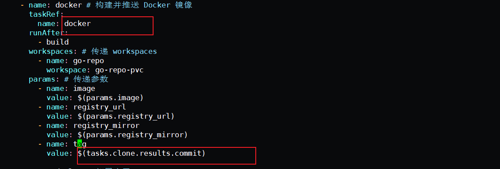
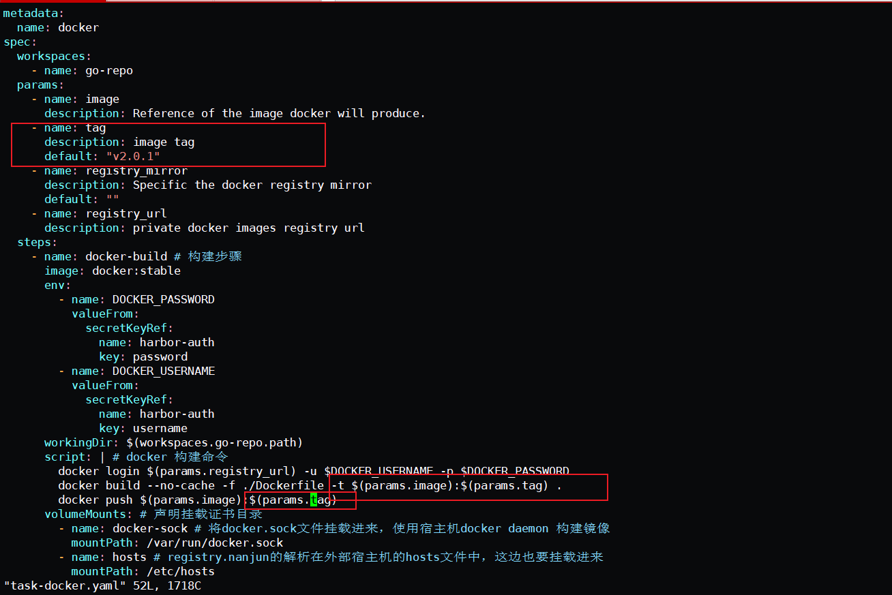

## 使用 Results 传递数据

我们在build镜像的时候，因为都是固定写死的，所以，我们现在需要实现修改镜像tag, 需要用到results这个方法

两种方式


- 可以通过Build-id，也可以通过commit-id来实现。
- 还需要获取到构建的时间

这里我们可以通过定义一个 Task 任务，然后通过 `script` 脚本去获取到数据后传入到 results 中去，我们可以把这些 results 数据传递到流水线中的其他任务中去，比如我们想要获取 git commit 的 SHA 值，或者生成一个随机的 ID 来作为镜像 TAG，比如这里我们创建一个名为 `generate-build-id` 的 Task 任务，定义了 `get-timestamp` 和 `get-buildid` 两个 Steps，一个用于生成时间戳，一个用于生成一个包含基本版本的结果值，将结果添加到 `results` 中去。

sa.yaml 

```shell
root@k8s-master:~/tekton/demo/pipline-results# cat sa.yaml 
apiVersion: v1
kind: ServiceAccount
metadata:
  name: git-pull
secrets:
  - name: basic-git
  - name: basic-docker
```


secret_docker.yaml 

```shell
root@k8s-master:~/tekton/demo/pipline-results# cat secret_docker.yaml 
apiVersion: v1
kind: Secret
metadata:
  name: basic-docker
  annotations:
    tekton.dev/docker-0: https://registry.cn-hangzhou.aliyuncs.com # Described below
type: kubernetes.io/basic-auth
stringData:
  username: xxxxxxxxxx
  password: xxxxxxxxxxx
```


secret.yaml 

```shell
root@k8s-master:~/tekton/demo/pipline-results# cat secret.yaml 
apiVersion: v1
kind: Secret
metadata:
  name: basic-git
  annotations:
    tekton.dev/git-0: https://gitee.com # Described below
type: kubernetes.io/basic-auth
stringData:
  username: xxxxxxx
  password: xxxxxxx
```


task-pull-code.yaml  

```shell
root@k8s-master:~/tekton/demo/pipline-results# cat task-pull-code.yaml  
# task-test.yaml
apiVersion: tekton.dev/v1beta1
kind: Task
metadata:
  name: task-results
spec:
  resources:
    inputs:
      - name: git-res
        type: git
    outputs:
      - name: builtImage
        type: image

  params:
  - name: dockerfile-path #指明 dockerfile 在仓库中的哪个位置
    type: string
    default: $(inputs.resources.golang-resource.path)/ # repo资源的路径
    description: dockerfile path

  steps:
    - name: run-test
      image: alpine:3.15
      workingDir: /workspace/demo-resource
      script: |
        pwd  && ls -l
        for i in $(seq 1 20); do
          touch /root/.m2/$i.txt
        done
        ls -l  /root/.m2/
      volumeMounts:
        - name: m2
          mountPath: /root/.m2 
  volumes:
    - name: m2
      hostPath:
        path: /root/.m2
    - name: docker-sock
      hostPath:
        path: /var/run/docker.sock
```


task-generate-build-id.yaml 

```shell
root@k8s-master:~/tekton/demo/pipline-results# cat task-generate-build-id.yaml 
# generate-build-id.yaml
apiVersion: tekton.dev/v1beta1
kind: Task
metadata:
  name: task-generate-build-id
spec:
  description: >-
    Given a base version, this task generates a unique build id by appending
    the base-version to the current timestamp.
  params:
    - name: base-version
      description: Base product version
      type: string
      default: "1.0"
  results:
    - name: timestamp
      description: Current timestamp
    - name: build-id
      description: ID of the current build
    - name: hostname-ts
      description: get hostname-ts
  steps:
    - name: get-timestamp
      image: bash:5.0.18
      script: |
        #!/usr/bin/env bash
        ts=`date "+%Y%m%d-%H%M%S"`
        echo "Current Timestamp: ${ts}"
        echo ${ts} | tr -d "\n" | tee $(results.timestamp.path)
    - name: get-buildid
      image: bash:5.0.18
      script: |
        #!/usr/bin/env bash
        ts=`cat $(results.timestamp.path)`
        buildId=$(inputs.params.base-version)-${ts}
        echo ${buildId} | tr -d "\n" | tee $(results.build-id.path)

    - name: hostname-ts
      image: bash:5.0.18
      script: |
        #!/usr/bin/env bash
        ts=`cat $(results.timestamp.path)`
        hostname-name=`hostname`
        hostnamets=${hostname-name}-${ts}
        echo ${hostnamets} | tr -d "\n" | tee $(results.hostname-ts.path)
        echo '[INFO]' hostnamets: ${hostnamets}
```


task-docker-build-push.yaml

```shell
root@k8s-master:~/tekton/demo/pipline-results# cat task-docker-build-push.yaml  
# task-build-push.yaml
apiVersion: tekton.dev/v1beta1
kind: Task
metadata:
  name: task-build-and-push
spec:
  resources:
    inputs: # 定义输入资源
      - name: repo #输入资源，就是github的那个仓库
        type: git
    outputs: # 定义输出资源
      - name: builtImage # 输出镜像名字
        type: image
  params:
    - name: pathToDockerfile #指明 dockerfile 在仓库中的哪个位置
      type: string
      default: $(resources.inputs.repo.path)/Dockerfile # repo资源的路径
      description: The path to the dockerfile to build
    - name: pathToContext #指明 dockerfile 在仓库中的哪个位置
      type: string
      default: $(resources.inputs.repo.path) # repo资源的路径
      description: the build context used by docker daemon
    - name: imageTag
      type: string
      default: "v0.2.0"
      description: the docker image tag
    - name: hostnamets
      type: string
      default: "hello"
      description:  print host name
  steps:
    - name: build-and-push
      image: docker:stable
      script: |
        #!/usr/bin/env sh
        docker login registry.cn-hangzhou.aliyuncs.com
        docker build -t $(resources.outputs.builtImage.url):$(params.imageTag) -f $(params.pathToDockerfile) $(params.pathToContext)
        echo '[INFO]' pathToDockerfile $(resources.inputs.repo.path)/Dockerfile 
        echo '[INFO]' pathToContext    $(resources.inputs.repo.path)
        docker push $(resources.outputs.builtImage.url):$(params.imageTag)  # 这边的参数都是在 input 和 output 中定义的
        echo  '[INFO] hostname-ts:'  $(params.hostnamets)
      volumeMounts:
      - name: docker-sock # 将docker.sock文件挂载进来，使用宿主机docker daemon 构建镜像
        mountPath: /var/run/docker.sock
      - name: hosts # registry.nanjun的解析在外部宿主机的hosts文件中，这边也要挂载进来
        mountPath: /etc/host      
  volumes:
    - name: docker-sock
      hostPath:
        path: /var/run/docker.sock
    - name: hosts
      hostPath:
        path: /etc/hosts
```


增加task-generate-build-id 任务，用来生成构建id

 pipeline.yaml 

```shell
root@k8s-master:~/tekton/demo/pipline-results# cat pipeline.yaml 
apiVersion: tekton.dev/v1beta1
kind: Pipeline
metadata:
  name: pipeline-results
spec:
  resources:  # 为 Tasks 提供输入和输出资源声明
    - name: git-res
      type: git
    - name: harbor-image
      type: image
  params:
    - name: image-tag
      type: string

  tasks:  # 添加task到流水线中

    # 拉取代码
    - name: clone-code
      taskRef:
        name: task-results
      resources:
        inputs:
          - name: git-res # Task 输入名称
            resource: git-res # Pipeline 资源名称
        outputs: 
          - name: builtImage
            resource: harbor-image 
           
    # 获取构建ID
    - name: get-build-id
      taskRef:
        name: task-generate-build-id
      params:
        - name: base-version
          value: $(params.image-tag) 
         
    # 构建并且推送镜像到仓库
    - name: build-and-push
      taskRef:
        name: task-build-and-push
      runAfter:
        - clone-code
        - get-build-id
      resources:
        inputs:
          - name: repo
            resource: git-res
        outputs:
          - name: builtImage
            resource: harbor-image
      params:
        - name: imageTag
          value: "$(tasks.get-build-id.results.build-id)"
        - name: hostnamets
          value: "$(tasks.get-build-id.results.hostname-ts)"  #获取上一task变量值，然后在build-and-push中实现调用和打印
```


pipelinerun.yaml 

```shell
root@k8s-master:~/tekton/demo/pipline-results# cat pipelinerun.yaml 
apiVersion: tekton.dev/v1beta1
kind: PipelineRun
metadata:
  name: pipelinerun-results
  namespace: default
spec:
  serviceAccountName: git-pull
  pipelineRef:
    name: pipeline-results
  resources:
  - name: git-res  # 指定输入的git仓库资源
    resourceRef:
      name: git-res
  - name: harbor-image
    resourceRef:
      name: harbor-image

  params:
    - name: image-tag
      value: "v0.3.0"
```


demo-rescource.yaml 

```shell
root@k8s-master:~/tekton/demo/pipline-results# cat demo-rescource.yaml 
apiVersion: tekton.dev/v1alpha1
kind: PipelineResource
metadata:
  name: git-res  # resource的名字
spec:
  type: git
  params:
  - name: revision
    value: master  #我要拉取仓库哪个分支的代码
  - name: url
    value: https://gitee.com/zhang_lai_qiang/golang-test.git  #这是我Github的golang代码仓库，运行的gin框架代码

---
apiVersion: tekton.dev/v1alpha1
kind: PipelineResource
metadata: 
  name: harbor-image
spec:
  type: image
  params:
    - name: url
      value: registry.cn-hangzhou.aliyuncs.com/zlq_registry/tekon-demo
```


start.sh 

```shell
root@k8s-master:~/tekton/demo/pipline-results# cat start.sh 
for i in `ls *.yaml | grep -v  run`; do kubectl delete  -f $i; done
for i in `ls *.yaml | grep -v  run`; do kubectl apply  -f $i; done

kubectl  delete  -f pipelinerun.yaml 
kubectl  apply   -f pipelinerun.yaml 
```


所有修改完成后，重新执行我们的整个流水线即可

tkn pipelinerun logs test-pipelinerun


## 案例 使用results实现 commit


此处，通过定义commit来实现在docker build的时候来通过commit来实现部署

#### 获取commit信息

这一步需要在clone代码的时候就需要获取到，具体的yaml可以参考官方文档，然后进行修改即可
https://hub.tekton.dev/tekton/task/git-clone 





#### pipeline中获取commit信息


因为在pipeline中，通过task来定义每个task执行的部分，下面是拉取代码的task ,然后在pipeline中命名为clone ,关联了git-clone的任务。所以如果想要获取commit信息，需要从clone中获取变量信息





然后在pipeline中需要把变量注入进去，需要定义，然后关联的任务为docker ,  方式如下。





在task-docker中添加注入的变量




