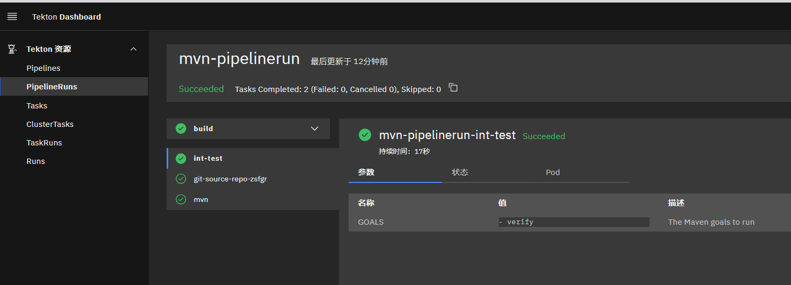

# Tektion-Workspaces


workspace可以定义在pipeline中，然后在多个task中可以实现调用，将需要缓存的数据保存到其中。

在实际工作中，我们经常需要的一个功能是能够在任务之间共享制品，以便缓存构建工具（比如 Maven 和 NPM）的依赖项，在 Tekton 0.10 版本就发布增加了对 Workspaces 的支持，这使得流水线中的任务可以更加轻松地使用 PV 来共享数据了，Workspaces 允许指定一个或多个 pipeline 中 task 运行时需要的 volume。


此处，我使用的是java项目 https://gitee.com/zhang_lai_qiang/springboot-helloworld.git，mvn打包后依赖缓存到workspaces中。 

Tekton Pipeline中的Workspace指的是Pipeline在运行时需要的共享卷的声明。它们类似于卷，只是不提供实际的卷，而只是声明意图。在Pipeline定义中，Workspaces可以作为共享卷传递给相关Task。当同一个Workspaces提供给多个Task时，这些Task可以从完全相同的卷中读写，并根据需要共享文件和工件。尽管以上的“卷”指的是用于缓存Maven依赖关系的持久化卷，但它也可以是ConfigMap，或者是传递给Pipeline运行的Secret，这些资源都可以在Task之间共享。


demo-rescource.yaml
```yaml
apiVersion: tekton.dev/v1alpha1
kind: PipelineResource
metadata:
  name: repo  # resource的名字
spec:
  type: git
  params:
  - name: revision
    value: master  #我要拉取仓库哪个分支的代码
  - name: url
    #value: https://gitee.com/zhang_lai_qiang/golang-test.git  #这是我Github的golang代码仓库，运行的gin框架代码
    value: https://gitee.com/zhang_lai_qiang/springboot-helloworld.git

---
apiVersion: tekton.dev/v1alpha1
kind: PipelineResource
metadata: 
  name: harbor-image
spec:
  type: image
  params:
    - name: url
      value: registry.cn-hangzhou.aliyuncs.com/zlq_registry/tekon-demo
```


pipeline-mvn.yaml

```yaml
# workspace-mvn-pipeline.yaml
apiVersion: tekton.dev/v1beta1
kind: Pipeline
metadata:
  name: mvn-pipeline
spec:
  workspaces: # 声明 workspaces
    - name: local-maven-repo
  resources: # 声明使用的资源
    - name: repo
      type: git
  tasks:

    - name: build # 构建任务
      taskRef:
        name: mvn-task # 引用上面的 mvn 任务
      resources: # 传递 resources 资源
        inputs:
          - name: repo
            resource: repo
      params: # 传递 params 参数
        - name: GOALS
          value: ["package"]
      workspaces: # 传递 workspaces
        - name: maven-repo
          workspace: local-maven-repo

    - name: int-test # 测试任务
      taskRef:
        name: mvn-task
      runAfter: ["build"] # 需要 build 任务执行完成后
      resources:
        inputs:
          - name: repo
            resource: repo
      params:
        - name: GOALS
          value: ["verify"]
      workspaces:
        - name: maven-repo
          workspace: local-maven-repo

#    - name: gen-report # 测试报告
#      taskRef:
#        name: mvn-task
#      runAfter: ["build"] # 需要 build 任务执行完成后
#      resources:
#        inputs:
#          - name: repo
#            resource: repo
#      params:
#        - name: GOALS
#          value: ["site"]
#      workspaces:
#        - name: maven-repo
#          workspace: local-maven-repo
#
```


pipelinerun.yaml

```yaml
apiVersion: tekton.dev/v1beta1
kind: PipelineRun
metadata:
  name: mvn-pipelinerun
  namespace: default
spec:
  #serviceAccountName: git-pull
  pipelineRef:
    name: mvn-pipeline
  resources:
  - name: repo  # 指定输入的git仓库资源
    resourceRef:
      name: repo
  workspaces:
    - name: local-maven-repo
      persistentVolumeClaim:
        claimName: mvn-repo-pvc
```


pvc.yaml

```yaml
# workspace-mvn-pvc.yaml
apiVersion: v1
kind: PersistentVolumeClaim
metadata:
  name: mvn-repo-pvc
spec:
  resources:
    requests:
      storage: 5Gi
  volumeMode: Filesystem
  storageClassName: nfs-storage # 使用 StorageClass 自动生成 PV
  accessModes:
    - ReadWriteOnce
```

sa.yaml
```yaml
apiVersion: v1
kind: ServiceAccount
metadata:
  name: git-pull
secrets:
  - name: basic-git
  - name: basic-docker
```

secret_docker.yaml
```yaml
apiVersion: v1
kind: Secret
metadata:
  name: basic-docker
  annotations:
    tekton.dev/docker-0: https://registry.cn-hangzhou.aliyuncs.com # Described below
type: kubernetes.io/basic-auth
stringData:
  username: xxxxxxxxx
  password: xxxxxxxxx
```


secret.yaml

```yaml
apiVersion: v1
kind: Secret
metadata:
  name: basic-git
  annotations:
    tekton.dev/git-0: https://gitee.com # Described below
type: kubernetes.io/basic-auth
stringData:
  username: xxxxxxxxx
  password: xxxxxxxxx
```


task-maven.yaml

```yaml
# workspace-mvn-task.yaml
apiVersion: tekton.dev/v1beta1
kind: Task
metadata:
  name: mvn-task
spec:
  workspaces:
    - name: maven-repo
  resources:
    inputs:
      - name: repo
        type: git
  params:
    - name: GOALS
      description: The Maven goals to run
      type: array
      default: ["package"]
  steps:
    - name: mvn
      #image: cnych/cloud-builders-mvn:tekton
      image: zhanglaiqiang/mvn:v3.6.3.4
      workingDir: /workspace/repo
      command: ["/usr/bin/mvn"]
      args:
        - -Dmaven.repo.local=$(workspaces.maven-repo.path)
        - "-s"
        - "/usr/share/maven/ref/settings-docker.xml"   #指定使用阿里源
        - "$(inputs.params.GOALS)"

```


`-Dmaven.repo.local=$(workspaces.maven-repo.path)` 命令将工作区的路径作为本地的 Maven 库，当然也可以配置 Workspace 挂载的路径，这里我们使用的是默认的路径。


执行创建后查看，步骤2使用的时间一共用了17s就执行完了。




```shell
root@k8s-master:~/tekton/demo/pipline-workspaces# tkn  pr describe mvn-pipelinerun 
Name:              mvn-pipelinerun
Namespace:         default
Pipeline Ref:      mvn-pipeline
Service Account:   default
Timeout:           1h0m0s
Labels:
 tekton.dev/pipeline=mvn-pipeline

🌡️  Status

STARTED          DURATION     STATUS
32 minutes ago   32 seconds   Succeeded

📦 Resources

 NAME     RESOURCE REF
 ∙ repo   repo

⚓ Params

 No params

📝 Results

 No results

📂 Workspaces

 NAME                 SUB PATH   WORKSPACE BINDING
 ∙ local-maven-repo   ---        PersistentVolumeClaim (claimName=mvn-repo-pvc)

🗂  Taskruns

 NAME                         TASK NAME   STARTED          DURATION     STATUS
 ∙ mvn-pipelinerun-int-test   int-test    32 minutes ago   17 seconds   Succeeded
 ∙ mvn-pipelinerun-build      build       32 minutes ago   15 seconds   Succeeded

```

