## Triggers介绍

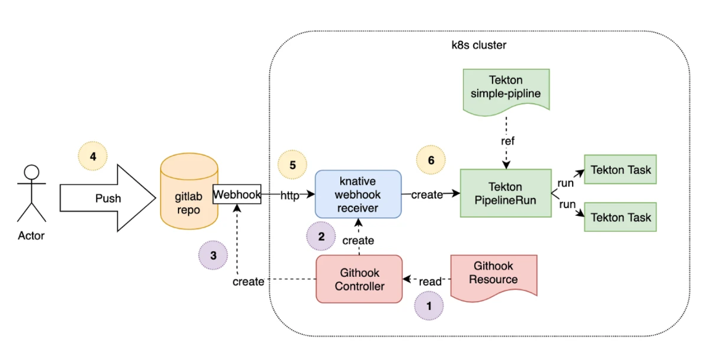


Triggers 同样通过下面的几个 CRD 对象对 Tekton 进行了一些扩展：

- `TriggerTemplate`: 创建资源的模板，比如用来创建 `PipelineResource` 和 `PipelineRun`
- `TriggerBinding`: 校验事件并提取相关字段属性
- `ClusterTriggerBinding`: 和 `TriggerBinding` 类似，只是是全局的
- `Interceptor`: 处理事件以进行自定义验证或过滤的拦截器
- `EventListener`: 连接 `TriggerBinding` 和 `TriggerTemplate` 到事件接收器，使用从各个 `TriggerBinding` 中提取的参数来创建 `TriggerTemplate` 中指定的 resources，同样通过 `interceptor` 字段来指定外部服务对事件属性进行预处理


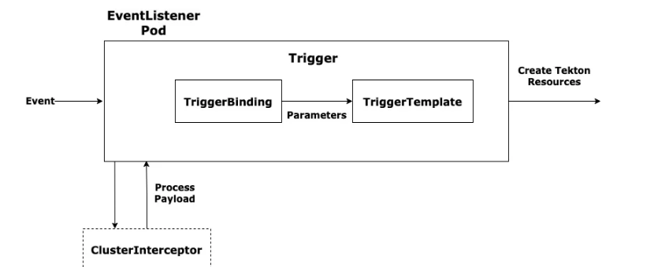


例如，我们可以使用触发器实现以下 CI/CD 工作流：

- 1. Triggers 监听 `git commit` 或 `git pull request` 事件。当检测到时，它会使用提交的代码执行一个单元测试的 `Pipeline`。
- 1. Triggers 监听指示测试成功完成的 `git push` 事件，当它检测到时，它会验证测试的结果并执行构建测试代码的 `Pipeline`。
- 1. 当关联的 `PipelineRun` 执行完成时，Triggers 检查构建的结果，如果成功，则执行一个 `Task`，将构建结果上传到对应的 Docker 镜像仓库。
- 1. 最后，Docker registry 发送一个事件到 `Pub/Sub`，该事件触发一个将构建镜像推送到 staging 环境的 `Pipeline`


## triggers安装

https://github.com/tektoncd/triggers/blob/main/releases.md


这里我使用的是v0.22.2版本

```shell
kubectl apply -f https://storage.googleapis.com/tekton-releases/triggers/previous/v0.22.2/release.yaml
kubectl apply -f https://storage.googleapis.com/tekton-releases/triggers/previous/v0.22.2/interceptors.yaml
```

kubernetes集群版本: v1.23.6

Triggers版本: 0.22.2


因为网络原因，我已经同步到阿里云，根据上面版本进行替换下面版本即可

```shell
image: "registry.cn-hangzhou.aliyuncs.com/zlq_registry/interceptors:v0.22.2"
image: "registry.cn-hangzhou.aliyuncs.com/zlq_registry/controller:v0.22.2"
registry.cn-hangzhou.aliyuncs.com/zlq_registry/eventlistenersink:v0.22.2

image: "registry.cn-hangzhou.aliyuncs.com/zlq_registry/webhook:v0.22.2"
```


安装

```shell
https://www.zlqit.com/devops/kubernetes/tekton/release.yaml
https://www.zlqit.com/devops/kubernetes/tekton/interceptors.yaml
```


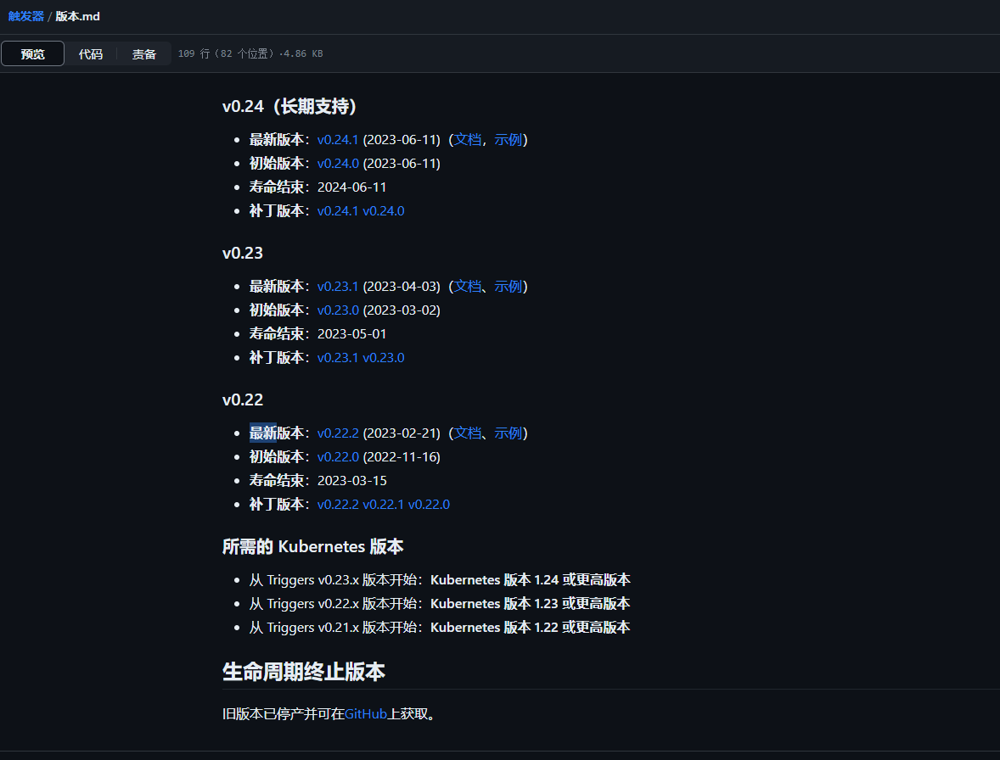


安装

可以使用如下命令查看 Triggers 的相关组件安装状态，直到都为 `Running` 状态：

```shell
root@k8s-master:~/tekton/demo/pipline-triggers# kubectl  get pods -n tekton-pipelines
NAME                                                 READY   STATUS    RESTARTS        AGE
tekton-dashboard-86dc7648d5-gjx6q                    1/1     Running   9 (126m ago)    7d20h
tekton-pipelines-controller-6bcb64d9b9-stpbm         1/1     Running   23 (128m ago)   21d
tekton-pipelines-webhook-787486d884-x2v7b            1/1     Running   21 (125m ago)   21d
tekton-triggers-controller-74dccbdd79-md6sb          1/1     Running   0               13m
tekton-triggers-core-interceptors-579b9cd556-d6n96   1/1     Running   0               9m6s
tekton-triggers-webhook-86d487889-rs4t6              1/1     Running   0               13m
```


现在我们来将前面的 Jenkins Pipeline 流水线转换成使用 Tekton 来构建，代码我们已经推送到了私有仓库 GitLab，地址为：https://gitee.com/zhang_lai_qiang/golang-test.git。

首先我们需要完成触发器的配置，当我们提交源代码到 GitLab 的时候，需要触发 Tekton 的任务运行，所以首先需要完成这个触发器。这里就可以通过 `EventListener` 这个资源对象来完成，创建一个名为 `gitlab-listener` 的 `EventListener` 资源对象，文件内容如下所示：


下面是一些拦截器的资源

```shell
root@k8s-master:~/tekton/demo/pipline-triggers# kubectl  get clusterinterceptor
NAME        AGE
bitbucket   3h3m
cel         3h3m
github      3h3m
gitlab      3h3m
```


## 安装触发器

首先我们需要完成触发器的配置，当我们提交源代码到 GitLab 的时候，需要触发 Tekton 的任务运行，所以首先需要完成这个触发器。这里就可以通过 `EventListener` 这个资源对象来完成，创建一个名为 `gitlab-listener` 的 `EventListener` 资源对象，文件内容如下所示：

​	

root@k8s-master:~/tekton/demo/pipline-triggers# cat ~/markdown.md 

event-listener-rbac.yaml
```yaml
apiVersion: v1
kind: ServiceAccount
metadata:
  name: tekton-triggers-gitlab-sa
secrets:
  - name: gitlab-auth
  - name: gitlab-secret
---
apiVersion: rbac.authorization.k8s.io/v1
kind: Role
metadata:
  name: tekton-triggers-gitlab-minimal
rules:
  # EventListeners need to be able to fetch all namespaced resources
  - apiGroups: ["triggers.tekton.dev"]
    resources:
      ["eventlisteners", "triggerbindings","interceptors","triggertemplates", "triggers"]
    verbs: ["get", "list", "watch"]
  - apiGroups: [""]
    # configmaps is needed for updating logging config
    resources: ["configmaps"]
    verbs: ["get", "list", "watch"]
  # Permissions to create resources in associated TriggerTemplates
  - apiGroups: ["tekton.dev"]
    resources: ["pipelineruns", "pipelineresources", "taskruns"]
    verbs: ["create"]
  - apiGroups: [""]
    resources: ["serviceaccounts"]
    verbs: ["impersonate"]
  - apiGroups: ["policy"]
    resources: ["podsecuritypolicies"]
    resourceNames: ["tekton-triggers"]
    verbs: ["use"]
  - apiGroups: ["interceptors.triggers.tekton.dev"]
    resources:
      ["eventlisteners", "triggerbindings", "triggertemplates", "interceptors"]
    verbs: ["get", "list", "watch"]    
---
apiVersion: rbac.authorization.k8s.io/v1
kind: RoleBinding
metadata:
  name: tekton-triggers-gitlab-binding
subjects:
  - kind: ServiceAccount
    name: tekton-triggers-gitlab-sa
roleRef:
  apiGroup: rbac.authorization.k8s.io
  kind: Role
  name: tekton-triggers-gitlab-minimal
---
kind: ClusterRole
apiVersion: rbac.authorization.k8s.io/v1
metadata:
  name: tekton-triggers-gitlab-clusterrole
rules:
  # EventListeners need to be able to fetch any clustertriggerbindings
  - apiGroups: ["triggers.tekton.dev"]
    resources: ["clustertriggerbindings", "clusterinterceptors"]
    verbs: ["get", "list", "watch"]
  - apiGroups: ["interceptors.triggers.tekton.dev"]
    resources:
      ["eventlisteners", "triggerbindings", "triggertemplates", "interceptors"]
    verbs: ["get", "list", "watch"]

---
apiVersion: rbac.authorization.k8s.io/v1
kind: ClusterRoleBinding
metadata:
  name: tekton-triggers-gitlab-clusterbinding
subjects:
  - kind: ServiceAccount
    name: tekton-triggers-gitlab-sa
    namespace: default
roleRef:
  apiGroup: rbac.authorization.k8s.io
  kind: ClusterRole
  name: tekton-triggers-gitlab-clusterrole
```


现在我们来将前面的 Jenkins Pipeline 流水线转换成使用 Tekton 来构建，代码我们已经推送到了私有仓库 GitLab，地址为：`http://git.k8s.local/course/devops-demo.git`。

首先我们需要完成触发器的配置，当我们提交源代码到 GitLab 的时候，需要触发 Tekton 的任务运行，所以首先需要完成这个触发器。这里就可以通过 `EventListener` 这个资源对象来完成，创建一个名为 `gitlab-listener` 的 `EventListener` 资源对象，文件内容如下所示：

gitee-push-listener.yaml

```yaml
# gitlab-push-listener.yaml
apiVersion: triggers.tekton.dev/v1beta1
kind: EventListener
metadata:
  name: gitlab-listener # 该事件监听器会创建一个名为 el-gitlab-listener 的Service对象
spec:
  serviceAccountName: tekton-triggers-gitlab-sa 
  triggers:
    - name: gitlab-push-events-trigger
      interceptors:
        - ref:
            name: gitlab
          params:
            - name: secretRef # 引用 gitlab-secret 的 Secret 对象中的 secretToken 的值
              value:
                secretName: gitlab-secret
                secretKey: secretToken
            - name: eventTypes
              value:
                - Push Hook # 只接收 GitLab Push 事件
      bindings:
        - ref: devops-demo-binding
      template:
        ref: devops-demo-template
```

由于 `EventListener` 创建完成后会生成一个 Listener 的服务，用来对外暴露用于接收事件响应，比如上面我们创建的对象名为 `gitlab-listener`，创建完成后会生成一个名为 `el-gitlab-listener` 的 Service 对象，由于我们 GitLab 本身就在集群内部，所以我们用 Service 的 DNS 形式来访问 `EventListener` 即可，如果你想暴露到集群外部则可以使用 NodePort 或者 Ingress 的形式。

另外需要注意的是在上面的 `EventListener` 对象中我们添加了 `interceptors` 属性，其中有一个内置的 `gitlab` 拦截器，GitLab 拦截器包含验证和过滤来自 GitLab 的请求逻辑， 比如我们可以配置 WebHook 的 `Secret Token`，可以通过 Secret 对象引入进来：


对应的 Secret 资源对象如下所示，一个用于 WebHook 的 `Secret Token`，另外一个是用于 GitLab 登录认证使用的：

secret-gitlab.yaml

```yaml
apiVersion: v1
kind: Secret
metadata:
  name: gitlab-secret
type: Opaque
stringData:
  secretToken: "1234567"
```

secret.yaml
```yaml
apiVersion: v1
kind: Secret
metadata:
  name: gitlab-auth
  annotations:
    tekton.dev/git-0: http://gitlab.kube-ops.svc.cluster.local # Described below
type: kubernetes.io/basic-auth
stringData:
  username: root
  password: admin321
```


这样就可以将 `TriggerBinding` 中的参数传递到 `TriggerTemplate` 对象中进行模板化。比如这里我们定义一个如下所示的 `TriggerBinding` 对象：

TriggerBinding.yaml

```yaml
apiVersion: triggers.tekton.dev/v1beta1
kind: TriggerBinding
metadata:
  name: devops-demo-binding
spec:
  params:
    - name: gitrevision
      value: $(body.checkout_sha)
    - name: gitrepositoryurl
      value: $(body.repository.git_http_url)
```

这里需要注意的是参数的值我们是通过读取 `GitLab WebHook` 发送过来的数据值，通过 `$()` 包裹的 JSONPath 表达式来提取的，关于表达式的更多用法可以查看[官方文档说明](https://github.com/tektoncd/triggers/blob/master/docs/triggerbindings.md#event-variable-interpolation)，至于能够提取哪些参数值，则可以查看 WebHook 的说明，比如这里我们是 GitLab Webhook 的 `Push Hook`，对应的请求体数据如下所示：


```shell
{
  "object_kind": "push",
  "before": "95790bf891e76fee5e1747ab589903a6a1f80f22",
  "after": "da1560886d4f094c3e6c9ef40349f7d38b5d27d7",
  "ref": "refs/heads/master",
  "checkout_sha": "da1560886d4f094c3e6c9ef40349f7d38b5d27d7",
  "user_id": 4,
  "user_name": "John Smith",
  "user_username": "jsmith",
  "user_email": "john@example.com",
  "user_avatar": "https://s.gravatar.com/avatar/d4c74594d841139328695756648b6bd6?s=8://s.gravatar.com/avatar/d4c74594d841139328695756648b6bd6?s=80",
  "project_id": 15,
  "project": {
    "id": 15,
    "name": "Diaspora",
    "description": "",
    "web_url": "http://example.com/mike/diaspora",
    "avatar_url": null,
    "git_ssh_url": "git@example.com:mike/diaspora.git",
    "git_http_url": "http://example.com/mike/diaspora.git",
    "namespace": "Mike",
    "visibility_level": 0,
    "path_with_namespace": "mike/diaspora",
    "default_branch": "master",
    "homepage": "http://example.com/mike/diaspora",
    "url": "git@example.com:mike/diaspora.git",
    "ssh_url": "git@example.com:mike/diaspora.git",
    "http_url": "http://example.com/mike/diaspora.git"
  },
  "repository": {
    "name": "Diaspora",
    "url": "git@example.com:mike/diaspora.git",
    "description": "",
    "homepage": "http://example.com/mike/diaspora",
    "git_http_url": "http://example.com/mike/diaspora.git",
    "git_ssh_url": "git@example.com:mike/diaspora.git",
    "visibility_level": 0
  },
  "commits": [
    {
      "id": "b6568db1bc1dcd7f8b4d5a946b0b91f9dacd7327",
      "message": "Update Catalan translation to e38cb41.\n\nSee https://gitlab.com/gitlab-org/gitlab for more information",
      "title": "Update Catalan translation to e38cb41.",
      "timestamp": "2011-12-12T14:27:31+02:00",
      "url": "http://example.com/mike/diaspora/commit/b6568db1bc1dcd7f8b4d5a946b0b91f9dacd7327",
      "author": {
        "name": "Jordi Mallach",
        "email": "jordi@softcatala.org"
      },
      "added": ["CHANGELOG"],
      "modified": ["app/controller/application.rb"],
      "removed": []
    },
    {
      "id": "da1560886d4f094c3e6c9ef40349f7d38b5d27d7",
      "message": "fixed readme",
      "title": "fixed readme",
      "timestamp": "2012-01-03T23:36:29+02:00",
      "url": "http://example.com/mike/diaspora/commit/da1560886d4f094c3e6c9ef40349f7d38b5d27d7",
      "author": {
        "name": "GitLab dev user",
        "email": "gitlabdev@dv6700.(none)"
      },
      "added": ["CHANGELOG"],
      "modified": ["app/controller/application.rb"],
      "removed": []
    }
  ],
  "total_commits_count": 4
}

```


请求体中的任何属性都可以提取出来，作为 `TriggerBinding` 的参数，如果是其他的 Hook 事件，对应的请求体结构可以[查看 GitLab 文档说明](https://docs.gitlab.com/ce/user/project/integrations/webhooks.html)。

这样我们就可以在 `TriggerTemplate` 对象中通过参数来读取上面 `TriggerBinding` 中定义的参数值了，定义一个如下所示的 `TriggerTemplate` 对象，声明一个 `TaskRun` 的模板，定义的 Task 任务也非常简单，只需要在容器中打印出代码的目录结构即可：


TriggerTemplate.yaml

```yaml
apiVersion: triggers.tekton.dev/v1beta1
kind: TriggerTemplate
metadata:
  name: devops-demo-template
spec:
  params: # 定义参数，和 TriggerBinding 中的保持一致
    - name: gitrevision
    - name: gitrepositoryurl
  resourcetemplates: # 定义资源模板
    - apiVersion: tekton.dev/v1beta1
      kind: TaskRun # 定义 TaskRun 模板
      metadata:
        generateName: gitlab-run- # TaskRun 名称前缀
      spec:
        serviceAccountName: tekton-triggers-gitlab-sa
        taskSpec: # Task 任务声明
          resources:
            inputs: # 定义一个名为 source 的 git 输入资源
              - name: source
                type: git
          steps:
            - name: show-path
              image: ubuntu # 定义一个执行步骤，列出代码目录结构
              script: |
                #! /bin/bash
                ls -la $(resources.inputs.source.path)
        resources: # 声明具体的输入资源参数
          inputs:
            - name: source # 和 Task 中的资源名保持一直
              resourceSpec: # 资源声明
                type: git
                params:
                  - name: revision
                    value: $(tt.params.gitrevision) # 读取参数值
                  - name: url
                    value: $(tt.params.gitrepositoryurl)
```


需要注意在最后的 pipelineresource 中引用参数值的时候使用了一个 `tt` 的前缀。定义完过后，直接创建上面的资源对象，创建完成后会自动生成 `EventListener` 的 Pod 和 Service 对象：


```shell

root@k8s-master:~/gitlab-install# kubectl get svc -l eventlistener=gitlab-listener
NAME                 TYPE        CLUSTER-IP      EXTERNAL-IP   PORT(S)             AGE
el-gitlab-listener   ClusterIP   10.107.99.121   <none>        8080/TCP,9000/TCP   135m
root@k8s-master:~/gitlab-install# kubectl get pod -l eventlistener=gitlab-listener
NAME                                 READY   STATUS    RESTARTS   AGE
el-gitlab-listener-cff57b6cf-qpdsr   1/1     Running   0          135m
root@k8s-master:~/gitlab-install# kubectl get eventlistener
NAME              ADDRESS                                                    AVAILABLE   REASON                     READY   REASON
gitlab-listener   http://el-gitlab-listener.default.svc.cluster.local:8080   True        MinimumReplicasAvailable   True 
```


gitlab配置

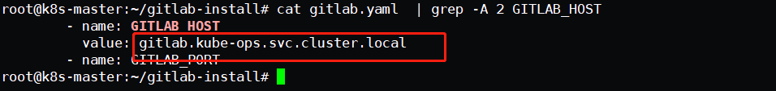

首先指定gitlab地址，这个地址就会listener拉取代码的时候会用到。我这里配置为svc地址，生产环境直接可以配置为能够通过外网访问的地址。


确认访问地址

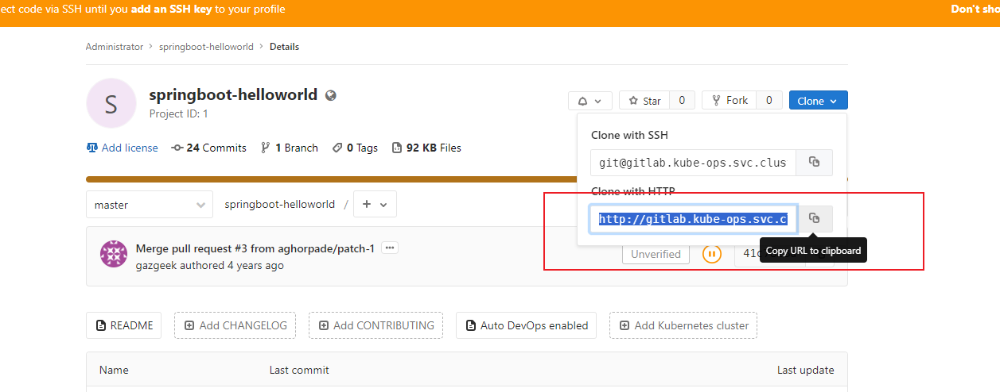


确保配置后如上图，能够在集群中服务能够请求到仓库。


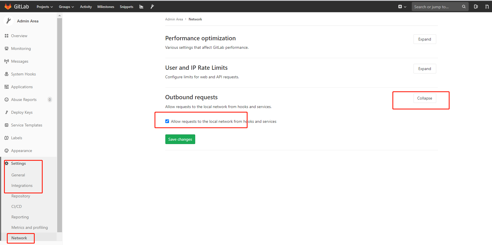


测试

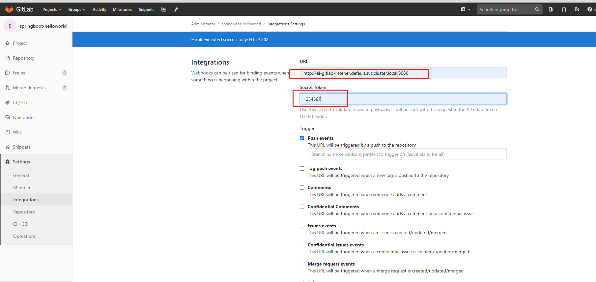


添加webhook

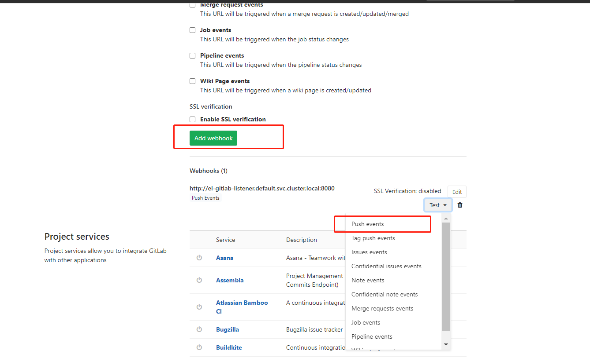


创建完成后，我们可以测试下该 WebHook 的 `Push events` 事件，直接点击测试即可（如果使用自定义的域名则需要在 coredns 中添加映射），正常会返回 `Hook executed successfully: HTTP 202` 的提示信息，这个时候在 Kubernetes 集群中就会出现如下所示的任务 Pod


```shell
root@k8s-master:~/gitlab-install# kubectl get pods -l triggers.tekton.dev/eventlistener=gitlab-listener
NAME                   READY   STATUS      RESTARTS   AGE
gitlab-run-228g4-pod   0/2     Completed   0          10m

root@k8s-master:~/gitlab-install# kubectl get taskrun -l triggers.tekton.dev/eventlistener=gitlab-listener
NAME               SUCCEEDED   REASON      STARTTIME   COMPLETIONTIME
gitlab-run-228g4   True        Succeeded   11m         10m

root@k8s-master:~/gitlab-install# tkn taskrun logs gitlab-run-228g4
[git-source-source-j4jkp] {"level":"info","ts":1694452832.0582829,"caller":"git/git.go:176","msg":"Successfully cloned http://gitlab.kube-ops.svc.cluster.local/root/springboot-helloworld.git @ 41c7823dddbef43680a0726ccea0631519b9d3c1 (grafted, HEAD) in path /workspace/source"}
[git-source-source-j4jkp] {"level":"info","ts":1694452832.0842206,"caller":"git/git.go:215","msg":"Successfully initialized and updated submodules in path /workspace/source"}

[show-path] total 40
[show-path] drwxr-xr-x 4 root root 4096 Sep 11 17:20 .
[show-path] drwxrwxrwx 3 root root 4096 Sep 11 17:20 ..
[show-path] drwxr-xr-x 8 root root 4096 Sep 11 17:20 .git
[show-path] -rw-r--r-- 1 root root   18 Sep 11 17:20 .gitignore
[show-path] -rw-r--r-- 1 root root  408 Sep 11 17:20 .travis.yml
[show-path] -rw-r--r-- 1 root root  537 Sep 11 17:20 Dockerfile
[show-path] -rw-r--r-- 1 root root   38 Sep 11 17:20 Procfile
[show-path] -rw-r--r-- 1 root root  969 Sep 11 17:20 README.md
[show-path] -rw-r--r-- 1 root root 2160 Sep 11 17:20 pom.xml
[show-path] drwxr-xr-x 4 root root 4096 Sep 11 17:20 src
```


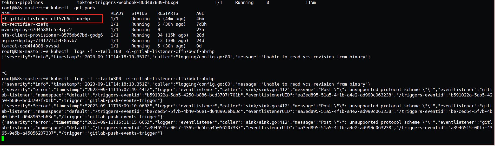


到这里我们就完成了通过 GitLab 的 Push 事件来触发 Tekton 的一个任务。

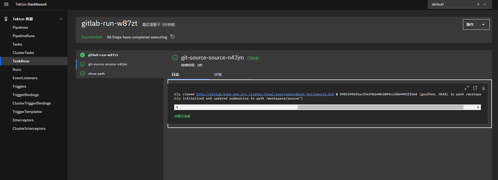


## 总结

坑： rbac的授权，根据报错进行处理，否则服务启动

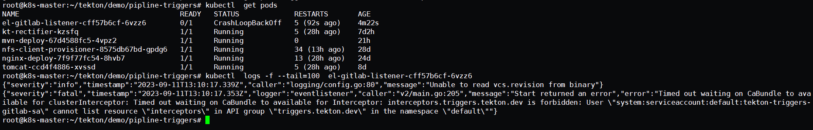


gitlab在k8s集群内部能够访问到即可

