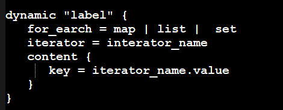
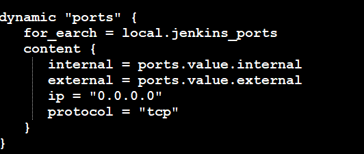

## Terraform基础

windows版本安装

下载官方二进制，放到 C:\Apps\Terraform下面， 然后在系统环境变量中编辑PATH，让其能够自动加载即可


配置语法

terraform 配置文件都是以.tf为后缀;

Terraform支持两种模式HCL, JSON; 


需要安装的两个插件(代码补全)

terraform  

HashiCorp terraform 


创建环境变量，用于存放身份认证信息。

```
export ALICLOUD_ACCESS_KEY="LTAI5t9g82e3ofLkYRqbDE"
export ALICLOUD_SECRET_KEY="RaZsnfJqQaUJjKzKVqLJsKaWtSCk"
export ALICLOUD_REGION="cn-beijing"


export TF_VAR_ALICLOUD_ACCESS_KEY="LTAI5t9g82e3ofLkYRqbDE"
export TF_VAR_ALICLOUD_SECRET_KEY="RaZsnfJqQaUJjKzKVqLJsKaWtSCk"
```


申请阿里云资源

terraform  init 初始化

初始化: 安装Provider,模块，配置后端State; 

.terraform目录在初始化时自动创建，Terraform使用它来管理缓存的提供程序插件和模块等配置;

state文件用于存储Terraform的数据， terraform.tfstate


校验代码语法检查

Validate主要运行检查，验证配置是否在语法上由效，属性名称和值类型的正确性  

```golang
terraform  validate -json
```


计划与预览

评估terraform配置，并打印声明的所有资源的期望状态

将期望状态与当前工作目录的基础设施对象进行比较

打印当前状态和期望状态之间的差异(不会执行变更)

```golang
terraform plan
```


申请资源

```golang
terraform apply
```


terraform show 申请资源 

读取状态或计划文件转换成人类可读的输出。这可用于检查计划以确保预期的计划操作，或检查Terraform看到的当前状态


销毁资源(慎重)

```golang
terraform  destroy
```

## Terraform语法

配置文件以.tf为后缀

支持两种模式HCL,JSON ，HCL适合查看，json适合代码数据处理

#### Provider插件

Terraform 通过provider管理基础设施，使用provider与云供应商API进行交互

每个Provider都包含相关的资源和数据源

官方地址

[Terraform Registry](https://registry.terraform.io/?product_intent=terraform)


配置Provider

关键字Provider

provider名称

```golang
provider "alicloud" {
 access_key = var.alicloud_access_key
 aecret_key = var.alicloud_secret_key
 reginon = var.region
}
```


alias-配置多个Provider

```golang
可以为同一个Provider定义多个配置，并选择基于每个资源或每个模块使用哪一个。这样做的主要原因是支持一个云平台的多个区域.
```


引用方式: ```<PROVIDER NAME>.<ALIAS>, alicloud.beijing```

```golang
provider "alicloud" {
   alias = "beijing"
   region = "cn-beijing-b"
}

provider "alicloud" {
   alias = "hangzhou"
   region = "cn-hangzhou-b"
}
```


### Resource资源

资源来源于Provider, 是Terraform中最重要的元素，每个资源块描述一个或多个基础对象，例如网络，计算实例或更高级别的组件，例如DNS记录

资源名称必须以字母或下划线开头，并且只能包含字母， 数字，下划线和破折号。

```golang
resource "resource_type" "name" {
  // resource_config
}

//保留name是唯一的   
```


### DataSource数据源

datasource提供资源的时候，可以通过参数过滤数据并提供其他模块应用，使用data块声明

```golang
data "alicloud_images" 'images_ds' {
   owners = "system"
   name_rege = "^centos_6"
   architecture = "x86_64"
   status = "Available"
   os_type = "linux"
   output_file = "./outputs.json"
}

output "image_name" {
   value = data.alicloud_images.images_ds.images
}
```


可以在resource中引用数据源

获取所有的镜像

```golang
terraform {
  required_providers {
    alicloud = {
      source = "hashicorp/alicloud"
    }
  }
}

variable "ALICLOUD_ACCESS_KEY" {
type = string
sensitive = true
}

variable "ALICLOUD_SECRET_KEY" {
  type = string
}

provider "alicloud" {
  access_key = var.ALICLOUD_ACCESS_KEY
  secret_key = var.ALICLOUD_SECRET_KEY
  region = "us-east-1"  // region区域
}

data "alicloud_images" "images_ds" {
  owners        = "system"
  name_regex    = ""
  os_type       = "linux"
  architecture  = "x86_64"
  instance_type = "ecs.n1.tiny"
}

output "first_image_id" {
  value = data.alicloud_images.images_ds.images.*.id
}
```


```txt
data.alicloud_images.images_ds: Read complete after 1m14s [id=31026615]

Changes to Outputs:
  + first_image_id = [
      + "ubuntu_22_04_uefi_x64_20G_alibase_20230515.vhd",
      + "ubuntu_22_04_x64_20G_alibase_20240322.vhd",
      + "ubuntu_20_04_x64_20G_alibase_20240220.vhd",
      + "ubuntu_18_04_x64_20G_alibase_20240223.vhd",
      + "ubuntu_16_04_x64_20G_alibase_20221227.vhd",
      + "rockylinux_9_3_x64_20G_alibase_20240228.vhd",
      + "rockylinux_9_2_x64_20G_alibase_20231115.vhd",
      + "rockylinux_9_1_uefi_x64_20G_alibase_20230605.vhd",
      + "rockylinux_9_1_x64_20G_alibase_20230516.vhd",
      + "rockylinux_9_0_x64_20G_alibase_20230323.vhd",
      + "rockylinux_8_9_x64_20G_alibase_20240228.vhd",
      + "rockylinux_8_8_uefi_x64_20G_alibase_20230907.vhd",
      + "rockylinux_8_8_x64_20G_alibase_20231115.vhd",
      + "rockylinux_8_7_uefi_x64_20G_alibase_20230918.vhd",
      + "rockylinux_8_7_x64_20G_alibase_20230918.vhd",
      + "rockylinux_8_6_x64_20G_alibase_20231010.vhd",
      + "rockylinux_8_5_x64_20G_alibase_20230601.vhd",
      + "opensuse_15_5_x64_20G_alibase_20231220.vhd",
      + "opensuse_15_4_x64_20G_alibase_20230613.vhd",
      + "opensuse_15_3_x64_20G_alibase_20221227.vhd",
      + "opensuse_15_2_x64_20G_alibase_20221227.vhd",
      + "freebsd_13_0_x86_30G_alibase_20220324.vhd",
      + "freebsd_12_3_x64_30G_alibase_20220331.vhd",
      + "fedora_39_x64_20G_alibase_20231121.vhd",
      + "fedora_38_x64_20G_alibase_20231018.vhd",
      + "fedora_37_x64_20G_alibase_20230407.vhd",
      + "fedora_35_x64_20G_alibase_20220824.vhd",
      + "fedora_33_0_x64_20G_alibase_20230206.vhd",
      + "debian_9_13_x64_20G_alibase_20220428.vhd",
      + "debian_12_5_x64_20G_alibase_20240325.vhd",
      + "debian_12_4_x64_20G_alibase_20240126.vhd",
      + "debian_12_2_uefi_x64_20G_alibase_20231128.vhd",
      + "debian_12_2_x64_20G_alibase_20231128.vhd",
      + "debian_11_9_x64_20G_alibase_20240325.vhd",
      + "debian_11_8_x64_20G_alibase_20240130.vhd",
      + "debian_11_7_x64_20G_alibase_20230907.vhd",
      + "debian_11_6_uefi_x64_20G_alibase_20230217.vhd",
      + "debian_11_6_x64_20G_alibase_20230419.vhd",
      + "debian_11_5_x64_20G_alibase_20221130.vhd",
      + "debian_11_4_x64_20G_alibase_20220824.vhd",
      + "debian_11_3_x64_20G_alibase_20220629.vhd",
      + "debian_11_1_x64_20G_alibase_20230206.vhd",
      + "debian_10_9_x64_20G_alibase_20221227.vhd",
      + "debian_10_7_x64_20G_alibase_20221227.vhd",
      + "debian_10_6_x64_20G_alibase_20221227.vhd",
      + "debian_10_5_x64_20G_alibase_20221227.vhd",
      + "debian_10_4_x64_20G_alibase_20221227.vhd",
      + "debian_10_3_x64_20G_alibase_20221227.vhd",
      + "debian_10_2_x64_20G_alibase_20230216.vhd",
      + "debian_10_13_x64_20G_alibase_20221228.vhd",
      + "debian_10_12_uefi_x64_20G_alibase_20220330.vhd",
      + "debian_10_12_x64_20G_alibase_20220824.vhd",
      + "debian_10_10_x64_20G_alibase_20221227.vhd",
      + "centos_stream_9_uefi_x64_20G_alibase_20240117.vhd",
      + "centos_stream_9_x64_20G_alibase_20240312.vhd",
      + "centos_stream_8_uefi_x64_20G_alibase_20230907.vhd",
      + "centos_stream_8_x64_20G_alibase_20240312.vhd",
      + "centos_8_5_x64_20G_alibase_20220428.vhd",
      + "centos_8_4_uefi_x64_20G_scc_20220629.vhd",
      + "centos_8_3_uefi_x64_20G_scc_20220629.vhd",
      + "centos_7_9_uefi_x64_20G_alibase_20230816.vhd",
      + "centos_7_9_uefi_x64_20G_scc_20220906.vhd",
      + "centos_7_9_x64_20G_alibase_20240321.vhd",
      + "anolisos_8_8_x64_20G_rhck_uefi_alibase_20230308.vhd",
      + "anolisos_8_8_x64_20G_rhck_alibase_20240221.vhd",
      + "anolisos_8_8_x64_20G_anck_dengbao_alibase_20230421.vhd",
      + "anolisos_8_8_x64_20G_anck_uefi_alibase_20230308.vhd",
      + "anolisos_8_8_x64_20G_anck_alibase_20240221.vhd",
      + "anolisos_8_6_x64_20G_rhck_uefi_alibase_20221031.vhd",
      + "anolisos_8_6_x64_20G_rhck_alibase_20221121.vhd",
      + "anolisos_8_6_x64_20G_anck_uefi_alibase_20221031.vhd",
      + "anolisos_8_6_x64_20G_anck_alibase_20221121.vhd",
      + "anolisos_8_4_x64_20G_rhck_alibase_20220704.vhd",
      + "anolisos_8_4_x64_20G_anck_alibase_20220704.vhd",
      + "anolisos_8_2_x64_20G_rhck_alibase_20220415.vhd",
      + "anolisos_8_2_x64_20G_anck_alibase_20220413.vhd",
      + "anolisos_7_9_x64_20G_rhck_uefi_alibase_20220819.vhd",
      + "anolisos_7_9_x64_20G_rhck_alibase_20230420.vhd",
      + "anolisos_7_9_x64_20G_anck_uefi_alibase_20220727.vhd",
      + "anolisos_7_9_x64_20G_anck_alibase_20230420.vhd",
      + "almalinux_9_3_x64_20G_alibase_20240228.vhd",
      + "almalinux_9_2_uefi_x64_20G_alibase_20230605.vhd",
      + "almalinux_9_2_x64_20G_alibase_20230613.vhd",
      + "almalinux_9_1_x64_20G_alibase_20230418.vhd",
      + "almalinux_9_0_x64_20G_alibase_20230323.vhd",
      + "almalinux_8_9_x64_20G_alibase_20240329.vhd",
      + "almalinux_8_8_uefi_x64_20G_alibase_20230907.vhd",
      + "almalinux_8_8_x64_20G_alibase_20231114.vhd",
      + "almalinux_8_7_uefi_x64_20G_alibase_20230907.vhd",
      + "almalinux_8_7_x64_20G_alibase_20230907.vhd",
      + "almalinux_8_6_x64_20G_alibase_20231010.vhd",
      + "almalinux_8_5_x64_20G_alibase_20230329.vhd",
      + "aliyun_3_x64_20G_qboot_alibase_20230727.vhd",
      + "aliyun_3_9_x64_20G_dengbao_alibase_20231219.vhd",
      + "aliyun_3_9_x64_20G_uefi_alibase_20231219.vhd",
      + "aliyun_3_9_x64_20G_alibase_20231219.vhd",
      + "aliyun_2_1903_x64_20G_qboot_alibase_20230214.vhd",
      + "aliyun_2_1903_x64_20G_dengbao_alibase_20230214.vhd",
      + "aliyun_2_1903_x64_20G_uefi_alibase_20230214.vhd",
      + "aliyun_2_1903_x64_20G_alibase_20231221.vhd",
      + "ubuntu_20_04_uefi_x64_20G_alibase_20220324.vhd",
      + "ubuntu_18_04_uefi_x64_20G_alibase_20220330.vhd",
      + "ubuntu_14_0405_64_20G_alibase_20170824.vhd",
      + "opensuse_42_03_64_20G_alibase_20171031.vhd",
      + "opensuse_15_1_x64_20G_alibase_20200623.vhd",
      + "freebsd_12_1_x64_30G_alibase_20201022.vhd",
      + "freebsd_11_4_x64_30G_alibase_20210319.vhd",
      + "freebsd_11_3_x64_30G_alibase_20200803.vhd",
      + "freebsd_11_02_64_30G_alibase_20190806.vhd",
      + "fcos_34_20210529_3_0_3_x64_20G_alibase_20210824.vhd",
      + "fcos_33.20210217.3.0_3_x86_20G_alibase_20210331.vhd",
      + "fedora_34_1_x64_20G_alibase_20220322.vhd",
      + "debian_9_09_64_20G_alibase_20190702.vhd",
      + "debian_9_8_x64_20G_alibase_20210928.vhd",
      + "debian_9_6_x64_20G_alibase_20210927.vhd",
      + "debian_9_13_uefi_x64_20G_alibase_20210611.vhd",
      + "debian_9_12_x64_20G_alibase_20200622.vhd",
      + "debian_9_11_x64_20G_alibase_20191225.vhd",
      + "debian_8_09_64_20G_alibase_20170824.vhd",
      + "debian_8.11_64_20G_alibase_20190311.vhd",
      + "debian_11_2_x64_20G_alibase_20220308.vhd",
      + "debian_11_0_x64_20G_alibase_20211130.vhd",
      + "debian_10_11_x64_20G_alibase_20220208.vhd",
      + "debian_10_10_uefi_x64_20G_alibase_20210611.vhd",
      + "centos_8_5_uefi_x64_20G_alibase_20220328.vhd",
      + "centos_8_4_uefi_x64_20G_alibase_20210611.vhd",
      + "centos_8_4_x64_20G_alibase_20211027.vhd",
      + "centos_8_3_uefi_x64_20G_alibase_20210611.vhd",
      + "centos_8_3_x64_20G_alibase_20210723.vhd",
      + "centos_8_2_x64_20G_alibase_20210712.vhd",
      + "centos_8_1_x64_20G_alibase_20210712.vhd",
      + "centos_8_0_x64_20G_alibase_20210712.vhd",
      + "centos_7_8_x64_20G_alibase_20211130.vhd",
      + "centos_7_7_x64_20G_alibase_20211130.vhd",
      + "centos_7_6_x64_20G_alibase_20211130.vhd",
      + "centos_7_5_x64_20G_alibase_20211130.vhd",
      + "centos_7_04_64_20G_alibase_201701015.vhd",
      + "centos_7_03_64_20G_alibase_20170818.vhd",
      + "centos_7_02_64_20G_alibase_20170818.vhd",
      + "centos_6_09_64_20G_alibase_20180326.vhd",
      + "centos_6_10_x64_20G_alibase_20201120.vhd",
      + "anolisos_8_4_x64_20G_rhck_uefi_alibase_20220328.vhd",
      + "anolisos_8_4_x64_20G_anck_uefi_alibase_20220328.vhd",
      + "anolisos_7_7_x64_20G_rhck_alibase_20211118.vhd",
      + "anolisos_7_7_x64_20G_anck_alibase_20211118.vhd",
      + "aliyun_3_x64_20G_scc_alibase_20220225.vhd",
      + "aliyun_2_1903_x64_20G_scc_alibase_20220225.vhd",
    ]
```


说明： 

最后如果镜像不经常换，那么可以将镜像的ID号写死。 


### Variable变量

这个可以理解为输入变量

变量允许自定义Terraform模块，而无需更改模块自己的源代码。这可以实现跨不通的Terraform配置共享模块，使模块可组合和可重用

- 在variables.tf文件中定义变量
- 在同一个模块的所有变量中必须是唯一的
- 可以从环境或者文本文件中读取
- Terraform默认读取terraform.tfvars


```golang
variable  "alicloud_access_key" {
  type = string
}

variable  "alicloud_secret_key" {
  type = string
}

```


限制变量是否展示

```golang
sensitive  = true  //限制变量在UI中显示
```


参数类型
```shell
- any
- string
- number
- bool 
- list(```<type>```)
- set(```<type>```)
- map(```<type>```)
- object({ATTR_NAME=ATTR_TYPE,...})
- tuple([```<TYPE>```,...])
```


#### map变量

这里以使用map类型的变量来定义NDS域名

首先就是声明变量,创建nds.tf文件

```golang
//声明
variable "dns_record" {
   type = map(string)
   description = "define dns name"
}

//赋值
dns_record = {
  "dev" = "dev",
  "stag" = "stag",
  "prod" = "prod"
}


//解析dns
resource "alicloud_dns_record" "record" {
  name = "zlqit.com"
  host_record = var.dns_record["dev"]
  type = "A"
  value = "192.168.100.10"
}

```


#### list变量使用

```golang

//声明
root@zhanglaiqiang-KVM:/data/terraform# cat list.tf  
variable "env_list" {

  type =  list(string)
  description = "deploy env name"
}


//赋值
env_list = ["dev","stag","prod"]


//使用
cat output.tf 
output "my_env" {
 value = var.env_list[0]

}


```


#### object变量使用

```golang 
root@zhanglaiqiang-KVM:/data/terraform# cat object.tf  
//object自定义对象
variable  "ecs_info" {
    type = object ({ ecs_image = string , ecs_name = string})
  }


cat terraform.tfvar
ecs_info = {
   ecs_image = "centos7_5_x64_20G_alibase_20211130.vhd"
   ecs_name = "mydemoecs"
}

root@zhanglaiqiang-KVM:/data/terraform# cat output.tf  
output "my_env" {
  value = var.ecs_info["ecs_image"]

}

```


### variable-locals本地变量

```golang
//定义
locals {
   ecs_name = "mydemoecs"
   owner = "zhangyong"
}

//引用
local.ecs_name
local.owner
```


### Output输出

```golang

```

### terraform模块简介

Terraform 可以更轻松扩展基础架构并保持其配置整洁。但是，随着基础架构的增长，单个目录变得难以管理。


## Terraform模块

一般对terraform文件.tf所在的文件夹称为根模块,在根模块下，我们可以创建多个子模块，实现代码的复用,子模块中也可以有子模块。


## Terraform案例

### 实现创建ECS

**目录结构图**

```shell
root@zhanglaiqiang-KVM:/data/terraform_module# tree -l
.
├── env
│   ├── dev
│   │   ├── main.tf
│   │   ├── terraform.tfstate
│   │   ├── terraform.tfstate.backup
│   │   ├── terraform.tfvars
│   │   ├── variables.tf
│   │   └── versions.tf
│   └── prod
│       ├── main.tf
│       ├── terraform.tfstate
│       ├── terraform.tfstate.backup
│       ├── terraform.tfvars
│       ├── variables.tf
│       └── versions.tf
└── modules
    ├── dns
    │   ├── main.tf
    │   └── variables.tf
    ├── ecs
    │   ├── main.tf
    │   ├── outputs.tf
    │   └── variables.tf
    ├── secgroup
    │   ├── main.tf
    │   ├── output.tf
    │   └── variables.tf
    └── vpc
        ├── main.tf
        ├── outputs.tf
        └── variables.tf

```

逐步每个文件内容展示

**vpc的配置文件**

```shell
root@zhanglaiqiang-KVM:/data/terraform_module/modules/vpc# cat main.tf  
// VPC专有网络，不收费
resource "alicloud_vpc" "vpc" {
  vpc_name = var.vpc_name
  cidr_block = var.vpc_cidr_block  // 网段
}


// switch交换机，虚拟资源，不收费
resource "alicloud_vswitch" "vsw" {
  vpc_id = alicloud_vpc.vpc.id  // 绑定vpc
  cidr_block = var.vsw_cidr_block  // 网段
  zone_id = var.region
}

root@zhanglaiqiang-KVM:/data/terraform_module/modules/vpc# 
root@zhanglaiqiang-KVM:/data/terraform_module/modules/vpc# cat outputs.tf 
output "vsw_id" {
    value = alicloud_vswitch.vsw.id
}

output "vpc_id" {
    value = alicloud_vpc.vpc.id 
}
root@zhanglaiqiang-KVM:/data/terraform_module/modules/vpc# cat variables.tf  
variable "vpc_cidr_block" {
  default = "172.16.0.0/12"
}

variable "vpc_name" {
  default = "tf-test"
}

variable "vsw_cidr_block" {
  default = "172.17.0.0/21"
}

variable "region" {
   type = string
}
```


**secgroup配置**

```shell
root@zhanglaiqiang-KVM:/data/terraform_module/modules/secgroup# cat main.tf  
resource "alicloud_security_group" "group" {
  name = var.security_group_name
  vpc_id = var.vpc_id // 绑定vpc
  security_group_type = "normal" // 普通类型
}


// security_group_rule 规则
resource "alicloud_security_group_rule" "allow_80_tcp" {
  type = "ingress"  // 入流量
  ip_protocol = "tcp"  // tcp协议
  nic_type = "intranet"  // 不用管
  policy = "accept"  // 接受类型
  port_range = "80/80"  // 端口范围，你需要访问什么端口就开什么端口
  priority = 10  // 优先级
  security_group_id = alicloud_security_group.group.id // 绑定安全组
  cidr_ip = "0.0.0.0/0"  // 运行外部网络访问
}

resource "alicloud_security_group_rule" "allow_22_tcp" {
  type = "ingress"  // 入流量
  ip_protocol = "tcp"  // tcp协议
  nic_type = "intranet"  // 不用管
  policy = "accept"  // 接受类型
  port_range = "22/22"  // 端口范围，你需要访问什么端口就开什么端口
  priority = 10  // 优先级
  security_group_id = alicloud_security_group.group.id // 绑定安全组
  cidr_ip = "0.0.0.0/0"  // 运行外部网络访问
}
root@zhanglaiqiang-KVM:/data/terraform_module/modules/secgroup# cat output.tf  
output "secgroup_id" {
  value = alicloud_security_group.group.id
}
root@zhanglaiqiang-KVM:/data/terraform_module/modules/secgroup# cat variables.tf  
variable "vpc_id" {
    
}


variable "security_group_name" {
  type = string
}
```


**ecs的配置**

```shell
root@zhanglaiqiang-KVM:/data/terraform_module/modules/ecs# cat main.tf  
//locals {
//   ecs_name = "myecs-2"
//}

// ecs按量付费，这里使用最小的规格
resource "alicloud_instance" "ecs" {
  availability_zone = var.region   // 可用区 var.region  这里使用变量
  security_groups = [var.secgroup_id] // 绑定安全组
  instance_type = var.instance_type // 服务器规格
  system_disk_category = var.system_disk_category // 系统磁盘
  system_disk_name = var.system_disk_name  // 磁盘显示名称
  system_disk_description = var.system_disk_description  // 磁盘描述信息
  image_id = var.image_id                                //  data.alicloud_images.images_ds.images[0].id  操作系统镜像id，这里是centos7.9  这里使用变量
  instance_name = var.ecs_name // 服务器实例名字
  vswitch_id = var.vsw_id  // 绑定交换机
  internet_max_bandwidth_out = 1  // 限制最大带宽1Mb，这里会生成公网ip，以提供访问
  internet_charge_type = "PayByTraffic"  // 重点---付费类型：按量付费
  password = "root@123"  // 生成服务器后，你的root密码
}
root@zhanglaiqiang-KVM:/data/terraform_module/modules/ecs# cat outputs.tf  
output "ecs_ip" {
  value = alicloud_instance.ecs.public_ip
}
root@zhanglaiqiang-KVM:/data/terraform_module/modules/ecs# cat variables.tf  
variable "region" {
   type = string
}

variable "vsw_id" {
   type = string
}

variable "secgroup_id" {
}

variable "ecs_name" {
   type = string
}


variable "instance_type" {

}

variable "image_id" {

}

variable "system_disk_category" {
  type = string
}

variable "system_disk_name" {
  type = string
}

variable "system_disk_description" {
  type = string
}
```


**dns相关的配置**

由于我的环境暂时没有用到，所以注释掉了

```shell
root@zhanglaiqiang-KVM:/data/terraform_module/modules/dns# cat main.tf  
//resource "alicloud_dns_record" "record" {
//   name = "ilync"
//   host_record = var.dns_record
//   type = "A"
//   value = var.ecs_ip
//}
root@zhanglaiqiang-KVM:/data/terraform_module/modules/dns# cat variables.tf  
//variable "ecs_ip" {
//
//}

//variable "dns_record" {
//
//}
```


**dev环境的配置信息**

```shell
root@zhanglaiqiang-KVM:/data/terraform_module/env/dev# cat main.tf  
// ak sk 可用区
provider "alicloud" {
  access_key = var.ALICLOUD_ACCESS_KEY
  secret_key = var.ALICLOUD_SECRET_KEY
  region     = "cn-beijing"
}

locals {
  region         = "cn-beijing-a"
  vpc_cidr_block = "172.16.0.0/12"
  vsw_cidr_block = "172.17.0.0/21"
  vpc_name       = "vpc-dev"

  //security_group部分
  security_group_name = "security_group_dev"
  //ecs部分
  ecs_name                = "ecs-dev"
  instance_type           = "ecs.c6.large"
  image_id                = "centos_7_9_x64_20G_alibase_20201228.vhd"
  system_disk_category    = "cloud_efficiency"
  system_disk_name        = "terraform-dev"
  system_disk_description = "terraform-dev"

}

module "vpc" {
  source         = "../../modules/vpc"
  vpc_cidr_block = local.vpc_cidr_block
  vsw_cidr_block = local.vsw_cidr_block
  vpc_name       = local.vpc_name
  region         = local.region //指定可用区
}


module "secgroup" {
  source              = "../../modules/secgroup"
  vpc_id              = module.vpc.vpc_id
  security_group_name = local.security_group_name
}

module "ecs" {
  source                  = "../../modules/ecs"
  region                  = local.region //指定可用区
  ecs_name                = local.ecs_name
  vsw_id                  = module.vpc.vsw_id
  secgroup_id             = module.secgroup.secgroup_id
  instance_type           = local.instance_type
  image_id                = local.image_id
  system_disk_category    = local.system_disk_category
  system_disk_name        = local.system_disk_name
  system_disk_description = local.system_disk_description

}


//module "dns" {
//    source = "../../modules/dns"
//    dns_record = "zhanglaiqiang"
//    ecs_ip = module.ecs.ecs_ip
//}
root@zhanglaiqiang-KVM:/data/terraform_module/env/dev# 
root@zhanglaiqiang-KVM:/data/terraform_module/env/dev# cat terraform.tfvars  
ALICLOUD_ACCESS_KEY = "LTAI5t9g82e3ofLkYRqbDE"
ALICLOUD_SECRET_KEY = "RaZsnfJqQaUJjKzKVqLJsKaWtSCk"
root@zhanglaiqiang-KVM:/data/terraform_module/env/dev# cat variables.tf  
// 声明变量
variable "ALICLOUD_ACCESS_KEY" {
  type      = string
  sensitive = true
}

variable "ALICLOUD_SECRET_KEY" {
  type = string
}

//variable "alicloud" {
//  type        = string
//  description = "region name"
//  default     = "cn-beijing"
//  sensitive   = true
//}
root@zhanglaiqiang-KVM:/data/terraform_module/env/dev# cat versions.tf  
terraform {
  required_version = "1.8.2"
  required_providers {
    alicloud = {
      source = "hashicorp/alicloud"
    }
  }
}

root@zhanglaiqiang-KVM:/data/terraform_module/env/dev#
```


## Terraform扩展

terraform init

代码格式化

terraform fmt

验证语法

terraform  validate

预览查看

terraform  plan


执行发布

terraform  apply --auto-approve


for_each创建资源副本

在遍历的时候，是以值得方式，不是以索引的方式

如果资源变更有不一样的地方，建议使用for_earch ，如果资源一模一样的时候，建议使用count，比如，dns添加A记录， 由三个变更为两个


dynamic 动态的内敛块


1. dynamic: 定义动态资源块，后面是label,默认为生成的语句块名称
2. for_earch: 要进行迭代循环的对象(map,set)
3. iterator:  临时的变量名称，如果未定义则使用label 既 "ports"
4. content: 要生成的语句块的内容部分


  ===> 

  


