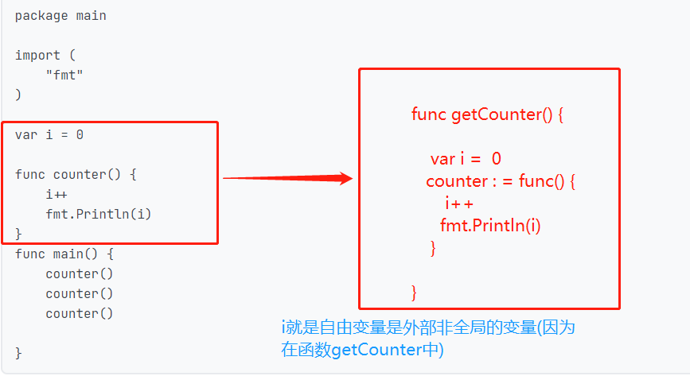
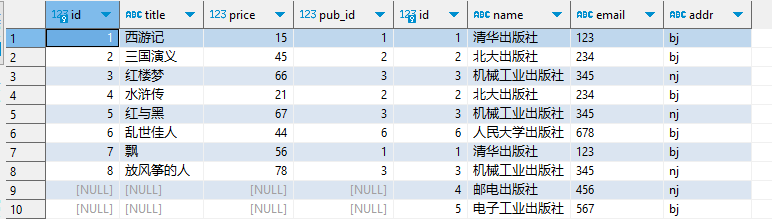

## 1、装饰器函数

当我们谈论装饰器时，就像给一幅画加框一样。想象一下，你有一幅美丽的画，你想让它更加独特、引人注目，于是你决定给它加一个漂亮的框。这个框不会改变画的内容，但它能够为画增添一些额外的特色。

在编程中，函数就像是画，它完成特定的任务。而装饰器就像是给这个函数加的框。它不会改变函数的本质，但可以为函数添加额外的功能，比如在函数执行前后做一些操作，或者修改函数的输出。

举个例子，假设你有一个函数用来计算两个数字的和。现在你想要在计算之前打印一条消息，然后在计算之后再打印一条消息。你可以创建一个装饰器，将这些额外的打印功能包裹在原始函数周围，而不需要修改原始函数本身。这样，原始函数仍然专注于计算，但在被装饰后，会额外执行你添加的打印操作。

举例：

```golang
package main

import "fmt"

// 原始函数
func add(x, y int) int {
    return x + y
}

// 装饰器函数
func decorator(f func(int, int) int) func(int, int) int {
    return func(x, y int) int {
        fmt.Println("执行前操作")
        result := f(x, y)
        fmt.Println("执行后操作")
        return result
    }
}

func main() {
    // 使用装饰器包装原始函数
    decoratedAdd := decorator(add)
    
    // 调用装饰后的函数
    fmt.Println(decoratedAdd(1, 2))
}

```

在这个示例中，decorator 函数接受一个函数作为参数，并返回一个函数。这个返回的函数包装了传入的函数，在执行前后添加了额外的操作。通过调用 decorator 函数，我们可以创建一个装饰后的函数，然后使用它来代替原始函数。

这样做的好处是，我们可以轻松地在不修改原始函数的情况下，添加新的功能或者修改原有功能。


## 2、高阶函数

只要符合下面一种都可以称为高阶函数

1、一个函数如果以一个函数为参数

2、或者一个函数以一个函数作为返回值的时候

函数包括入参和出参以及他们各自的数据类型，入参跟出参都可以是函数，还有他们的数据类型

### 2.1 函数的基本定义

一个函数的定义通常由以下几个部分组成：

1. **函数名**：函数的名称，用于调用。
2. **参数列表**：函数接受的输入参数，多个参数可以用逗号分隔。
3. **返回值类型**：函数的输出类型，可以有多个返回值。
4. **函数体**：执行逻辑的代码块。

```golang
func 函数名(参数列表) 返回值类型 {
    // 函数体
}

//示例
func add(a int, b int) int {
    return a + b
}

```

### 2.2 参数和返回值可以是函数

在 Go 中，函数本身可以作为参数传递给另一个函数，也可以作为返回值从一个函数返回。

````golang
func operate(a int, b int, op func(int, int) int) int {
    return op(a, b)   
}

func add(a int, b int) int {
    return a + b
}

func main() {
    result := operate(3, 5, add) // 将 add 函数作为参数传递
    fmt.Println(result)          // 输出 8
}

//因为  op func(int, int) int  op函数接受两个整数，他会返回一个整数，所以涉及到函数作为参数的时候，他也需要有返回值。这是韩式定义的本质  
````

- **`operate`** 函数有 3 个参数：`a` 和 `b` 是整数，`op` 是一个函数类型的参数，它接受两个 `int` 参数，并返回一个 `int`。
- 在 `main` 函数中，将 `add` 函数作为参数传递给 `operate` 函数。

### 3.3 函数作为返回值

```golang
func multiplier(factor int) func(int) int {
    return func(x int) int {
        return x * factor
    }
}

func main() {
    double := multiplier(2)  // 返回的匿名函数将 `factor` 捕获为 2
    fmt.Println(double(5))   // 输出 10
}

```

**`multiplier`** 函数返回一个匿名函数，这个匿名函数接收一个 `int` 参数并返回它与 `factor` 的乘积。

在 `main` 函数中，`multiplier(2)` 返回了一个函数，这个函数每次被调用时都会将输入乘以 2。

### 3.4 函数定义中的入参与出参

**参数（入参）**：

- 一个函数可以接受任意数量的参数，每个参数都有类型。
- 参数类型可以是基础类型（如 `int`、`string`），也可以是复杂类型（如结构体、函数、接口等）。
- 参数列表的格式是 `参数名 参数类型`，如果有多个参数，它们用逗号分隔。

**返回值（出参）**：

- 一个函数可以返回一个或多个值，每个返回值也有类型。
- 返回值的类型在参数列表后面声明。
- 如果函数没有返回值，则可以省略返回值类型

#### 多个返回值

Go 语言允许函数返回多个值，通常用于返回主结果和错误信息。

```golang
func divide(a int, b int) (int, error) {
    if b == 0 {
        return 0, fmt.Errorf("division by zero")
    }
    return a / b, nil
}

func main() {
    result, err := divide(10, 0)
    if err != nil {
        fmt.Println("Error:", err)
    } else {
        fmt.Println("Result:", result)
    }
}
//返回值有多个的时候可以()括起来
```


## 3、匿名函数


3.1 定义

在 Go 语言中，匿名函数是没有名字的函数，可以直接定义并且立即使用。匿名函数最常见的用途包括作为参数传递给其他函数，或者用于闭包。

匿名函数的基本形式与普通函数类似，唯一的区别是它**没有函数名**。以下是匿名函数的定义和使用方式：

```golang
func(参数列表) 返回值类型 {
    函数体
}
```

匿名函数可以直接定义并立即执行：

```golang
package main

import "fmt"

func main() {
    // 定义并立即执行匿名函数
    func() {
        fmt.Println("This is an anonymous function!")
    }()
}

//直接使用变量
package main
import "fmt"
func main() {
	// 定义并立即执行匿名函数
	speack := func() string {
		return "nihao"
	}()
	fmt.Println(speack)
}

```


没有函数名的函数

golang中，在一个函数内部(比如，main函数),如果想声明一个新的函数，只能用匿名函数

```shell
func main() {
	//foo := func() { return }
	//fmt.Println(foo)
	(func(x int) int {
		fmt.Println(x)
		return x
	})(10)

}
```


匿名函数

函数是必须要有返回值,不能少return 


## 4、闭包

### 4.1 闭包的概念

也蛮难的一个知识点，但是真很会不容易

1.非常重要重要，在开发工作中有1%就正常情况下

2.工作中大部分数据都可以通过if-else等以及数据类型凑出来，但是闭包可以很巧妙的解决一些问题，也比较关键

闭包也可以理解为一个函数，也可以称为闭包函数

官方的概念:  

**是引用了自由变量（外部非全局）的函数。**

这句话看着很扯，作何解释?


实现一个计数器

```golang
package main

import (
	"fmt"
)

var i = 0

func counter() {
	i++
	fmt.Println(i)
}
func main() {
	counter()
	counter()
	counter()

}
```


这样会产生一个问题，数据没法做隔离，会污染全局的变量

### 4.2 闭包的理解

接下来的思想： 就是把功能和数据封装做成一个整体，不影响其他外部的变量等，如果实现呢，就是把功能函数和数据变量通过一个函数来组装起来

修改后的函数如下：通过这个简单的代码，很通俗的能够理解i变量满足的条件，或者说变成闭包的条件

- i不能在功能函数中
- i是非全局变量





**谁引用了这个自由变量，谁就是闭包函数**，最后返回闭包函数

```golang
//代码写法1-将闭包作为返回值，这个匿名函数是一个闭包
package main

import "fmt"

func getCounter() func() {
	var i = 0
	counter := func() {
		i++
		fmt.Println(i)
	}
	return counter
}
func main() {
	counter := getCounter()
	counter()
	counter()
	counter()
}


//代码写法2 
package main

import "fmt"

func getCounter() func() {
	var i = 0
	return func() {
		i++
		fmt.Println(i)
	}
}
func main() {
	counter := getCounter()
	counter()
	counter()
	counter()
}


//代码写法3-将闭包作为返回值的情况
package main

import "fmt"
 //返回的是一个匿名函数，函数的值是int类型的整数
func getCounter() func() int {
	var i = 0
	return func() int {
		i++
		return i
	}
}
func main() {
	counter := getCounter()
	fmt.Println(counter())
	fmt.Println(counter())
	fmt.Println(counter())
}
```


匿名函数定义就是func()这种方式

**解释**

1. **`getCounter` 函数**:
   - `getCounter` 函数内部定义了一个局部变量 `i`，并且返回一个匿名函数。
   - `return func() { i++ fmt.Println(i) }` 是一个匿名函数，它每次被调用时都会递增 `i` 并打印它的值。
   - 这个匿名函数形成了一个闭包，因为它捕获并记住了外部变量 `i` 的状态。
2. **`return` 返回的内容**:
   - `return` 语句返回的是一个类型为 `func()` 的匿名函数。在 Go 语言中，这个匿名函数是没有名字的，但是它能够访问 `getCounter` 函数中的 `i` 变量。
   - 这个匿名函数在 `main` 函数中被赋值给变量 `counter`。
3. **在 `main` 函数中使用**:
   - `counter := getCounter()` 调用 `getCounter` 函数并将返回的匿名函数（闭包）赋值给 `counter` 变量。
   - 当你调用 `counter()` 时，实际上是在调用这个匿名函数，它会递增 `i` 并打印其当前值。

> 思考： 每次调用counter()的时候，正常的时候应该变量会清理掉，但是上面打印会一直存在。所以这个是go编译器给闭包函数的一个功能, 比如上面，  var i 不会依附getCounter,i 会依然存活。


闭包在运行时可以有多个实例，不同的引用环境和相同的函数组合可以产生不同的实例。

```golang
package main

import "fmt"

func getCounter(i int) func() {
	return func() {
		i++
		fmt.Println(i)
	}
}
func main() {
	counter1 := getCounter(10)
	counter1()
	fmt.Println("sleep")
	counter1()
	counter1()
	fmt.Println("=====================")
	counter2 := getCounter(2)
	counter2()
	counter2()
}
```


其他几种用法

### 1. **直接声明和调用闭包**（无需 `return`）

```golang
package main

import "fmt"

func main() {
    var i = 0
    increment := func() {
        i++
        fmt.Println(i)
    }
    
    increment() // 输出: 1
    increment() // 输出: 2
}

```

### 2. **在函数内部直接调用闭包**

```golang
package main

import "fmt"

func doSomething() {
    var message = "Hello, Go!"
    
    func() {
        fmt.Println(message) // 闭包捕获外部变量 message
    }() // 直接调用匿名函数
}

func main() {
    doSomething() // 输出: Hello, Go!
}

```


## 5、结构体

结构体是用来干嘛的?

> 结构体是用来声明自定义数据类型的

方式1 先声明，再赋值

在结构体声明的时候不会实例化一个对象出来

```golang
type Student struct {
    sid int
    name string 
    age  int
    course []string
}
```

实例化一个对象出来，开辟一个空间	

```
func main(){  
 var s  Student  //注意，course赋值会报错，需要初始化
 fmt.Println(s)
 s.sid = 10001
}
//s是Student的实例对象,后面没有赋值的都是按照默认值
```

难点： 了解底层存储原理

方式2  声明并赋值

```shell
var s = Student{sid: 1002,name: "zhang", age: 21}
var s = Student{sid: 1002,name: "zhang", age: 21,course:nil}  //多值赋值
```

结构体实例化方式4

```golang
func main(){
   var s1 = new(Student)  //这种方式相当于  &Student{},相当于把指针地址给s1
}
```

结构体的方法接收器,在python和Java中，是直接在class student() {} 全部包裹在一起，但是在golang中，是通过方法指定的方式指定属于哪个结构体。


```shell
package main

import "fmt"

type Student struct {
	sid    int
	name   string
	age    int
	course []string
}

func NewStudent(sid int, name string, age int, course []string) Student {
	return Student{
		sid:    sid,
		name:   name,
		age:    age,
		course: course,
	}
}

// Student类型的方法接收器
func (s Student) read(book string) {
	fmt.Printf("%s正在读%s\n", s.name, book)
}

func (s Student) learn() {
	fmt.Println("%s正在学习\n", s.name)
}

func main() {
	s1 := NewStudent(1001, "rain", 32, []string{"", "", ""})
	fmt.Println(s1)
	fmt.Println(s1.name)
	fmt.Println(s1.age)
	s1.read("ssss")
	s1.learn()

	s2 := NewStudent(10001, "eric", 32, []string{"", "", ""})
	s2.learn()
	s2.read("金瓶梅")

}
```


### 5.1 结构体的匿名字段


深层次的变量查找

```golang
package main

import "fmt"

type Addr struct {
	provice   string
	city      string
	xiancheng string
}

type Student struct {
	name string
	age  int
	Addr Addr   //这种字段名跟结构体名一样的情况，可以嵌套通过.查询，但是不能够自动查询
}

func main() {
	s := Student{"zhanglaiqiang", 22, Addr{"北京市", "昌平区", "海淀区"}}
	fmt.Println(s.Addr)
	fmt.Println(s.Addr.xiancheng)
	fmt.Println(s.xiancheng)  //这个是查询不到的
 }
```


结构体匿名字段查询

```golang
package main

import "fmt"

type Addr struct {
	provice   string
	city      string
	xiancheng string
}

type Student struct {
	name string
	age  int
	Addr   //当字段名跟声明的结构体名称一样的情况下，可以单独写一个,golang能够自动查询
}

func main() {
	s := Student{"zhanglaiqiang", 22, Addr{"北京市", "昌平区", "海淀区"}}
	fmt.Println(s.Addr)
	fmt.Println(s.Addr.xiancheng)
	fmt.Println(s.xiancheng)  //这个是可以查询到的 
}
```


### 5.2 结构体标签

**举例1**

config.yaml

```
server:
  port: 8080
  host: "localhost"

database:
  user: "admin"
  password: "secret"
  name: "mydb"
```

实现一个读取配置文件的案例

```golang
package main

import (
    "fmt"
    "gopkg.in/yaml.v3"
    "io/ioutil"
    "log"
)

type Config struct {
    Server struct {
        Port int    `yaml:"port"`
        Host string `yaml:"host"`
    } `yaml:"server"`

    Database struct {
        User     string `yaml:"user"`
        Password string `yaml:"password"`
        Name     string `yaml:"name"`
    } `yaml:"database"`
}

func main() {
    // 读取文件
    data, err := ioutil.ReadFile("config.yaml")
    if err != nil {
        log.Fatalf("Error reading YAML file: %v", err)
    }

    // 创建Config实例
    var config Config

    // 解析YAML文件
    err = yaml.Unmarshal(data, &config)
    if err != nil {
        log.Fatalf("Error parsing YAML file: %v", err)
    }

    // 输出读取的配置
    fmt.Printf("Server host: %s\n", config.Server.Host)
    fmt.Printf("Server port: %d\n", config.Server.Port)
    fmt.Printf("Database user: %s\n", config.Database.User)
    fmt.Printf("Database name: %s\n", config.Database.Name)
}
```

细节介绍：

对下面部分展开细说

在 Go 语言中，结构体标签（Struct Tags）是用于给结构体字段添加元数据的特殊字符串。它们通常用于在序列化和反序列化过程中指定字段的名称和其他特性。在你的代码中，`yaml:"database"` 这种写法就是使用了结构体标签。

**结构体标签的作用**

```golang
type Config struct {
    Server struct {
        Port int    `yaml:"port"`
        Host string `yaml:"host"`
    } `yaml:"server"`

    Database struct {
        User     string `yaml:"user"`
        Password string `yaml:"password"`
        Name     string `yaml:"name"`
    } `yaml:"database"`
}
```

**逐部分解释**

1. **结构体定义**：
   - `Server` 和 `Database` 是嵌套在 `Config` 结构体中的两个结构体字段。
   - 这两个字段对应 YAML 配置文件中的顶级键 `server` 和 `database`。
2. **结构体标签**：
   - 每个结构体字段下面有一个结构体标签，例如 `yaml:"port"`、`yaml:"host"`、`yaml:"database"`。
   - 结构体标签是跟在字段定义后面的，以反引号包裹的字符串。
3. **`yaml:"database"` 标签**：
   - `yaml:"database"` 标签告诉 YAML 解析器，当它遇到 `database` 这个键时，将其映射到 `Config` 结构体中的 `Database` 字段。
   - 这意味着，YAML 文件中 `database` 下面的键（例如 `user`、`password`、`name`）会对应到 `Database` 结构体中的相应字段。
4. **字段名称与标签的关系**：
   - 如果结构体字段名与 YAML 中的键名相同（忽略大小写），则标签是可选的，结构体字段会自动映射到对应的 YAML 键。
   - 如果你希望使用不同的名称，或者 YAML 文件中的键名和 Go 结构体字段名不一致，可以通过结构体标签来明确映射关系

**结构体标签的通用性**

结构体标签不仅可以用于 YAML，还可以用于其他序列化格式（如 JSON、XML）。不同的序列化库会根据标签中的指示，来决定如何处理字段的序列化和反序列化。

例如，对于 JSON，你可以写：

```golang
User string `json:"user"`
```

这表示当序列化为 JSON 时，`User` 字段应对应 JSON 中的 `user` 键。

**总结**

**`yaml:"database"`**：是一个结构体标签，指定了 YAML 文件中的 `database` 键映射到 Go 结构体中的 `Database` 字段。

结构体标签通过告诉序列化/反序列化库如何处理字段，从而使得 Go 代码与外部数据格式之间的映射更加灵活。

**举例说明2:**

使用不同的名称，或者 YAML 文件中的键名和 Go 结构体字段名不一致，可以通过结构体标签来明确映射关系

假设场景

假设你有一个 YAML 配置文件，其中的键名不是很适合作为 Go 结构体的字段名。例如：

```
server_config:
  port_number: 8080
  server_host: "localhost"
```

在这个 YAML 文件中：

- `server_config` 是顶级键。
- `port_number` 和 `server_host` 是 `server_config` 下的键。

现在假设你不想让 Go 结构体中的字段名称直接使用这些键名，而是希望使用更简洁或更符合 Go 语言命名习惯的字段名。

**解决方案：使用结构体标签**

你可以通过结构体标签来映射 YAML 键名与 Go 结构体字段名的不一致。以下是如何实现的代码：

```golang
go
复制代码
package main

import (
    "fmt"
    "gopkg.in/yaml.v3"
    "io/ioutil"
    "log"
)

type Config struct {
    ServerConfig struct {
        Port int    `yaml:"port_number"`  // port_number 对应 YAML 中的键名
        Host string `yaml:"server_host"`  // server_host 对应 YAML 中的键名
    } `yaml:"server_config"`  // server_config 对应 YAML 中的顶级键
}

func main() {
    // 读取文件
    data, err := ioutil.ReadFile("config.yaml")
    if err != nil {
        log.Fatalf("Error reading YAML file: %v", err)
    }

    // 创建 Config 实例
    var config Config

    // 解析 YAML 文件
    err = yaml.Unmarshal(data, &config)
    if err != nil {
        log.Fatalf("Error parsing YAML file: %v", err)
    }

    // 输出读取的配置
    fmt.Printf("Server host: %s\n", config.ServerConfig.Host)
    fmt.Printf("Server port: %d\n", config.ServerConfig.Port)
}
```

解释

1. **`server_config` 映射到 `ServerConfig`**：
   - `yaml:"server_config"` 标签告诉 YAML 解析器，YAML 文件中的 `server_config` 键对应到 Go 结构体的 `ServerConfig` 字段。
2. **`port_number` 映射到 `Port`**：
   - `yaml:"port_number"` 标签将 YAML 文件中的 `port_number` 键映射到 Go 结构体中的 `Port` 字段。
3. **`server_host` 映射到 `Host`**：
   - `yaml:"server_host"` 标签将 YAML 文件中的 `server_host` 键映射到 Go 结构体中的 `Host` 字段。

YAML 文件内容 (`config.yaml`)

```yaml
server_config:
  port_number: 8080
  server_host: "localhost"
```

输出结果

当你运行这个 Go 程序时，它会输出：

```yaml
Server host: localhost
Server port: 8080
```

总结

通过使用结构体标签，你可以在 Go 结构体中使用更符合 Go 命名规范的字段名，而不必严格遵循 YAML 文件中的键名。这样，代码更易读且符合语言习惯，同时仍然能够正确地映射和处理配置文件中的数据。

以上犯错记录:


**解释：**

- **字段名称：** 通过将字段名称 (`DiskPath`, `UsageThreshold` 等) 首字母大写，这些字段就变成了导出字段，可以被 YAML 解析正确读取。
- **使用：** 修改后，程序应该可以正确地从 `config.yaml` 文件中读取 `diskPath` 和其他字段的值。

### 5.3 封装，继承， 多态


继承需要学习

结构体的继承，继承就是需要解决的问题就是代码复用的问题

先看第一组代码

```golang
package main

import "fmt"

type Dog struct {
	Name string
	Kind string
}

func (d *Dog) eat() {
	fmt.Printf("%s is eating!\n", d.Name)
}

func (d *Dog) sleep() {
	fmt.Printf("%s is sleeping!\n", d.Name)
}

// Cat类型
type Cat struct {
	Name string
}

func (c *Cat) eat() {
	fmt.Printf("%s is eating!\n", c.Name)
}

func (c *Cat) sleep() {
	fmt.Printf("%s is sleep!\n", c.Name)
}

func main() {
	dog := Dog{"金毛", "狗"}
	dog.eat()

	cat := Cat{"miaomaio"}
	cat.eat()
}  
//以上狗和猫都能实现吃和睡觉，但是都是通过结构体绑定实现的，但是这种问题就是代码没有复用
```


 然后通过代码复用的方式来实现，下面是通过继承的方式来实现

```golang
package main

import "fmt"

// 定义动物的公共属性
type Animal struct {
	Name string
}

func (a *Animal) eat() {
	fmt.Printf("%s is eating!\n", a.Name)
}

func (a *Animal) sleep() {
	fmt.Printf("%s is sleep !\n", a.Name)
}

// 定义狗的属性
type Dog struct {
	Kind string
	Animal
}

func (d *Dog) bark() {
	fmt.Printf("%s is barking!\n", d.Name)
}

// 定义猫的属性
type Cat struct {
	Kind string
	Animal
}

func main() {
	dog := Dog{"哈士奇", Animal{"aaa"}}
	dog.eat()
	dog.sleep()
	dog.bark() //这个是给狗的特有属性，就绑定到狗的属性中
	cat := Cat{"miaomiao", Animal{"bbb"}}
	cat.eat()
	cat.sleep()
}
```


### 5.4 序列化

接口提供的数据需要进行序列化，通过json实现数据发送，客户端获取到json数据后，实现json饭序列化。 这个很重要，需要好好学习

```golang
package main

import (
	"encoding/json"
	"fmt"
)

type Addr struct {
	Province string
	City     string
}

type Stu struct {
	Name string `json:"rename"`
	Age  int    `json:"-"`
	Addr Addr
}

func main() {
	var student = Stu{"zhanglaiqiang", 22, Addr{"gansu", "lanzhou"}}
	jsonStuMap, _ := json.Marshal(student)
	fmt.Println(string(jsonStuMap))

	//反序列化-通过map的方式
	var StuMap map[string]interface{}
	err := json.Unmarshal(jsonStuMap, &StuMap)

	if err != nil {
		return
	}
	fmt.Println(StuMap)
	fmt.Println(StuMap["Age"])

	//通过结构体的方式进行反序列化
	jsonStuStruct, _ := json.Marshal(student)
	var StuStruct Stu
	err = json.Unmarshal(jsonStuStruct, &StuStruct)
	if err != nil {
		return
	}
	fmt.Println(StuStruct, StuStruct.Name)

	var s1 = Stu{"s1", 18, Addr{"甘肃", "兰州"}}
	var s2 = Stu{"s2", 18, Addr{"甘肃", "兰州"}}
	var s3 = Stu{"s3", 18, Addr{"甘肃", "兰州"}}

	var data = []Stu{s1, s2, s3}
	json_data, _ := json.Marshal(data)
	fmt.Println(string(json_data))

	var data2 []Stu
	json.Unmarshal(json_data, &data2)
	fmt.Println(data2, data2[1].Name)

}
```


注意： 

```golang
type Stu struct {
	Name string `json:"rename"`  //表示在序列化之后显示的名称
	Age  int    `json:"-"`        //-表示不显示
	Addr Addr
}
```


切片中存放结构体对象 

```golang
type Customer struct  {
 cid  int
 name string
 age int
 gender string
 email string
}


var  customers []Customer
type Customer []Customer  #如果之前是map,可以把map对象换成Customer

customers = append(customers, NewCustomer) //添加这一步都不需要改动
```


结构体语法糖

```go
结构体指针的操作
var updateCustomer *Customer
updateCustomer = &customers[updateIndex]

//取值操作
updateCustomer.name 相当于  *updateCustomer.name   go语言中只是默认可以省略了* ,能够自动添加
```


类型中，还有一种byte类型，就只表示一个字符

在切片中可以存放map,或者结构体对象，然后实现对象的操作，增删改查


## 6、面向对象过程思维

面向过程洗衣服

1.将衣服放在洗衣机

2.倒入洗衣液

3.洗涤衣服

4.脱水

5.甩干

6.晾晒

每个过程相当于一个函数，一个一个执行完就结束了。 


面向对象编程

人对象- 人类型

洗衣机- 洗衣机类型


1. 人.将衣服放在洗衣机()
2. 人.倒入洗衣液()
3. 洗衣机.洗涤衣服()
4. 洗衣机.脱水()
5. 洗衣机.甩干()
6. 人.晾晒()

例如： 

```golang
type  Person struct{
 
   name string
   age  int
}


func (p Person) foo(){
   address string
}

p1 = Person{name: "yuan","age": 22}
p1.foo()
fmt.Println(p1.addres)
```

这就是将某个方法归属在某个类型下，而对象完成对他的调用

```golang
在上面中，方法就是func , 类型就是Person ，而对象就是p1
```


相关视频参考07day/07 客户关系管理系统-函数结构体版本（3）


## 7、包管理

**go-path**

就是一个问价夹，一般包的名称就其源文件所在目录的名称

1.11版本之前，遵循gopath包管理

1.11版本之后，遵循gomodule的包管理


 注意： 需要在goland中取消gomodule  


在gopath中自动在src下  `${gopath}/src`

src是自动去找的。项目都需要在src下创建(必须)


go-mod

go mod init mysite

go mod tidy  //清扫拉取第三方库

go mod vendor  //第三包保存到本地


## 8、并发

创建并发

- 主死从随
- 同步锁

```golang
func read(){
  defer  wg.Done()  //执行完了执行done一下，就减去1
  time.Sleep(time.Second*3)
  fmt.Println('hello,world')
}

func listen(){
  defer  wg.Done()  //执行完了执行done一下，就减去1
  time.Sleep(time.Second*5)
  fmt.Println('hello,world')
}


var wg sync.WaitGroup //定义一个同步锁定时器

//执行的主函数定义
func main(){
  start := time.Now().Unix()
  wg.Add(2)  //创建了两个同步锁
  go read()
  go listen()
  
  wg.Wait()  //计数器为0的时候继续往下走
  end := time.Now().Unix()
  fmt.Println(end-start)
}
```


- 互斥锁

sync.Mutex

这个代码如果不使用互斥锁，可能每次累加之后结果不一定为100

````go
package main

import (
	"fmt"
	"sync"
)

var wg sync.WaitGroup
var lock sync.Mutex
var x = 0

func add() {
	x++
	wg.Done()
}

func main() {
	wg.Add(100)
	for i := 0; i < 100; i++ {
		go add()
	}
	wg.Wait()
	fmt.Println(x)
}
````

通过互斥锁的方式来实现

```go
package main

import (
	"fmt"
	"sync"
)

var wg sync.WaitGroup
var lock sync.Mutex
var x = 0

func add() {
   //在锁期间，其他携程不能计算，只有当前携程执行完，其他携程竞争继续执行当前返回的结果
	lock.Lock()
	x++
	lock.Unlock()   
  time.Sleep(time.Millisecond * 100)  //这个点需要理解，非常有意思-第一个携程做完+1之后等待0.1s,第二个抢到锁之后，又等待0.1s,以此类推，因为每个携程在做加法计算时，时间可以忽略不计，所以大概也就0.1s左右，每个携程前面的要比后面的执行早一点，所以会有一点点时间差
  wg.Done()
}

func main() {
	wg.Add(100)
	for i := 0; i < 100; i++ {
		go add()
	}
	wg.Wait()
	fmt.Println(x)
}
```

锁这种机制就是串型化，要解决阻塞的地方


## 9、channel

### 9.1 channel使用

silice, map, channel都是引用类型

注意点： 

- 值拷贝， 只是地址拷贝，并非重新开辟空间
- 先进先出，就是先进入channel的，在输出的时候先打印
- 单向通道，默认双向通道支持可写可读，也可以设置成单向通道

```go
package main
import "fmt"
func foo(ch chan int) {
	fmt.Println(<-ch)
}
func main() {
	chan01 := make(chan int, 3)
	chan01 <- 1
	chan01 <- 2
	chan01 <- 3
	chan02 := chan01
	fmt.Println(<-chan02)
	fmt.Println(<-chan02)
	chan02 <- 100
	chan02 <- 300
	fmt.Println(<-chan01)
	fmt.Println(<-chan01)
	foo(chan02)  //使用函数还是引用地址
}

输出结果： 
1
2
3
100
300

```


如果管道想要实现通过.来访问结构体的属性，如何实现呢

```go
type Msg struct {
	content string
	from    string
}

func main() {
	var ch02 = make(chan interface{}, 3)
	ch02 <- "hello"
	ch02 <- true
	ch02 <- Msg{content: "hello", from: "zhang"}
	fmt.Println(<-ch02)
	fmt.Println(<-ch02)
	fmt.Println((<-ch02).(Msg).from)   //	fmt.Println(<-ch02.from)这种方法肯定报错
}

输出结果：
hello
true
zhang
```


以上出现这种deadlock是因为没有子携程，就会出现这种情况

```go

func main() {
	var chan01 = make(chan int, 3)
	chan01 <- 1
	chan01 <- 2
	chan01 <- 3
	//close(chan01)
	x, ok := <-chan01
	//false表示通道关闭，true表示通道开启
	fmt.Println(x, ok)
	for i := range chan01 {
		fmt.Println(i)
	}
}


//改进后
func main() {
	var chan01 = make(chan int, 3)
	chan01 <- 1
	chan01 <- 2
	chan01 <- 3
	close(chan01)         //添加此处，写结束后需要关闭通道，这样读携程就能知道是已经写结束了
	x, ok := <-chan01
	//false表示通道关闭，true表示通道开启
	fmt.Println(x, ok)
	for i := range chan01 {
		fmt.Println(i)
	}
}

```

> 遍历之前一定要close管道


案例-生产者和消费者模式

```go
package main

import (
	"fmt"
	"sync"
)

var wg sync.WaitGroup

// 单向通道，只能写入
func producer(ch chan<- interface{}) {
	defer wg.Done()
	for i := 0; i < 5; i++ {
		ch <- i
		fmt.Println("producer产生了 ", i)
	}
}

// 单向通道，只能读取
func consummer(ch <-chan interface{}) {
	defer wg.Done()
	for i := 0; i < 10; i++ {
		i := <-ch
		fmt.Println("consummer消费了", i)
	}
}

func main() {
	ch1 := make(chan interface{})
	wg.Add(2)
	go producer(ch1)  // 启用goroutine从通道接收值
	go consummer(ch1) // 启用goroutine从通道接收值

	wg.Wait()
	fmt.Println("end")
}
```

生产环境中，一般是生产者大于消费者，或者消费者大于生产者。

**在上面的这种方式中，如果消费者携程检测到写的携程不存在，那么就会出现deadlock**

避免出现deadlock，在写结束后可以close()，这样就可以避免报错

```go
var wg sync.WaitGroup

// 单向通道，只能写入
func producer(ch chan<- interface{}) {
	defer wg.Done()
	for i := 0; i < 5; i++ {
		time.Sleep(time.Second * 2)
		ch <- i
		fmt.Println("producer产生了 ", i)
	}
	close(ch)
}

// 单向通道，只能读取
func consummer(ch <-chan interface{}) {
	defer wg.Done()
	for i := range ch {
		fmt.Println("consummer消费了", i)
	}
}

func main() {
	ch1 := make(chan interface{})
	wg.Add(2)
	go producer(ch1)  // 启用goroutine从通道接收值
	go consummer(ch1) // 启用goroutine从通道接收值

	wg.Wait()
	fmt.Println("end")
}
```

###  9.2 channel中的select

在 Go 中，`select` 语句用于同时监听多个通道（channel）。它的作用类似于 `switch` 语句，但专门用于处理通道的通信。`select` 会在多个通道中选择一个可操作的分支执行，常见的场景包括超时处理、异步操作、以及处理多个异步任务之间的竞争。

`select` 在 Go 中的执行机制并不是基于"执行结果为 true",它的行为是 **基于通道的可操作性**，即**哪个通道已经准备好进行操作**，`select` 就会执行对应的分支。它会等待通道的发送或接收操作变为可执行状态，而不是检查条件是否为 `true`。

具体解释

- **通道准备就绪**：`select` 等待某个通道有数据可接收（对于 `<-channel`），或准备好接收数据（对于 `channel <- value`）。当某个通道满足条件时，它就会选择执行该分支。
- **没有就绪的通道**：如果所有的通道都没有准备好，`select` 会阻塞，直到某个通道可用。除非使用了 `default` 分支，此时 `select` 会立即执行 `default` 分支而不阻塞。

```go
package main

import (
    "fmt"
    "time"
)

func main() {
    ch := make(chan string)

    go func() {
        time.Sleep(1 * time.Second)
        ch <- "数据准备好了"
    }()

    select {
    case msg := <-ch:
        fmt.Println("接收到:", msg)
    case <-time.After(2 * time.Second):
        fmt.Println("超时")
    }
}

```

在 Go 中，`<-time.After(2 * time.Second)` 这一行代码创建了一个通道，并在 2 秒后向该通道发送一个值。然而，`time.After` 返回的通道本身并不会将这个值提供给任何变量。它只是触发一个超时事件，值被接收后触发相应的操作。

具体来说，`time.After` 会创建一个定时器，2 秒之后，定时器会自动向这个通道发送一个空值（实际上是一个 `time.Time` 类型的值，但在这里并没有用到）。然后 `select` 会监听这个通道，一旦有值进入，`case <-time.After(2 * time.Second)` 就会触发，执行对应的分支代码。这个值不会被保存到任何变量中，因为我们只关心时间超时后的事件触发，而不是这个具体值。


## 10、数据库

#### 数据库表与表的关系

-- 版本2
-- 一对多关系：一张表中的一条记录对应另外一张表中的多条记录（单向的）

​     建立一对多的关系：在多的表中创建关联字段

​     比如：  book表跟出版社，一个出版社可以对应多本书 ,这样做的好处就是可以节约空间


-- 多对多关系：一张表中的一条记录对应另外一张表中的多条记录（双向的）

   建立多对多的关系：创建第三章关系表

   比如： 作者和出版的书籍，一个作者可以对应多个书籍，一本书籍也可以对应多个作者


-- 一对一关系：一张表中的一条记录对应另外一张表中的一条记录（双向的）

   建立一对一的关系：在两张表中的任意一张中创建关联字段(unique唯一约束)

   比如作者跟作者信息，一个作者对应一个作者自己的个人信息author表跟authorDetail表


book

id    title  price pub_date   publish_id
 1   西游记   199  1000-1-1    1
 2   西厢记   299  1200-1-1    1
 3   金瓶梅   399  1200-1-1    1
 4   水浒传   499  1200-1-1    2

publish
id     name         email        addr        tel
 1   苹果出版社    123@qq.com    beijing      110
 2   橘子出版社    234@qq.com    beijing      911

author

id     name      gender   ad_id(unique)
 1     alex       男        1
 2     rain       男        2

authorDetail

id   addr   tel   gf     xueli
 1   北京    110   铁锤    本科
 2   北京    321   钢弹    专科


book2author

id  book_id   author_id
 1     1          1
 2     1          2
 2     2          2


简单总结：

一对多

​    在多的表中创建关联字段

多对多

   需要创建第三张表做关联，一般就是三个字段，主键之外，就是两个关联字段

一对一

   在两张表中任意一个表创建关联字段

#### 创建表和插入数据

```sql
/*-- 书籍表
CREATE TABLE book(
                     id INT PRIMARY KEY AUTO_INCREMENT,
                     title VARCHAR(32),
                     price DOUBLE(5,2),
pub_id INT NOT NULL
)ENGINE=INNODB CHARSET=utf8;


-- 出版社表
CREATE TABLE publisher(
                          id INT PRIMARY KEY AUTO_INCREMENT,
                          name VARCHAR(32),
                          email VARCHAR(32),
                          addr VARCHAR(32)
)ENGINE=INNODB CHARSET=utf8;

-- 插入数据
INSERT INTO book(title,price,pub_id) VALUES
                                         ('西游记',15,1),
                                         ('三国演义',45,2),
                                         ('红楼梦',66,3),
                                         ('水浒传',21,2),
                                         ('红与黑',67,3),
                                         ('乱世佳人',44,6),
                                         ('飘',56,1),
                                         ('放风筝的人',78,3);

INSERT INTO publisher(id,name,email,addr) VALUES
                                              (1,'清华出版社',"123","bj"),
                                              (2,'北大出版社',"234","bj"),
                                              (3,'机械工业出版社',"345","nj"),
                                              (4,'邮电出版社',"456","nj"),
                                              (5,'电子工业出版社',"567","bj"),
                                              (6,'人民大学出版社',"678","bj");


*/

/*-- 作者表
CREATE TABLE author(
                       id INT PRIMARY KEY AUTO_INCREMENT,
                       NAME VARCHAR(32) NOT NULL
)ENGINE=INNODB CHARSET=utf8;

-- 作者表和书籍表的多对多关系表
CREATE TABLE book2author(
                            id INT NOT NULL UNIQUE AUTO_INCREMENT,
                            author_id INT NOT NULL,
                            book_id INT NOT NULL
)ENGINE=INNODB CHARSET=utf8;

-- 插入数据

INSERT INTO author(NAME) VALUES
                             ('yuan'),
                             ('rain'),
                             ('alvin'),
                             ('eric');

-- 插入关系数据
INSERT INTO book2author(author_id,book_id) VALUES
                                               (1,1),
                                               (1,2),
                                               (2,1),
                                               (3,3),
                                               (3,4),
                                               (1,3);*/


CREATE TABLE authorDetail(
                             id INT PRIMARY KEY AUTO_INCREMENT,
                             tel VARCHAR(32),
                             addr VARCHAR(32),
                             author_id INT NOT NULL unique -- 也可以给author添加一个关联字段：   alter table author add authorDetail_id INT NOT NULL
)ENGINE=INNODB CHARSET=utf8;

-- 插入数据
INSERT INTO authorDetail(tel,addr,author_id) VALUES
                                                 ("110","北京",1),
                                                 ("911","成都",2),
                                                 ("119","上海",3),
                                                 ("111","广州",4);
```


#### join查询

```sql 
create database student
use student


CREATE TABLE book(
                     id INT PRIMARY KEY AUTO_INCREMENT,
                     title VARCHAR(32),
                     price DOUBLE(5,2),
pub_id    INT NOT NULL
)ENGINE=INNODB CHARSET=utf8;


CREATE TABLE publisher(
                          id INT PRIMARY KEY AUTO_INCREMENT,
                          name VARCHAR(32),
                          email VARCHAR(32),
                          addr VARCHAR(32)
)ENGINE=INNODB CHARSET=utf8;


INSERT INTO book(title,price,pub_id) VALUES
                                         ('西游记',15,1),
                                         ('三国演义',45,2),
                                         ('红楼梦',66,3),
                                         ('水浒传',21,2),
                                         ('红与黑',67,3),
                                         ('乱世佳人',44,6),
                                         ('飘',56,1),
                                         ('放风筝的人',78,3);

INSERT INTO publisher(id,name,email,addr) VALUES
                                              (1,'清华出版社',"123","bj"),
                                              (2,'北大出版社',"234","bj"),
                                              (3,'机械工业出版社',"345","nj"),
                                              (4,'邮电出版社',"456","nj"),
                                              (5,'电子工业出版社',"567","bj"),
                                              (6,'人民大学出版社',"678","bj");

CREATE TABLE author(
                       id INT PRIMARY KEY AUTO_INCREMENT,
                       NAME VARCHAR(32) NOT NULL
)ENGINE=INNODB CHARSET=utf8;


CREATE TABLE book2author(
                            id INT NOT NULL UNIQUE AUTO_INCREMENT,
                            author_id INT NOT NULL,
                            book_id INT NOT NULL
)ENGINE=INNODB CHARSET=utf8;


INSERT INTO author(NAME) VALUES
                             ('yuan'),
                             ('rain'),
                             ('alvin'),
                             ('eric');


INSERT INTO book2author(author_id,book_id) VALUES
                                               (1,1),
                                               (1,2),
                                               (2,1),
                                               (3,3),
                                               (3,4),
                                               (1,3);
                                              
                                              
CREATE TABLE authorDetail(
                             id INT PRIMARY KEY AUTO_INCREMENT,
                             tel VARCHAR(32),
                             addr VARCHAR(32),
                             author_id INT NOT NULL unique -- 也可以给author添加一个关联字段：   alter table author add authorDetail_id INT NOT NULL
)ENGINE=INNODB CHARSET=utf8;                                              
                                              
         
INSERT INTO authorDetail(tel,addr,author_id) VALUES
                                                 ("110","北京",1),
                                                 ("911","成都",2),
                                                 ("119","上海",3),
                                                 ("111","广州",4);


                                                
 -- 子查询三国演义的出版社名称
 use student
 SELECT  id from book WHERE title="三国演义"
 SELECT  name from publisher WHERE  id=2
               
 
-- 查询手机号等于110的作者出版过哪些书籍名称
 
SELECT author_id  from authorDetail ad  WHERE tel="110"
 
SELECT * from book2author WHERE author_id = "1"  -- 1,2,3
SELECT * from book WHERE id in (1,2,3)


-- join 查询三国演义的出版社的名称
一本书籍对应一个出版社
select * from book, publisher -- 这种会形成笛卡尔积
select * from book, publisher  where book.pub_id  = publisher.id


SELECT *  
    from book, publisher  
    WHERE  book.pub_id  = publisher.id 
       and  title = "三国演义"

       
SELECT  *
    from book
         inner join publisher on book.pub_id  = publisher.id
         WHERE  title ="三国演义"
      

-- left join right join 
select * 
    from book
       inner join publisher on book.pub_id = publisher.id
       
 select * 
    from book
       left join publisher on book.pub_id = publisher.id      
       
   
  select * 
    from book
       right join publisher on book.pub_id = publisher.id       
```


右查询，以右边的表为基准




涉及到多表查询

这里查询会涉及到三张表的查询

 -- 查询yuan出版的书籍名称(这个是属于多表查询)

```sql
 SELECT  * from author 
 select * from  book,book2author 
 select * from book2author
 

 SELECT * from book inner join book2author  
          on book.id = book2author.book_id
          inner  join author 
           on book2author.author_id = author.id 
           WHERE  author.NAME ="yuan"
```


 -- 查询手机号110的作者出版过哪些书籍名称

```sql
SELECT  * from author 
select * from authorDetail

 SELECT  * from book 
          inner join book2author 
                  on book.id = book2author.book_id
          inner join author
                  on book2author.author_id = author.id
          inner join authorDetail
                  on author.id = authorDetail.author_id
 WHERE authorDetail.tel = "911"
```


## 11、常见的一些库

```
log.Fatalf() //输出日志打印，并且获取执行状态码，退出执行
```
