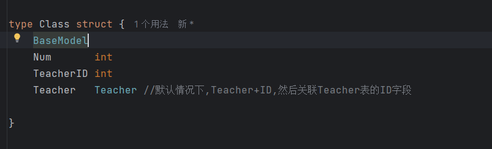
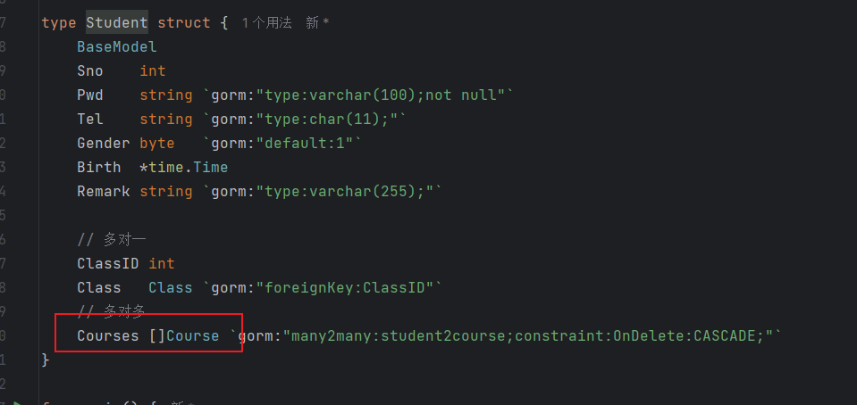
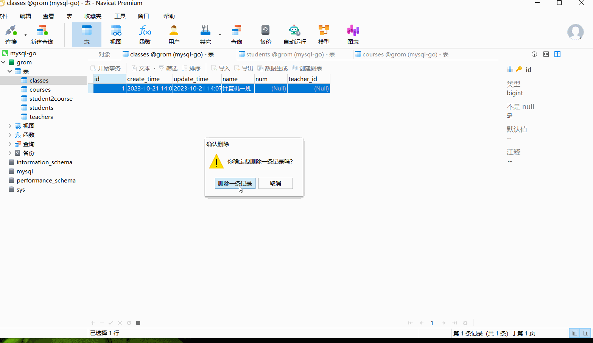
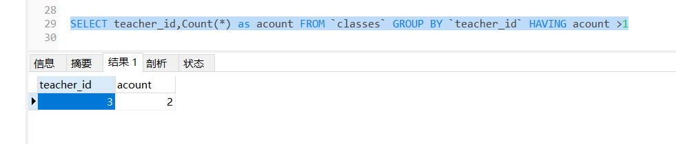
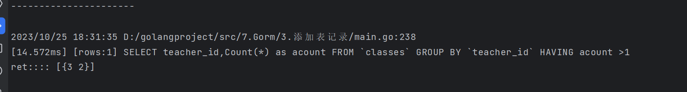

## 创建表的继承和关联表

### 关于Class表的一些说明:

Teacher -->  Teacher理解，首先Teacher会自动添加ID,然后去关联表Teacher中的id字段。



在数据库中查看


### 关于Student表的一些说明

按照如图，解释



```shell
t1 := Teacher{ID=1,name="zhang",...}

c1 = Class{Name:"软件一班", TeacherID=1}

c1.Teacher (gorm: TeacherID=1 --> sql --> Teacher{ID=1,name="zhang",...})

```

总结: 

1) 多对多的时候,上面gorm会自动创建第三章关联表 student2course,当然也可以通过手动创建结构体实现，但是这样不利于自动获取值。

2) 多对多关系,一个学生可以有多门课程，当然，一门课程也可以有多个学生。所以就是多对多关系,需要新建一个表来做关联


### 外键关联自动删除

constraint:OnDelete:CASCADE 添加此配置,就是连带外键的数据就自动删除

如果不添加此项,那就是在删除的时候，必须先要删除在关联使用表中的数据,才能删除




## GORM根据查询结果生成第三章数据表


```golang
	// 查询每一个teacher_id 的课程个数
	type Ret struct {
		TeacherID int
		Acount    int
	}
	var ret []Ret
	fmt.Println("----------------------")
	//db.Model(&Class{}).Select("teacher_id,Count(*) as acount").Group("teacher_id").Having("acount >?", 1).Scan(&ret) //需要巩固学习
	db.Model(&Class{}).Select("teacher_id,Count(*) as acount").Group("teacher_id").Having("acount >?", 1).Find(&ret) //需要巩固学习
	fmt.Println("ret::::", ret)
```




执行代码




详细说明: 

1. `db.Model(&Class{})`：这部分代码用于指定要操作的数据库模型。`&Class{}` 表示你要操作名为 `Class` 的模型，通常对应数据库中的一个表。
2. `.Select("teacher_id,Count(*) as count")`：这一部分用于选择查询的列。它指定了两列：`teacher_id` 和 `Count(*) as count`。`Count(*)` 是一个聚合函数，用于计算每个教师的记录数量，而 `as count` 是为了给计数结果指定一个别名，以便在后续的`Having`子句中引用。
3. `.Group("teacher_id")`：这一部分用于对查询结果进行分组，按照 `teacher_id` 列的值分组。这是因为前面使用了聚合函数，所以需要指定分组列。
4. `.Having("count > ?", 1)`：这是一个筛选条件，用于过滤分组后的结果。它指定了只返回那些分组中的记录数量（即 `count`）大于1的分组。
5. `.Scan(&ret)`：最后，使用 `Scan` 方法将查询结果存储到名为 `ret` 的切片中。`ret` 的类型应该与查询结果的结构匹配，通常是一个结构体切片，每个结构体对应查询的一行记录。

总之，这段代码的目的是从数据库中选择 `teacher_id` 和每个教师的记录数量，然后对结果进行分组，最后筛选出记录数量大于1的分组。查询结果存储在 `ret` 中。


将代码存储到ret列表中的两种方式，都可以

```golang
db.Model(&Class{}).Select("teacher_id,Count(*) as acount").Group("teacher_id").Having("acount >?", 1).Scan(&ret) //需要巩固学习
	db.Model(&Class{}).Select("teacher_id,Count(*) as acount").Group("teacher_id").Having("acount >?", 1).Find(&ret) //需要巩固学习
```

