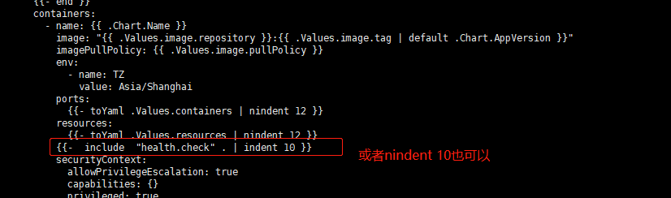
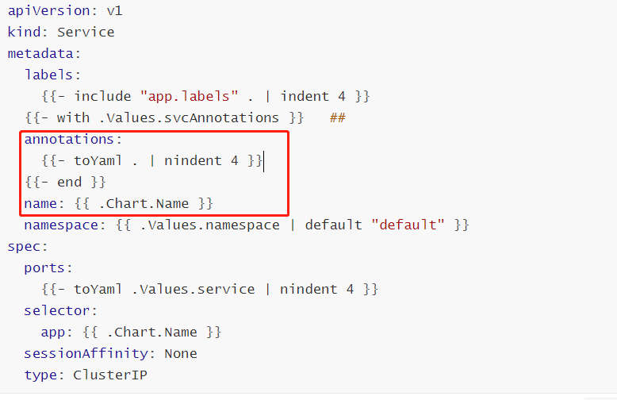
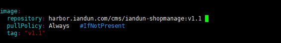
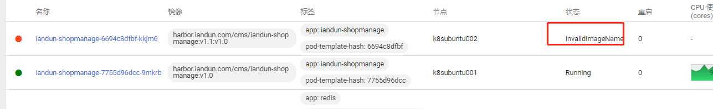
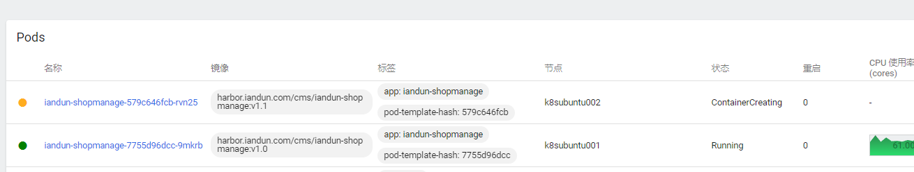

参考文档：

https://www.qikqiak.com/k8s-book/

## 常见操作命令

1、拉取指定版本

```
root@master001:~# helm search repo cilium
NAME           	CHART VERSION	APP VERSION	DESCRIPTION
cilium/cilium  	1.15.6       	1.15.6     	eBPF-based Networking, Security, and Observability
cilium/tetragon	1.1.2        	1.1.2      	Helm chart for Tetragon
root@master001:~# helm pull cilium/cilium --version="1.15.6"
```


## helm2跟helm3一些区别

```shell
版本2删除一个release使用的命令
helm delete release-name --purge
helm  uninstall release-name   [helm3]   --purge#会作为一个默认的行为

版本3删除一个release使用的命令
helm uninstall release-name   

查看chart信息命令变更
helm  inspect  
helm show  [helm3]

拉取charts包命令变更
helm  fetch   
helm pull    [helm3]

必须指定release名称
helm install  自动生成随机名称
helm install --generate-name  必须指定一个名称   [helm3]

```

helm3

```
安装
helm install ./tomcat/ --generate-name 

更新
helm upgrade -f ./tomcat/values.yaml  tomcat-1640575223  ./tomcat/ 


helm  create  chart包名称   #创建chart

hem  get manifest  full-ragdoll  查看渲染效果

helm install --dry-run  --debug  ./mychart/  不会真正的安装
```

博客2地址

https://huangzhongde.cn/istio/Chapter4.html


添加引号:  使用quoto 

```shell
apiVersion: apps/v1
kind: Deployment
metadata:
  name: {{ .Release.Name }}-configmap
  labels:
    {{- include "tomcat.labels" . | nindent 4 }}
    app: {{ quote .Values.apps.server }}    #quote表示添加引号
```


如果在values中没有值，添加默认值

```shell
apiVersion: apps/v1
kind: Deployment
metadata:
  name: {{ .Release.Name }}-configmap
  labels:
    {{- include "tomcat.labels" . | nindent 4 }}
    app: {{ quote .Values.apps.server }}
    app1: {{ .Values.apps.test  | default "Hello_world" | quote }}  #添加默认值为"hello_world"


#验证： 
# Source: nginx/templates/deployment.yaml
apiVersion: apps/v1
kind: Deployment
metadata:
  name: tomcat-1640577827-configmap
  labels:
    helm.sh/chart: nginx-V1.0
    app: "nginx-test"
    app1: "Hello_world"

```


学习模板

https://pkg.go.dev/text/template


流程控制语句if以及删除空格行： 

```shell

apiVersion: apps/v1
kind: Deployment
metadata:
  name: {{ .Release.Name }}-configmap
  labels:
    {{- include "tomcat.labels" . | nindent 4 }}
    app: {{ quote .Values.apps.server }}
    app1: {{ .Values.apps.test  | default "Hello_world" | quote }}
    {{- if eq .Values.apps.python "django" }}   #在if前面加-表示删除空行
    web: truefsd
    {{- end }}    


#不运行，渲染效果
helm upgrade -f ./tomcat/values.yaml  tomcat-1640577827 ./tomcat/   --dry-run
```


with语句

```shell
apiVersion: apps/v1
kind: Deployment
metadata:
  name: {{ .Release.Name }}-configmap
  labels:
    {{- include "tomcat.labels" . | nindent 4 }}

    {{- with .Values.apps }}                 #with语句范围第一行
    app: {{ quote .server }}
    app1: {{ .test  | default "Hello_world" | quote }}
    {{- if eq .python "django" }}
    web: truefsd
    {{- end }}
    {{- end }}                               #with语句控制范围最后一行
```


## 1、release内置对象

对象从模板引擎传递到模板中。 而且你的代码可以传递对象（当我们看到with和range语句时，我们会看到一些例子）。 甚至有几种方法可以在你的模板中创建新的对象，比如我们稍后会看到的tuple函数。

对象可以很简单，只有一个values。 或者他们可以包含其他对象或功能。 例如。 Release对象包含多个对象（如Release.Name），而Files对象有几个功能。

```shell
在上一节中，我们使用{{.Release.Name}}将版本的名称插入到模板中。 Release是您可以在模板中访问的顶级对象之一。
- Release: 这个对象描述了这个release本身。 它里面有几个对象：
  - Release.Name: release的名称
  - Release.Time: 发布的时间
  - Release.Namespace: release的版本(如果声明中未覆盖)
  - Release.Service: Release service的名称（通常为Tiller）。
  - Release.Revision: 此release的修订版号。 它从1开始，每调用一次helm upgrade都会增加
  - Release.IsUpgrade: 如果当前操作是upgrade或rollback，则设置为true。
  - Release.IsInstall: 如果当前操作是install，则设置为true。
- Values: values从values.yaml文件和用户提供的文件传递到模板中。 默认情况下，值为空。
- Chart: Chart.yaml文件的内容。 Chart.yaml中的任何数据都可以在这里访问。 例如{{.Chart.Name}} - {{.Chart.Version}}将打印出mychart-0.1.0
  - [chart指南](https://www.bookstack.cn/read/study-helm/charts-charts.md)中列出了可用字段
- Files: 这提供了对chat中所有非特殊文件的访问。 虽然您无法使用它来访问模板，但您可以使用它来访问chart中的其他文件。
  - Files.Get: 是一个按名称获取文件的函数（.Files.Get config.ini）
  - Files.GetBytes: 是将文件内容作为字节数组而不是字符串获取的函数。 这对像chart这样的东西很有用。
- Capabilities: 这提供了关于Kubernetes集群支持哪些功能的信息。
  - Capabilities.APIVersions: 是一组版本号
  - Capabilities.APIVersions.Has $version: 指示是否在群集上启用版本（batch / v1）
  - Capabilities.KubeVersion: 提供了查找Kubernetes版本的方法。 它具有以下值：Major，Minor，GitVersion，GitCommit，GitTreeState，BuildDate，GoVersion，Compiler和Platform。
  - Capabilities.TillerVersion: 提供了查找Tiller版本的方法。 它具有以下值：SemVer，GitCommit和GitTreeState。
- Template: 包含有关正在执行的当前模板的信息
  - Name: 到当前模板的namespace文件路径（例如mychart/templates/mytemplate.yaml）
  - BasePath: 当前chart模板目录的namespace路径（例如mychart/templates）。

```
这些值可用于任何顶级模板。 我们稍后会看到，这并不一定意味着它们将在任何地方都可用。

内置Values始终以大写字母开头。 这符合Go的命名约定。 当你创建自己的name时，你可以自由地使用适合你的团队的惯例。 一些团队，如[Kubernetes chart](https://github.com/kubernetes/charts)团队，选择仅使用首字母小写来区分本地名称与内置名称。 在本指南中，我们遵循该约定。


## 2、values文件

我们看了Helm模板提供的内置对象。Values是四个内置对象之一。 该对象提供对传入chart的values的访问。 其内容来自四个来源：

- chart中的values.yaml文件
- 如果这是一个子chart，来自父chart的values.yaml文件
- Values文件如果通过-f标志传递给helm install或helm update（helm install -f myvals.yaml ./mychart）
- 个别参数通过—set设置（例如helm install —set foo = bar ./mychart）

上面的列表按照特定的顺序排列：values.yaml是默认值，可以由父chart的values.yaml覆盖，而这些values可以被用户提供的values文件覆盖，而这些值又可以被—set参数覆盖。


默认的values.yaml中的值会被-f 指定的文件所覆盖

1、创建chart包

helm create mychart

创建文件

```shell
root@k8s-master-cms-test:/data/helm-charts/iandun-api# cat ./mychart/templates/configmap.yaml 
apiVersion: v1
kind: ConfigMap
metadata:
  name: mychart-configmap
data: 
  myvalue: "hello,world"

```

测试

```shell
root@k8s-master-cms-test:/data/helm-charts/iandun-api# helm install test --dry-run  ./mychart/
NAME: test
LAST DEPLOYED: Wed Oct 12 10:16:30 2022
NAMESPACE: default
STATUS: pending-install
REVISION: 1
TEST SUITE: None
HOOKS:
MANIFEST:
---
# Source: mychart/templates/configmap.yaml
apiVersion: v1
kind: ConfigMap
metadata:
  name: mychart-configmap
data: 
  myvalue: "hello,world"
```

可以通过helm get manifest  release_name可以查看具体的渲染文件

```shell
root@k8s-master-cms-test:/data/helm-charts/iandun-api# helm get manifest mychart 
---
# Source: mychart/templates/configmap.yaml
apiVersion: v1
kind: ConfigMap
metadata:
  name: mychart-configmap
data: 
  myvalue: "hello,world"

```


注意： 使用helm  delete  release_name 可能不能直接删除

通过 helm ls  --all查看所有的，看删除的是否存在

helm delete    release-name  --purge  彻底删除 

helm3 版本以后没有了此问题

```shell
root@k8s-master-cms-test:/data/helm-charts/iandun-api# helm delete mychart 
release "mychart" uninstalled
root@k8s-master-cms-test:/data/helm-charts/iandun-api# helm list --all
NAME	NAMESPACE	REVISION	UPDATED	STATUS	CHART	APP VERSION
root@k8s-master-cms-test:/data/helm-charts/iandun-api# helm list --all
NAME	NAMESPACE	REVISION	UPDATED	STATUS	CHART	APP VERSION
```


2、configmap名称更换为release-name名称

```shell
root@k8s-master-cms-test:/data/helm-charts/iandun-api# cat mychart/templates/configmap.yaml  
apiVersion: v1
kind: ConfigMap
metadata:
  name: {{ .Release.Name }}-configmap
data: 
  myvalue: "hello,world"
```


验证选然后结果

```yaml
root@k8s-master-cms-test:/data/helm-charts/iandun-api# helm install test-mychart --dry-run  ./mychart/
NAME: test-mychart
LAST DEPLOYED: Wed Oct 12 10:25:41 2022
NAMESPACE: default
STATUS: pending-install
REVISION: 1
TEST SUITE: None
HOOKS:
MANIFEST:
---
# Source: mychart/templates/configmap.yaml
apiVersion: v1
kind: ConfigMap
metadata:
  name: test-mychart-configmap  ##渲染后名称变掉
data: 
  myvalue: "hello,world"
```


3、values值

删除原有的values值

修改如下:

```shell
root@k8s-master-cms-test:/data/helm-charts/iandun-api# cat mychart/values.yaml 
favorite: 
  drink: coffee
  food: pizza
```


修改如下：

```
root@k8s-master-cms-test:/data/helm-charts/iandun-api# cat  mychart/templates/configmap.yaml 
apiVersion: v1
kind: ConfigMap
metadata:
  name: {{ .Release.Name }}-configmap
data: 
  myvale: {{ .Release.Name }}
  drink: {{ .Values.favorite.drink }}
  food: {{ .Values.favorite.food }}
```


验证渲染效果：

```yaml
root@k8s-master-cms-test:/data/helm-charts/iandun-api# helm install test-mychart --dry-run  ./mychart/
NAME: test-mychart
LAST DEPLOYED: Wed Oct 12 11:13:14 2022
NAMESPACE: default
STATUS: pending-install
REVISION: 1
TEST SUITE: None
HOOKS:
MANIFEST:
---
# Source: mychart/templates/configmap.yaml
apiVersion: v1
kind: ConfigMap
metadata:
  name: test-mychart-configmap
data: 
  myvale: test-mychart
  drink: coffee
  food: pizza
```

## 3、helm模板函数与管道


1、双引号： 关键词 quote

```yaml
root@k8s-master-cms-test:/data/helm-charts/iandun-api# cat mychart/templates/configmap.yaml 
apiVersion: v1
kind: ConfigMap
metadata:
  name: {{ .Release.Name }}-configmap
data: 
  myvale: {{ .Release.Name }}
  drink: {{ quote .Values.favorite.drink }}
  food: {{ .Values.favorite.food }}
```


然后进行渲染，添加双引号

```yaml

root@k8s-master-cms-test:/data/helm-charts/iandun-api# helm install test-mychart --dry-run  ./mychart/
NAME: test-mychart
LAST DEPLOYED: Wed Oct 12 11:21:47 2022
NAMESPACE: default
STATUS: pending-install
REVISION: 1
TEST SUITE: None
HOOKS:
MANIFEST:
---
# Source: mychart/templates/configmap.yaml
apiVersion: v1
kind: ConfigMap
metadata:
  name: test-mychart-configmap
data: 
  myvale: test-mychart
  drink: "coffee"
  food: pizza

```

Helm拥有超过60种可用功能。 其中一些是由[Go模板语言](https://godoc.org/text/template)本身定义的。 其他大多数都是[Sprig模板库](https://godoc.org/github.com/Masterminds/sprig)的一部分。 在我们通过例子进行的过程中，我们会看到其中的很多。

方式2，以上方式通过管道的方式实现

```yaml
root@k8s-master-cms-test:/data/helm-charts/iandun-api# cat mychart/templates/configmap.yaml 
apiVersion: v1
kind: ConfigMap
metadata:
  name: {{ .Release.Name }}-configmap
data: 
  myvale: {{ .Release.Name }}
  drink: {{ .Values.favorite.drink | quote }}  ###参考修改 
  food: {{ .Values.favorite.food }}
```


3、转成大写字符  -upper

```yaml
root@k8s-master-cms-test:/data/helm-charts/iandun-api# cat mychart/templates/configmap.yaml 
apiVersion: v1
kind: ConfigMap
metadata:
  name: {{ .Release.Name }}-configmap
data: 
  myvale: {{ .Release.Name }}
  drink: {{ .Values.favorite.drink | quote | upper }}  ###参考修改 
  food: {{ .Values.favorite.food }}
```


4、字符串重复三次-repeat

```
drink: {{ .Values.favorite.drink | repeat 3 | quote }}  ###参考修改 
```

管道都是有顺序的，从前往后


5、使用DEFUALT功能： -defalut

如果values中不存在，可以使用default

```
drink: {{ .Values.favorite.support | default "run" }}  ###参考修改 

```

## 4、helm模板之控制流程


控制结构（模板说法中称为“操作”）为模板作者提供了控制模板生成流程的能力。 Helm的模板语言提供了以下控制结构：

- `if`/`else: 用于创建条件块
- with: 指定范围
- range: 它提供了“for-each”风格的循环

除此之外，它还提供了一些声明和使用命名模板段的操作：

- define: 在模板中声明一个新的命名模板
- template: 导入一个Named模板
- block: 声明了一种特殊的可填写模板区域

在本节中，我们将讨论if，with和range。 其他内容在本指南后面的“Named模板”一节中介绍。

IF/ELSE

我们要看的第一个控制结构是用于在模板中有条件地包含文本块。 这是if/else块。

条件的基本结构如下所示：

```
{{ if PIPELINE }}  
# Do something{{ else if OTHER PIPELINE }}  
# Do something else{{ else }}  # Default case{{ end }}
```

请注意，我们现在讨论的是管道而不是values。 其原因是要明确控制结构可以执行整个管道，而不仅仅是评估一个values。

如果values是以下内容，则管道评估为false:

- 一个为false的布尔值
- 一个为0的数字
- 一个空字符串
- nil(empty或者null)
- 一个空集合(`map`, `slice`, `tuple`, `dict`, `array`)


让我们为ConfigMap添加一个简单的条件。 如果drink被设置为coffee，我们将添加另一个设置：

```yaml
root@k8s-master-cms-test:/data/helm-charts/iandun-api# cat mychart/templates/configmap.yaml
apiVersion: v1
kind: ConfigMap
metadata:
  name: {{ .Release.Name }}-configmap
data: 
  myvale: {{ .Release.Name }}
  drink: {{ quote .Values.favorite.drink }}
  food: {{ .Values.favorite.food }}
  {{ if eq .Values.favorite.drink "coffee" }}mug: true {{ end }}

```

由于我们在最后一个例子中注入了drink：coffee，所以输出不应该包括mug：true; 但是，如果我们将该行添加到我们的values.yaml文件中，则输出应如下所示：

```yaml
root@k8s-master-cms-test:/data/helm-charts/iandun-api# helm install test-mychart --dry-run  ./mychart/
NAME: test-mychart
LAST DEPLOYED: Wed Oct 12 12:01:55 2022
NAMESPACE: default
STATUS: pending-install
REVISION: 1
TEST SUITE: None
HOOKS:
MANIFEST:
---
# Source: mychart/templates/configmap.yaml
apiVersion: v1
kind: ConfigMap
metadata:
  name: test-mychart-configmap
data: 
  myvale: test-mychart
  drink: "coffee"
  food: pizza
  mug: true

```


2、格式优化和调整

上面的方式if写在一行，阅读格式不太好，修改后如下

```yaml
root@k8s-master-cms-test:/data/helm-charts/iandun-api# cat mychart/templates/configmap.yaml
apiVersion: v1
kind: ConfigMap
metadata:
  name: {{ .Release.Name }}-configmap
data: 
  myvale: {{ .Release.Name }}
  drink: {{ quote .Values.favorite.drink }}
  food: {{ .Values.favorite.food }}               //格式调整为三行
  {{ if eq .Values.favorite.drink "coffee" }}
  mug: true 
  {{ end }}
root@k8s-master-cms-test:/data/helm-charts/iandun-api# helm install test-mychart --dry-run  ./mychart/
NAME: test-mychart
LAST DEPLOYED: Wed Oct 12 12:04:45 2022
NAMESPACE: default
STATUS: pending-install
REVISION: 1
TEST SUITE: None
HOOKS:
MANIFEST:
---
# Source: mychart/templates/configmap.yaml
apiVersion: v1
kind: ConfigMap
metadata:
  name: test-mychart-configmap
data: 
  myvale: test-mychart
  drink: "coffee"
  food: pizza
  
  mug: true        ##然后上下有空行

root@k8s-master-cms-test:/data/helm-charts/iandun-api#
```


首先，可以使用特殊字符修改模板声明的大括号语法，以告诉模板引擎填充空白。```{{ - （添加了短划线和空格）表示应该将空白空格左移，而 - }}```表示空格右侧的空格应该被使用。 小心！ 换行符也是空格！

取消空行方式

```

  {{- if eq .Values.favorite.drink "coffee" }}
  mug: true 
  {{- end }}
```

 3、with用法

 这控制着变量的作用域。 .(句号) 是对当前范围的引用。 所以.Values告诉模板在当前范围内找到Values对象。

  通过with指定控制范围

范围是可以改变的,with可以允许你设置当前的范围(.).例如:我们一直在处理.Values.favorites。 让我们重写我们的ConfigMap来改变。 范围指向.Values.favorites：

```yaml
root@k8s-master-cms-test:/data/helm-charts/iandun-api# cat mychart/templates/configmap.yaml
apiVersion: v1
kind: ConfigMap
metadata:
  name: {{ .Release.Name }}-configmap
data: 
  myvale: {{ .Release.Name }}
  {{- with .Values.favorite }}   
  drink: {{ quote .drink }}      ##需要修改
  food: {{ .food }}              ##需要修改
  {{- if eq .drink "coffee" }}   ##需要修改
  mug: true 
  {{- end }}
  {{- end }}
  
  注意： 在witch语句范围之内，调用.Release.Name是无法识别的
  
```

4、Range用法

循环列表的使用方法

许多编程语言都支持使用for循环，foreach循环或类似的功能机制进行循环。 在Helm的模板语言中，遍历集合的方式是使用rang运算符。


首先，让我们在我们的values.yaml文件中添加一份披萨配料列表：

```yaml
root@k8s-master-cms-test:/data/helm-charts/iandun-api# cat mychart/values.yaml
favorite: 
  drink: coffee
  food: pizza
pizzaToppings:
  - mushrooms
  - cheese
  - peppers
  - onions

```


现在开始循环上面的pizzaToppings

现在我们有一个pizzaToppings列表（称为模板中的一个切片(slice)）。 我们可以修改我们的模板，将这个列表打印到我们的ConfigMap中：

```yaml
  pizzatoppings: |-
    {{- range .Values.pizzatoppings }}
    - {{ . | title | quote }}
    {{- end }
```


端口循环案例

```yaml
root@k8s-master-cms-test:/data/helm-charts/iandun-api/mychart# cat templates/configmap.yaml 
apiVersion: v1
kind: ConfigMap
metadata:
  name: {{ .Release.Name }}-configmap
data: 
  myvale: {{ .Release.Name }}
  {{- with .Values.favorite }}
  drink: {{ quote .drink }}
  food: {{ .food }}
  {{- if eq .drink "coffee" }}
  mug: true 
  {{- end }}
  {{- end }}   ###从下面开始, indent表示前面空两个空格
  ports: |- 
  {{- range $key, $val := .Values.ports }}
  {{ $key | indent 2 }}: {{ $val | quote }}
  {{- end }}
```


验证：

```yaml
root@k8s-master-cms-test:/data/helm-charts/iandun-api/mychart# helm install test-mychart --dry-run ./
NAME: test-mychart
LAST DEPLOYED: Wed Oct 12 20:19:59 2022
NAMESPACE: default
STATUS: pending-install
REVISION: 1
TEST SUITE: None
HOOKS:
MANIFEST:
---
# Source: mychart/templates/configmap.yaml
apiVersion: v1
kind: ConfigMap
metadata:
  name: test-mychart-configmap
data: 
  myvale: test-mychart
  drink: "coffee"
  food: pizza
  mug: true    ###主要看下面四行
  ports: |-
    port1: "30001"
    port2: "30002"
    port3: "30003"

```

说明： 如果是通过configmap 创建的资源，helm会对语法进行验证，格式要符合一定的要求，否则会报错


5、变量

indent 2： 表示空两格

nindent 2:  表示换行空两格

default 表示默认值，如果没有定义则会被引用

quote 表示加引号。

-表示缩进换行，不然会有空格：


## 5、helm命名模板

1、template用法

定义全局的文件： _helpers.tpl ， 当然文件名可以自定义，因为是全局的，所以在charts中的文件也可以调用templates中的 _helpers.tpl。

也就是子模板，也是全局的


```yaml
root@k8s-master-cms-test:/data/helm-charts/iandun-api/mychart# cat templates/_helpers.tpl
{{/* 生产报告  */}}
{{- define "mychart.labels" }}
  labels:
    from: helm
    date: {{ now | htmlDate }}
{{- end }}

```

调用模板内容

```yaml
root@k8s-master-cms-test:/data/helm-charts/iandun-api/mychart# cat templates/configmap.yaml
apiVersion: v1
kind: ConfigMap
metadata:
  name: {{ .Release.Name }}-configmap
  {{- template "mychart.labels" }}    #在此处调用模板内容
data: 
  myvale: {{ .Release.Name }}
  {{- with .Values.favorite }}
  drink: {{ quote .drink }}
  food: {{ .food }}
  {{- if eq .drink "coffee" }}
  mug: true 
  {{- end }}
  {{- end }}
  ports: |- 
  {{- range $key, $val := .Values.ports }}
  {{ $key | indent 2 }}: {{ $val | quote }}
  {{- end }}
```


调用模板有关作用域的问题

如下如果获取Chart.Name 或者Chart.Version运行会直接报错

```
root@k8s-master-cms-test:/data/helm-charts/iandun-api/mychart# cat templates/_helpers.tpl 
{{/* 生产报告  */}}
{{- define "mychart.labels" }}
  labels:
    from: helm
    date: {{ now | htmlDate }}
    chart: {{ .Chart.Name }}
    version: {{ .Chart.Version }}
{{- end }}

```


参考以下注释的地方修改即可

```yaml
root@k8s-master-cms-test:/data/helm-charts/iandun-api/mychart# cat templates/configmap.yaml  
apiVersion: v1
kind: ConfigMap
metadata:
  name: {{ .Release.Name }}-configmap
  {{- template "mychart.labels" . }}   ###需要在此处加. 表示从当前路径,否则会报错
data: 
  myvale: {{ .Release.Name }}
  {{- with .Values.favorite }}
  drink: {{ quote .drink }}
  food: {{ .food }}
  {{- if eq .drink "coffee" }}
  mug: true 
  {{- end }}
  {{- end }}
  ports: |- 
  {{- range $key, $val := .Values.ports }}
  {{ $key | indent 2 }}: {{ $val | quote }}
  {{- end }}
```


演示效果，然后才能够自动生成

```yaml
metadata:
  name: test-mychart-configmap
  labels:
    from: helm
    date: 2022-10-12
    chart: mychart
    version: 0.1.0

```

2、include函数

对于上面的方式，使用另一种方式

```yaml
#调整所有内容左对齐
root@k8s-master-cms-test:/data/helm-charts/iandun-api/mychart# cat templates/_helpers.tpl 
{{/* 生产报告  */}}
{{- define "mychart.labels" }}
from: helm
date: {{ now | htmlDate }}
chart: {{ .Chart.Name }}
version: {{ .Chart.Version }}
{{- end }}
```

然后把template换成 include函数，通过indent缩进的方式实现

```yaml
root@k8s-master-cms-test:/data/helm-charts/iandun-api/mychart# cat   templates/configmap.yaml 
apiVersion: v1
kind: ConfigMap
metadata:
  name: {{ .Release.Name }}-configmap
  labels:
{{- include "mychart.labels" . | indent 4 }}    ##此处空42个空格
  ##方式2
  {{- include "mychart.labels" . | nindent 4 }}    ## 为了美观，缩进4个控制也是一样的
data: 
  myvale: {{ .Release.Name }}
  {{- with .Values.favorite }}
  drink: {{ quote .drink }}
  food: {{ .food }}
  {{- if eq .drink "coffee" }}
  mug: true 
  {{- end }}
  {{- end }}
  ports: |- 
  {{- range $key, $val := .Values.ports }}
  {{ $key | indent 2 }}: {{ $val | quote }}
  {{- end }}
  {{- include "mychart.labels" . | indent 2 }}   ##此处缩进2个空格
```

说明： 使用同一个模板，如果想要实现在不同位置的位置调整，可以通过include + indent来实现, 非常灵活。


第一种： 所有资源类型可以共用的配置，可以通过include抽取配置

注意： 类似下面这种，不管是service,还是deployment,还是pvc，都可以统一化，比如添加标签

```yaml
apiVersion: v1
kind: Service
metadata:
  labels:    
    app: iandun-shopmanage
    time: 2022-10-21
  annotations:
    prometheus.io/port: "9090"
    prometheus.io/scrape: "true"
  name: iandun-shopmanage
  namespace: andun

```

 通过templates/_helpers.tpl 定义

```
{{- define "app.labels" }}
app: {{ .Chart.Name }}
time: {{ now | htmlDate }}
{{- end }}
```

然后插入

```yaml
apiVersion: v1
kind: Service
metadata:
  labels:
    {{- include "app.labels" . | indent 4 }}  #此对齐格式后，只需要按照源文件移动需要的空格
  {{- with .Values.podAnnotations }}
  annotations:
    {{- toYaml . | nindent 4 }}
  {{- end }}
  name: {{ .Chart.Name }}
  namespace: {{ .Values.namespace | default "default" }}
spec:
```

方式2： 有些配置不是适用所有的资源，需要单独配置，也可以单独抽取配置

比如： 

```
{{/*
Service health check
*/}}
{{- define "health.check" }}
readinessProbe:
  httpGet:
    path: /actuator/health
    port: http
livenessProbe:
  httpGet:
    path: /actuator/health
    port: 8080
    scheme: HTTP
  initialDelaySeconds: 500  #容器启动后多久开始探测
  timeoutSeconds: 3         #表示容器必须在2s内做出相应反馈给probe，否则视为探测失败
  periodSeconds: 30         #探测周期，每30s探测一次
  successThreshold: 1       #连续探测1次成功表示成功
  failureThreshold: 2       #连续探测3次失败表示失败
{{- end }}
```

deployment操作如下：




## 6、helm模板之其他注意事项

1、NOTES.txt文本的使用

在本节中，我们将看看Helm的工具，向您的chart用户提供说明。 在chart安装或chart升级结束时，Helm可以为用户打印出一大块有用的信息。 这些信息是使用模板高度定制的。

要将安装注释添加到chart，只需创建一个templates / NOTES.txt文件。 这个文件是纯文本的，但是它像一个模板一样处理，并且具有所有可用的普通模板函数和对象。

我们来创建一个简单的NOTES.txt文件：


NOTES文件根据情况修改

```yaml
root@k8s-master-cms-test:/data/helm-charts/iandun-api/mychart# cat   templates/NOTES.txt
Thank you for install {{ .Chart.Name }}

Now version is {{ .Chart.Version }}

Your release name is {{ .Release.Name }}


To learn more about the release , try:
   $ helm  status {{ .Release.Name }}
   $ helm  get {{ .Release.Name }}

```


然后测试

```yaml
root@k8s-master-cms-test:/data/helm-charts/iandun-api/mychart# helm install test-mychart --dry-run --debug ./
....
---
NOTES:
Thank you for install mychart

Now version is 0.1.0

Your release name is test-mychart


To learn more about the release , try:
   $ helm  status test-mychart
   $ helm  get test-mychart

```

## 7、subcharts和全局values


到目前为止，我们只用一个chart工作。 但是chart可以有称为subcharts的依赖关系，它们也有自己的values和模板。 在本节中，我们将创建一个subcharts并查看我们可以从模板中访问值的不同方式。

在我们深入了解代码之前，需要了解一些有关subcharts的重要细节。

1. Subcharts被认为是“独立的”，这意味着subcharts不能明确依赖于其父图。
2. 因此，subcharts无法访问其父项的values。
3. 父charts可以覆盖subcharts的values。
4. helm有全局values的概念，可以被所有charts访问。

当我们在本节中通过示例时，其中许多概念将变得更加清晰

创建subcharts


对于这些练习，我们将从本指南开始时创建的mychart/chart开始，并在其中添加一个新的charts。

```
$ cd mychart/charts
$ helm create mysubchart
Creating mysubchart
$ rm -rf mysubchart/templates/*.*
```


注意，和以前一样，我们删除了所有的基本模板，以便我们可以从头开始。 在本指南中，我们专注于模板如何工作，而不是管理依赖关系。 但chart指南有更多关于subcharts工作的信息。

将value和模板添加到subcharts


接下来，我们为mysubchart图表创建一个简单的模板和values文件。 在mychart/charts/mysubchart中应该已经有了一个values.yaml。 我们将这样设置：

```
dessert: cake
```

接下来，我们将在mychart/charts/mysubchart/templates/configmap.yaml目录中创建一个新的ConfigMap模板:

```
apiVersion: v1
kind: ConfigMap
metadata:
  name: {{ .Release.Name }}-cfgmap2
data:
  dessert: {{ .Values.dessert }}
```


由于每个subcharts都是独立的chart，因此我们可以自行测试mysubchart：

```
$ helm install --dry-run --debug mychart/charts/mysubchart
SERVER: "localhost:44134"
CHART PATH: /Users/mattbutcher/Code/Go/src/k8s.io/helm/_scratch/mychart/charts/mysubchart
NAME:   newbie-elk
TARGET NAMESPACE:   default
CHART:  mysubchart 0.1.0
MANIFEST:
---
# Source: mysubchart/templates/configmap.yaml
apiVersion: v1
kind: ConfigMap
metadata:
  name: newbie-elk-cfgmap2
data:
  dessert: cake
```

从父chart中覆盖value

我们原来的chart mychart现在是mysubchart的父chart[。 这种关系完全基于mysubchart在mychart/charts中的事实。

由于mychart是父级，我们可以在mychart中指定配置，并将该配置推入mysubchart。 例如，我们可以像这样修改mychart/values.yaml：

```
favorite:
  drink: coffee
  food: pizza
pizzaToppings:
  - mushrooms
  - cheese
  - peppers
  - onions
mysubchart:
  dessert: ice cream
```


请注意最后两行。 mysubchart部分内的任何指令都将被发送到mysubchart chart。 因此，如果我们运行helm install —dry-run —debug mychart，我们将看到的其中一个是mysubchart ConfigMap：

```
# Source: mychart/charts/mysubchart/templates/configmap.yaml
apiVersion: v1
kind: ConfigMap
metadata:
  name: unhinged-bee-cfgmap2
data:
  dessert: ice cream
```

顶层的value现在已经覆盖了subchart的价值。

这里有一个重要的细节需要注意。 我们没有将mychart/charts/mysubchart/templates/configmap.yaml的模板更改为指向.Values.mysubchart.dessert。 从该模板的角度来看，该值仍位于.Values.dessert。 随着模板引擎一起传递值，它会设置范围。 因此，对于mysubchart模板，只有专门用于mysubchart的值将在.Values中可用。

但有时候，您确实希望某些值可用于所有模板。 这是使用全局chart value完成的。


全局chart values

全局values是可以从任何chart或subchart以完全相同的名称访问的values。 全局需要明确声明。 您不能像现有全局一样使用非全局。

Values数据类型有一个名为Values.global的保留部分，可以设置全局值。 我们在mychart/values.yaml文件中设置一个。

```
favorite:
  drink: coffee
  food: pizza
pizzaToppings:
  - mushrooms
  - cheese
  - peppers
  - onions
mysubchart:
  dessert: ice cream
global:
  salad: caesar
```

由于全局变量的工作方式，mychart/templates/configmap.yaml和mysubchart/templates/configmap.yaml应该能够以```{{.Values.global.salad}}```的形式访问该值。

`mychart/templates/configmap.yaml`:

```
apiVersion: v1
kind: ConfigMap
metadata:
  name: {{ .Release.Name }}-configmap
data:
  salad: {{ .Values.global.salad }}
```


`mysubchart/templates/configmap.yaml`:

```
 复制代码apiVersion: v1kind: ConfigMapmetadata:  name: {{ .Release.Name }}-cfgmap2data:  dessert: {{ .Values.dessert }}  salad: {{ .Values.global.salad }}
```


现在，如果我们运行dry run install，我们会在两个输出中看到相同的值：

```
# Source: mychart/templates/configmap.yaml
apiVersion: v1
kind: ConfigMap
metadata:
  name: silly-snake-configmap
data:
  salad: caesar
---
# Source: mychart/charts/mysubchart/templates/configmap.yaml
apiVersion: v1
kind: ConfigMap
metadata:
  name: silly-snake-cfgmap2
data:
  dessert: ice cream
  salad: caesar
```

全局变量对于传递这样的信息非常有用，但它确实需要一些计划来确保将正确的模板配置为使用全局变量。

## 8、witch用法

比如给service添加注释，注释比较多，可以使用循环的一种方式

在values中定义如下:

```
svcAnnotations:
  prometheus.io/scrape: "true"   #对于业务需要在此处添加一行 --非常重要
  prometheus.io/port: "9090"
```

然后在service中定义如下方式




## 10、网络查阅-upgrade

CI构建

我在我的构建 CI 中使用下面的命令，以便在每次构建时部署掌舵。但是，我注意到未部署更改。

```yaml
              helm upgrade --install --force \
              --namespace=default \
              --values=kubernetes/values.yaml \
              --set image.tag=latest \
              --set service.name=my-service \
              --set image.pullPolicy=Always \
              myService kubernetes/myservice
```

您不必每次都用新标签标记图像。只需添加

```yaml
date: "{{ now | unixEpoch }}"
```

下`spec/template/metadata/labels`并设置`imagePullPolicy: Always`。Helm 会检测部署对象的变化，并且每次都会拉取最新的镜像：

```yaml
apiVersion: apps/v1
kind: Deployment
metadata:
  name: "{{ .Release.Name }}-{{ .Values.app.frontendName }}-deployment"
  labels:
    app.kubernetes.io/name: {{ .Values.app.frontendName }}
    app.kubernetes.io/instance: {{ .Release.Name }}
spec:
  replicas: {{ .Values.replicaCount }}
  selector:
    matchLabels:
      app.kubernetes.io/name: {{ .Values.app.frontendName }}
      app.kubernetes.io/instance: {{ .Release.Name }}
  template:
    metadata:
      labels:
        app.kubernetes.io/name: {{ .Values.app.frontendName }}
        app.kubernetes.io/instance: {{ .Release.Name }}
        date: "{{ now | unixEpoch }}"
    spec:
      containers:
        - name: {{ .Values.app.frontendName }}
          image: "rajesh12/myimage:latest"
          imagePullPolicy: Always
###来自网络
```

运行`helm upgrade releaseName ./my-chart`以升级您的版本


官网文档： 

```yaml
$ helm upgrade -f myvalues.yaml -f override.yaml redis ./redis
$ helm upgrade --set foo=bar --set foo=newbar redis ./redis
```

## 11、问题记录

镜像无效，不会影响现有已经运行的服务



以上明显存在错误写法，更新后不会更新部署

helm upgrade  iandun-shopmanage ./ --namespace andun





更新正确后，是滚动更新，当前服务正常后，才删除以前旧版本


