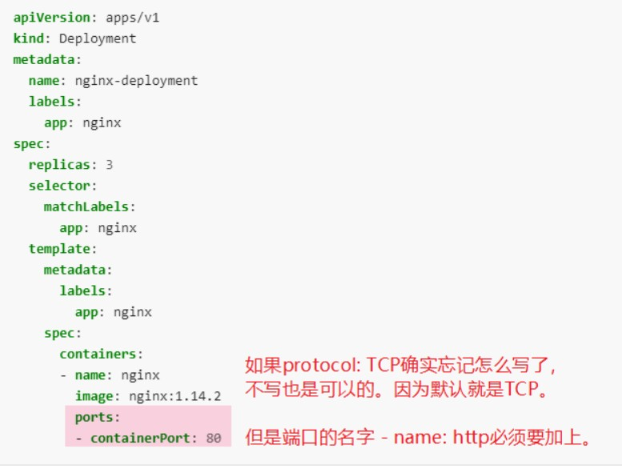
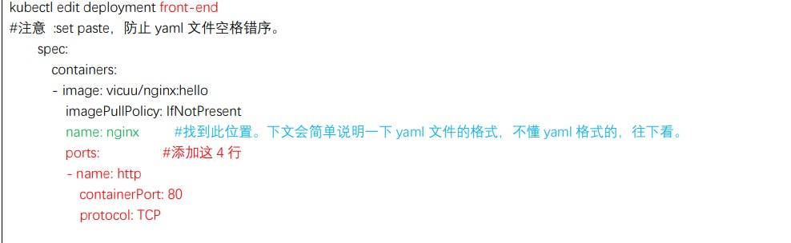
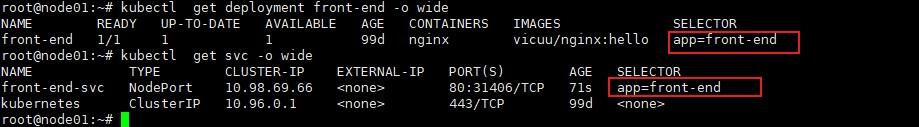
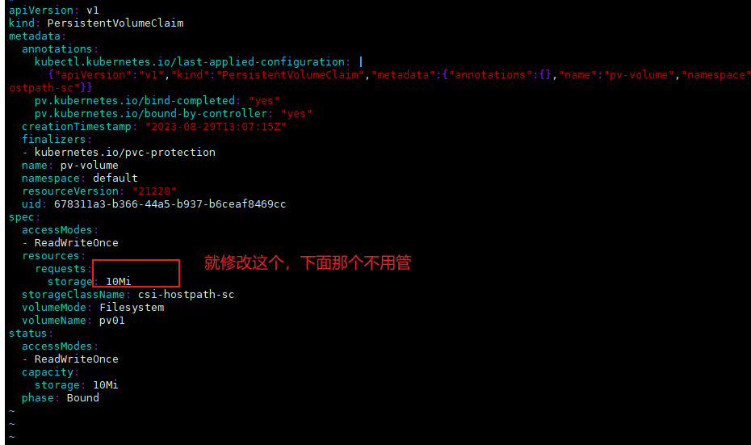
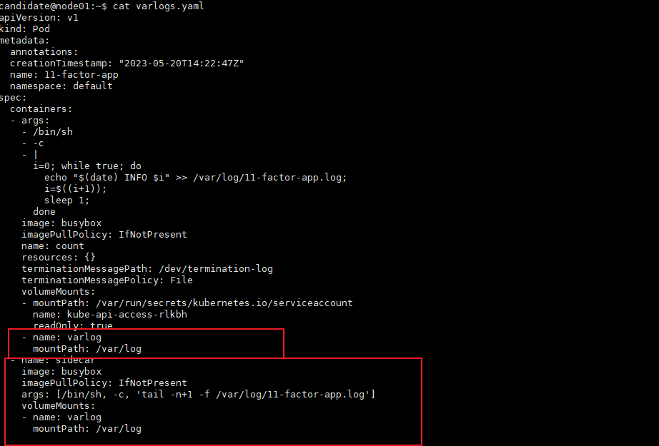
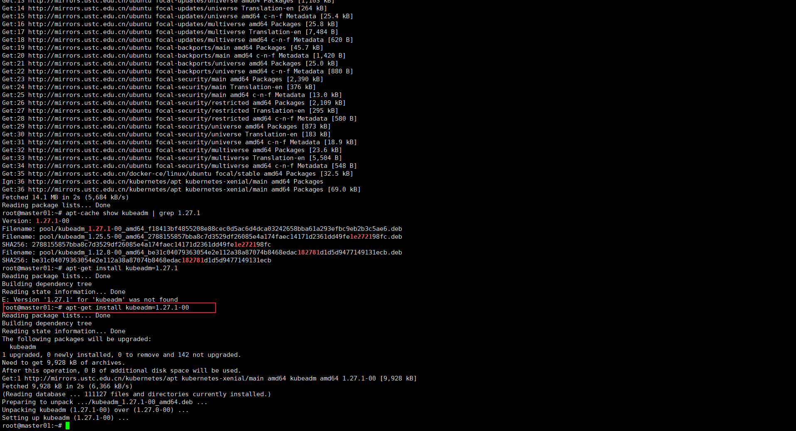
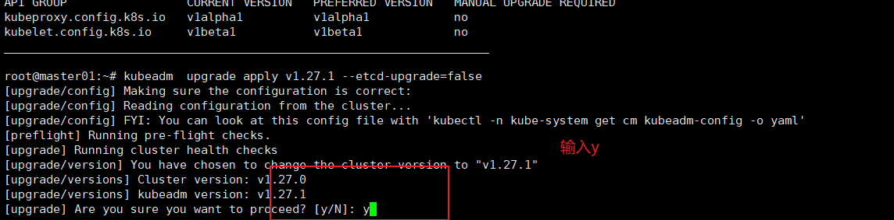

## 1、RBAC权限控制

Context 

为部署流水线创建一个新的 ClusterRole 并将其绑定到范围为特定的 namespace 的特定 ServiceAccount。 

Task 

创建一个名为 deployment-clusterrole 且仅允许创建以下资源类型的新 ClusterRole： 

Deployment 

StatefulSet

DaemonSet 

在现有的 namespace app-team1 中创建一个名为 cicd-token 的新 ServiceAccount。 限于 namespace app-team1 中，将新的 ClusterRole deployment-clusterrole 绑定到新的 ServiceAccount cicd-token。


解答

\# 题目中写了“限于 namespace app-team1 中”，则创建 rolebinding。没有写的话，则创建 clusterrolebinding。

```shell
kubectl  config use-context k8s
kubectl  create clusterrole deployment-clusterrole3  --verb=create  --resource=deployments,statefulsets,daemonsets
kubectl  create serviceaccount  cicd-token  -n app-team1
kubectl  create rolebinding -n app-team1  cicd-token-rolebinding --clusterrole=deploy-clusterrole --serviceaccount=app-team1:cicd-token
```


## 2、查看Pod的CPU


\# kubectl config use-context k8s 

开始操作

\# 查看 pod 名称 -A 是所有 namespace

kubectl top pod -l name=cpu-loader --sort-by=cpu -A

\# 将 cpu 占用最多的 pod 的 name 写入/opt/test1.txt 文件

echo "查出来的 Pod Name" > /opt/KUTR000401/KUTR00401.txt

检查

cat /opt/KUTR000401/KUTR00401.txt

```shell
root@node01:~# kubectl  top pod -l name=cpu-loader --sort-by=cpu -A 
NAMESPACE   NAME                         CPU(cores)   MEMORY(bytes)   
cpu-top     redis-test-5db498bbd-h2mfj   1m           3Mi             
cpu-top     nginx-host-c58757c-q6k74     0m           3Mi             
cpu-top     test0-784f495b5c-2dqdv       0m           5Mi             
root@node01:~# echo 'redis-test-5db498bbd-h2mfj' > /opt/KUTR000401/KUTR00401.txt 
root@node01:~# cat /opt/KUTR000401/KUTR00401.txt
redis-test-5db498bbd-h2mfj
```


## 3、配置网络策略 NetworkPolicy


设置配置环境：
 [candidate@node-1] $ kubectl config use-context hk8s

Task
在现有的 namespace my-app 中创建一个名为 allow-port-from-namespace 的新 NetworkPolicy
确保新的 NetworkPolicy 允许 namespace echo 中的 Pods 连接到 namespace my-app 中的 Pods 的 9000 端口。

进一步确保新的 NetworkPolicy： 
不允许对没有在监听 端口 9000 的 Pods 的访问 
不允许非来自 namespace echo 中的 Pods 的访问


注解：

双重否定就是肯定，所以最后两句话的意思就是： 
仅允许端口为 9000 的 pod 方法。 
仅允许 echo 命名空间中的 pod 访问。

```shell
root@node01:~# kubectl  config use-context k8s
root@node01:~# cat networkpolicy.yaml 
apiVersion: networking.k8s.io/v1
kind: NetworkPolicy
metadata:
  name: allow-port-from-namespace
  namespace: my-app
spec:
  podSelector:
    matchLabels: {}
  policyTypes:
    - Ingress
  ingress:
    - from:
        - namespaceSelector:
            matchLabels:
              project: echo
      ports:
        - protocol: TCP
          port: 9000
          
root@node01:~# kubectl  apply -f networkpolicy.yaml          
```


## 4、暴露服务 service    


Task

请重新配置现有的 deployment front-end 以及添加名为 http 的端口规范来公开现有容器 nginx 的端口 80/tcp。
创建一个名为 front-end-svc 的新 service，以公开容器端口 http
配置此 service，以通过各个 Pod 所在的节点上的 NodePort 来公开他们。

考点：将现有的 deploy 暴露成 nodeport 的 service。


参考链接 

https://kubernetes.io/docs/concepts/workloads/controllers/deployment/





参考下面进行编辑




```shell
root@node01:~# kubectl  expose  deployment front-end --type=NodePort  --port=80  --target-port=80 --name=front-end-svc
```


暴露后进行验证




确保 service 的 selector 标签与 deployment 的 selector 标签一致。如果不一致，可以通过编写yaml文件来实现。

```yaml
ports:
- nodePort: 34001
  port: 80
  protocol: TCP
  targetPort: 80
selector:          //此处是重点
  app: front-end   //此处是重点
```


## 5、创建ingress


Task
如下创建一个新的 nginx Ingress 资源：
名称: ping 
Namespace: ing-internal
使用服务端口 5678 在路径 /hello 上公开服务 hello
可以使用以下命令检查服务 hello 的可用性，该命令应返回 hello：
curl -kL /hello


```yaml
root@node01:~# cat ingress-class.yaml 
apiVersion: networking.k8s.io/v1
kind: IngressClass
metadata:
  labels:
    app.kubernetes.io/component: controller
  name: nginx               #调整
  annotations:
    ingressclass.kubernetes.io/is-default-class: "true"
spec:
  controller: k8s.io/ingress-nginx
  

#参考链接 https://kubernetes.io/docs/concepts/services-networking/ingress/#default-ingress-class
root@node01:~# cat ingress.yaml 
apiVersion: networking.k8s.io/v1
kind: Ingress
metadata:
  name: ping                         #调整
  annotations:
    nginx.ingress.kubernetes.io/rewrite-target: /
  namespace: ing-internal            #调整
spec:
  ingressClassName: nginx            #调整
  rules:
  - http:
      paths:
      - path: /hello                 #调整
        pathType: Prefix
        backend:
          service:
            name: hello               #调整
            port:
              number: 5678            #调整
#参考链接 https://kubernetes.io/docs/concepts/services-networking/ingress/              
              
kubectl  apply -f ingress-class.yaml
kubectl  apply -f ingress.yaml
```


验证

```shell
root@node01:~# kubectl  get ingress -n ing-internal
NAME   CLASS   HOSTS   ADDRESS          PORTS   AGE
ping   nginx   *       10.105.186.107   80      4m7s
root@node01:~# curl  10.105.186.107/hello
```


## 6、扩容deployment副本数量

考题:

Task 
将 deployment presentation 扩展至 4 个 pods

```shell
root@node01:~# kubectl  get deploy  -A  | grep  presentation
default            presentation              1/1     1            1           99d
root@node01:~# kubectl  scale deploy presentation  --replicas=4
deployment.apps/presentation scaled
root@node01:~# kubectl  get deploy -A | grep presentation 
default            presentation              4/4     4            4           99d
```


## 7、调度pod到指定节点


Task 
按如下要求调度一个 pod：

名称：nginx-kusc00401 
Image：nginx
Node selector：disk=ssd

考点：nodeSelect 属性的使用

参考官网文档： 

https://kubernetes.io/docs/tasks/configure-pod-container/assign-pods-nodes/

```shell
root@node01:~# kubectl  run nginx-kusc00401  --image=nginx --dry-run=client -o yaml > pod.yaml

root@node01:~# cat pod.yaml 
apiVersion: v1
kind: Pod
metadata:
  creationTimestamp: null
  labels:
    run: nginx-kusc00401
  name: nginx-kusc00401
spec:
  containers:
  - image: nginx
    name: nginx-kusc00401
    resources: {}
  nodeSelector:   #添加此处
    disk: ssd     #添加此处
  dnsPolicy: ClusterFirst  
  restartPolicy: Always    
status: {}
root@node01:~# 

验证：
root@node01:~# kubectl  get pods -A -o wide | grep  nginx-kusc00401
default            nginx-kusc00401                            1/1     Running   0               42s   10.244.196.163   node01     <none>           <none>
```


## 8、查看可用节点数量


Task 
检查有多少 nodes 已准备就绪（不包括被打上 Taint：NoSchedule 的节点）， 
并将数量写入 /opt/KUSC00402/kusc00402.txt

因为题目要求，不包括被打上 Taint：NoSchedule 的就绪节点，所以要排除 NoSchedule 的


```shell
root@node01:~# kubectl  describe nodes | grep -i Taints
Taints:             node-role.kubernetes.io/control-plane:NoSchedule
Taints:             <none>
Taints:             <none>

root@node01:~# echo "2" > /opt/KUSC00402/kusc00402.txt

```


## 9、创建多容器的 pod


[candidate@node-1] $ kubectl config use-context k8s Task 

按如下要求调度一个 Pod： 

名称：kucc8 app 

containers: 2 

container 名称/images：

 ⚫ nginx 

⚫ consul


考点： 概念

https://kubernetes.io/docs/concepts/workloads/pods/


```yaml
root@node01:~# cat work-pod.yaml 
apiVersion: v1
kind: Pod 
metadata:
  name: kucc8
spec:
  containers:
  - name: nginx
    image: nginx:1.14.2
    imagePullPolicy: IfNotPresent
  - name: consul
    image: consul
    imagePullPolicy: IfNotPresent

root@node01:~# kubectl  get pods  kucc8 
NAME    READY   STATUS    RESTARTS   AGE
kucc8   2/2     Running   0          13s
```


## 10、创建 PV 


设置配置环境： 
[candidate@node-1] $ kubectl config use-context hk8s
 Task 
创建名为 app-config 的 persistent volume，容量为 1Gi，访问模式为 ReadWriteMany。
 volume 类型为 hostPath，位于 /srv/app-config


考点：hostPath 类型的 pv

https://kubernetes.io/docs/tasks/configure-pod-container/configure-persistent-volume-storage/


```shell
root@node01:~# cat pv.yaml  
apiVersion: v1
kind: PersistentVolume
metadata:
  name: app-config
  #labels:
  #  type: local
spec:
  #storageClassName: manual
  capacity:
    storage: 1Gi
  accessModes:
    - ReadWriteMany
  hostPath:
    path: "/srv/app-config"
```


## 11、创建 PVC

 考题

Task 
创建一个新的 PersistentVolumeClaim： 
名称: pv-volume 
Class: csi-hostpath-sc
容量: 10Mi

创建一个新的 Pod，来将 PersistentVolumeClaim 作为 volume 进行挂载：
名称：web-server
Image：nginx:1.16 
挂载路径：/usr/share/nginx/html

配置新的 Pod，以对 volume 具有 ReadWriteOnce 权限

最后，使用 kubectl edit 或 kubectl patch 将 PersistentVolumeClaim 的容量扩展为 70Mi，并记录此更改。

https://kubernetes.io/docs/tasks/configure-pod-container/configure-persistent-volume-storage/#create-a-persistentvolumeclaim


```shell
#创建pvc
candidate@node01:~$ cat pvc.yaml 
apiVersion: v1
kind: PersistentVolumeClaim
metadata:
  name: pv-volume
spec:
  storageClassName: csi-hostpath-sc
  accessModes:
    - ReadWriteOnce
  resources:
    requests:
      storage: 10Mi


candidate@node01:~$ cat pvc-pod.yaml 
apiVersion: v1
kind: Pod
metadata:
  name: web-server
spec:
  volumes:
    - name: task-pv-storage
      persistentVolumeClaim:
        claimName: pv-volume  #使用上面创建的pvc名字
  containers:
    - name: task-pv-container
      image: nginx:1.16
      #ports:
      #  - containerPort: 80
      #    name: "http-server"
      volumeMounts:
        - mountPath: "/usr/share/nginx/html"
          name: task-pv-storage
```

修改为70Mi 

```shell
kubectl  edit pvc pv-volume --record


```


注意，模拟环境是nfs,修改完后会报错。 考试环境没有报错




## 12、查看 pod 日志


Task 
监控 pod foo 的日志并： 
提取与错误 RLIMIT_NOFILE 
相对应的日志行 将这些日志行写入 /opt/KUTR00101/foo


```shell
candidate@node01:~$ kubectl  logs  foo | grep "RLIMIT_NOFILE" > /opt/KUTR00101/foo
```


## 13、使用 sidecar 代理容器日志

实际付款为162113.84 ，发票税率为13%，实际为8%, 计算实际发票金额为多少   

Context 
将一个现有的 Pod 集成到 Kubernetes 的内置日志记录体系结构中（例如 kubectl logs）。 
添加 streaming sidecar 容器是实现此要求的一种好方法。

Task 
使用 busybox Image 来将名为 sidecar 的 sidecar 容器添加到现有的 Pod 11-factor-app 中。 
新的 sidecar 容器必须运行以下命令： 
/bin/sh -c tail -n+1 -f /var/log/11-factor-app.log 使用挂载在/var/log 的 Volume，
使日志文件 11-factor-app.log 可用于 sidecar 容器。 除了添加所需要的 volume mount 以外，请勿更改现有容器的规格。

考题翻译成白话，就是： 添加一个名为 sidecar 的边车容器(使用 busybox 镜像)，加到已有的 pod 11-factor-app 中。 确保 sidecar 容器能够输出 /var/log/11-factor-app.log 的信息。 使用 volume 挂载 /var/log 目录，确保 sidecar 能访问 11-factor-app.log 文件


官方链接： 

https://kubernetes.io/docs/concepts/cluster-administration/logging/


具体操作如下

```shell
#从考试机器导出yaml配置文件
kubectl  get pods  11-factor-app -o yaml  > varlogs.yaml
#然后删除pod
candidate@node01:~$ kubectl  delete pods 11-factor-app

#然后进行编辑

candidate@node01:~$ cat varlogs.yaml 
apiVersion: v1
kind: Pod
metadata:
  annotations:
  creationTimestamp: "2023-05-20T14:22:47Z"
  name: 11-factor-app
  namespace: default
spec:
  containers:
  - args:
    - /bin/sh
    - -c
    - |
      i=0; while true; do
        echo "$(date) INFO $i" >> /var/log/11-factor-app.log;
        i=$((i+1));
        sleep 1;
      done
    image: busybox
    imagePullPolicy: IfNotPresent
    name: count
    resources: {}
    terminationMessagePath: /dev/termination-log
    terminationMessagePolicy: File
    volumeMounts:
    - mountPath: /var/run/secrets/kubernetes.io/serviceaccount
      name: kube-api-access-rlkbh
      readOnly: true
     #添加部分  
    - name: varlog
      mountPath: /var/log
    #添加部分  
  - name: sidecar
    image: busybox
    imagePullPolicy: IfNotPresent
    args: [/bin/sh, -c, 'tail -n+1 -f /var/log/11-factor-app.log'] 
    volumeMounts:
    - name: varlog
      mountPath: /var/log

  dnsPolicy: ClusterFirst
  enableServiceLinks: true
  nodeName: node01
  nodeSelector:
    kubernetes.io/hostname: node01
  preemptionPolicy: PreemptLowerPriority
  priority: 0
  restartPolicy: Always
  schedulerName: default-scheduler
  securityContext: {}
  serviceAccount: default
  serviceAccountName: default
  terminationGracePeriodSeconds: 30
  tolerations:
  - effect: NoExecute
    key: node.kubernetes.io/not-ready
    operator: Exists
    tolerationSeconds: 300
  - effect: NoExecute
    key: node.kubernetes.io/unreachable
    operator: Exists
    tolerationSeconds: 300
  volumes:
  - name: kube-api-access-rlkbh
    projected:
      defaultMode: 420
      sources:
      - serviceAccountToken:
          expirationSeconds: 3607
          path: token
      - configMap:
          items:
          - key: ca.crt
            path: ca.crt
          name: kube-root-ca.crt
      - downwardAPI:
          items:
          - fieldRef:
              apiVersion: v1
              fieldPath: metadata.namespace
            path: namespace
     #添加部分        
  - name: varlog
    emptyDir: {}    

candidate@node01:~$ kubectl apply -f varlogs.yaml

#验证
candidate@node01:~$ kubectl  logs -f --tail=100 11-factor-app -c sidecar
```

清单文件配置参考

修改1




修改2


## 14、升级集群


Task 
现有的 Kubernetes 集群正在运行版本 1.27.0。仅将 master 节点上的所有 Kubernetes 控制平面和节点组件升级到版本 1.27.1。

确保在升级之前 drain master 节点，并在升级后 uncordon master 节点。

可以使用以下命令，通过 ssh 连接到 master 节点： 
ssh master01

可以使用以下命令，在该 master 节点上获取更高权限：

sudo -i
另外，在主节点上升级 kubelet 和 kubectl。

请不要升级工作节点，etcd，container 管理器,CNI 插件， DNS 服务或任何其他插件


（注意，考试敲命令时，注意要升级的版本，根据题目要求输入具体的升级版本！！！）

考点：如何离线主机，并升级控制面板和升级节点


解答 

```shell
# kubectl config use-context mk8s

# cordon 停止调度，将 node 调为 SchedulingDisabled。新 pod 不会被调度到该 node，但在该 node 的旧 pod 不受影响。
# drain 驱逐节点。首先，驱逐该 node 上的 pod，并在其他节点重新创建。接着，将节点调为 SchedulingDisabled。
# 所以 kubectl cordon master01 这条，可写可不写。但我一向做事严谨，能复杂，就绝不简单了事。。。所以就写了

candidate@node01:~$ kubectl  cordon master01 
node/master01 cordoned
candidate@node01:~$ kubectl  get nodes 
NAME       STATUS                     ROLES           AGE    VERSION
master01   Ready,SchedulingDisabled   control-plane   101d   v1.27.0
node01     Ready                      <none>          101d   v1.27.0
node02     Ready                      <none>          101d   v1.27.0


candidate@node01:~$ kubectl  drain  master01 --ignore-daemonsets

candidate@node01:~$ ssh master01
candidate@master01:~$ sudo -i 

root@master01:~# apt-get update
root@master01:~# apt-cache show kubeadm | grep 1.27.1
Version: 1.27.1-00
Filename: pool/kubeadm_1.27.1-00_amd64_f18413bf4855208e88cec0d5ac6d4dca03242658bba61a293efbc9eb2b3c5ae6.deb
Filename: pool/kubeadm_1.25.5-00_amd64_2788155857bba8c7d3529df26085e4a174faec14171d2361dd49fe1e272198fc.deb
SHA256: 2788155857bba8c7d3529df26085e4a174faec14171d2361dd49fe1e272198fc
Filename: pool/kubeadm_1.12.8-00_amd64_be31c04079363054e2e112a38a87074b8468edac182781d1d5d9477149131ecb.deb
SHA256: be31c04079363054e2e112a38a87074b8468edac182781d1d5d9477149131ecb
root@master01:~# apt-get install kubeadm=1.27.1-00

截图是 1.27.0 升级 1.27.1 的
```





```shell
root@master01:~# kubeadm version
kubeadm version: &version.Info{Major:"1", Minor:"27", GitVersion:"v1.27.1", GitCommit:"4c9411232e10168d7b050c49a1b59f6df9d7ea4b", GitTreeState:"clean", BuildDate:"2023-04-14T13:20:04Z", GoVersion:"go1.20.3", Compiler:"gc", Platform:"linux/amd64"}

```


```shell
# 验证升级计划，会显示很多可升级的版本，我们关注题目要求升级到的那个版本。
root@master01:~# kubeadm upgrade plan
```


```shell
# 排除 etcd，升级其他的，提示时，输入 y。大约要等 5 分钟。
kubeadm upgrade apply v1.27.1 --etcd-upgrade=false
```




升级 kubelet

```shell
root@master01:~# apt-get install kubelet=1.27.1-00
root@master01:~# kubelet  --version 
Kubernetes v1.27.1
```

升级 kubectl

```shell
root@master01:~# apt-get  install kubectl=1.27.1-00
root@master01:~# kubectl  version 
WARNING: This version information is deprecated and will be replaced with the output from kubectl version --short.  Use --output=yaml|json to get the full version.
Client Version: version.Info{Major:"1", Minor:"27", GitVersion:"v1.27.1", GitCommit:"4c9411232e10168d7b050c49a1b59f6df9d7ea4b", GitTreeState:"clean", BuildDate:"2023-04-14T13:21:19Z", GoVersion:"go1.20.3", Compiler:"gc", Platform:"linux/amd64"}
Kustomize Version: v5.0.1
Server Version: version.Info{Major:"1", Minor:"27", GitVersion:"v1.27.1", GitCommit:"4c9411232e10168d7b050c49a1b59f6df9d7ea4b", GitTreeState:"clean", BuildDate:"2023-04-14T13:14:42Z", GoVersion:"go1.20.3", Compiler:"gc", Platform:"linux/amd64"}

```


回退考试的初始节点candidate@node01

```shell
root@master01:~# exit 
logout
candidate@master01:~$ exit 
logout
Connection to master01 closed.
candidate@node01:~$
```


恢复master01调度

```shell
candidate@node01:~$ kubectl  uncordon master01 
node/master01 uncordoned
#检查 master01 是否为 Ready
candidate@node01:~$ kubectl  get node 
NAME       STATUS   ROLES           AGE    VERSION
master01   Ready    control-plane   101d   v1.27.1
node01     Ready    <none>          101d   v1.27.0
node02     Ready    <none>          101d   v1.27.0
```


## 15、备份还原 etcd

设置配置环境 
此项目无需更改配置环境。但是，在执行此项目之前，请确保您已返回初始节点。

[candidate@master01] $ exit #注意，这个之前是在 master01 上，所以要 exit 退到 node01，如果已经是 node01 了，就不要再 exit 了。

Task 
首先，为运行在 [链接文本](https://127.0.0.1:2379)  上的现有 etcd 实例创建快照并将快照保存到 /var/lib/backup/etcd-snapshot.db

注意，真实考试中，这里写的是 [链接文本](https://127.0.0.1:2379)

为给定实例创建快照预计能在几秒钟内完成。 如果该操作似乎挂起，则命令可能有问题。用 CTRL + C 来取消操作，然后重试。 
然后还原位于/data/backup/etcd-snapshot-previous.db 的现有先前快照。 
提供了以下 TLS 证书和密钥，以通过 etcdctl 连接到服务器。


CA 证书: /opt/KUIN00601/ca.crt 
客户端证书: /opt/KUIN00601/etcd-client.crt
 客户端密钥: /opt/KUIN00601/etcd-client.key


考点：etcd 的备份和还原命令


```shell
candidate@node01:~$ export ETCDCTL_API=3
candidate@node01:~$ etcdctl  --endpoints=https://11.0.1.111:2379 --cacert="/opt/KUIN00601/ca.crt" --cert="/opt/KUIN00601/etcd-client.crt" --key="/opt/KUIN00601/etcd-client.key"  snapshot save /var/lib/backup/etcd-snapshot.db 
{"level":"info","ts":"2023-08-31T01:32:18.023+0800","caller":"snapshot/v3_snapshot.go:65","msg":"created temporary db file","path":"/var/lib/backup/etcd-snapshot.db.part"}
{"level":"info","ts":"2023-08-31T01:32:18.032+0800","logger":"client","caller":"v3@v3.5.7/maintenance.go:212","msg":"opened snapshot stream; downloading"}
{"level":"info","ts":"2023-08-31T01:32:18.032+0800","caller":"snapshot/v3_snapshot.go:73","msg":"fetching snapshot","endpoint":"https://11.0.1.111:2379"}
{"level":"info","ts":"2023-08-31T01:32:18.183+0800","logger":"client","caller":"v3@v3.5.7/maintenance.go:220","msg":"completed snapshot read; closing"}
{"level":"info","ts":"2023-08-31T01:32:18.192+0800","caller":"snapshot/v3_snapshot.go:88","msg":"fetched snapshot","endpoint":"https://11.0.1.111:2379","size":"9.8 MB","took":"now"}
{"level":"info","ts":"2023-08-31T01:32:18.192+0800","caller":"snapshot/v3_snapshot.go:97","msg":"saved","path":"/var/lib/backup/etcd-snapshot.db"}
Snapshot saved at /var/lib/backup/etcd-snapshot.db
candidate@node01:~$ ls -l /var/lib/backup/etcd-snapshot.db 
-rw-------+ 1 candidate candidate 9846816 Aug 31 01:32 /var/lib/backup/etcd-snapshot.db
```


检查：（考试时，这些检查动作，都可以不做） 
etcdctl snapshot status /var/lib/backup/etcd-snapshot.db -wtable

```shell
candidate@node01:~$ etcdctl  snapshot status  /var/lib/backup/etcd-snapshot.db    -wtable 
Deprecated: Use `etcdutl snapshot status` instead.

+----------+----------+------------+------------+
|   HASH   | REVISION | TOTAL KEYS | TOTAL SIZE |
+----------+----------+------------+------------+
| 43bb1477 |   245642 |       1627 |     9.8 MB |
+----------+----------+------------+------------+
```


还原： 
#考试时，/data/backup/etcd-snapshot-previous.db 的权限应该是只有 root 可读，所以需要使用 sudo 命令。 
#可以 ll /data/backup/etcd-snapshot-previous.db 检查一下读写权限和属主。


\# 不加 sudo 会报错 permission denied， 上面执行了 export ETCDCTL_API=3 了，下面就可以不写 ETCDCTL_API=3d 的，另外还原也是可以不写证书的（--cacert --cert --key）。

```shell
candidate@node01:~$ sudo  ETCDCTL_API=3 etcdctl  --endpoints=https://11.0.1.111:2379  snapshot restore /data/backup/etcd-snapshot-previous.db 
Deprecated: Use `etcdutl snapshot restore` instead.

2023-08-31T01:37:47+08:00	info	snapshot/v3_snapshot.go:248	restoring snapshot	{"path": "/data/backup/etcd-snapshot-previous.db", "wal-dir": "default.etcd/member/wal", "data-dir": "default.etcd", "snap-dir": "default.etcd/member/snap", "stack": "go.etcd.io/etcd/etcdutl/v3/snapshot.(*v3Manager).Restore\n\tgo.etcd.io/etcd/etcdutl/v3@v3.5.7/snapshot/v3_snapshot.go:254\ngo.etcd.io/etcd/etcdutl/v3/etcdutl.SnapshotRestoreCommandFunc\n\tgo.etcd.io/etcd/etcdutl/v3@v3.5.7/etcdutl/snapshot_command.go:147\ngo.etcd.io/etcd/etcdctl/v3/ctlv3/command.snapshotRestoreCommandFunc\n\tgo.etcd.io/etcd/etcdctl/v3/ctlv3/command/snapshot_command.go:129\ngithub.com/spf13/cobra.(*Command).execute\n\tgithub.com/spf13/cobra@v1.1.3/command.go:856\ngithub.com/spf13/cobra.(*Command).ExecuteC\n\tgithub.com/spf13/cobra@v1.1.3/command.go:960\ngithub.com/spf13/cobra.(*Command).Execute\n\tgithub.com/spf13/cobra@v1.1.3/command.go:897\ngo.etcd.io/etcd/etcdctl/v3/ctlv3.Start\n\tgo.etcd.io/etcd/etcdctl/v3/ctlv3/ctl.go:107\ngo.etcd.io/etcd/etcdctl/v3/ctlv3.MustStart\n\tgo.etcd.io/etcd/etcdctl/v3/ctlv3/ctl.go:111\nmain.main\n\tgo.etcd.io/etcd/etcdctl/v3/main.go:59\nruntime.main\n\truntime/proc.go:255"}
2023-08-31T01:37:47+08:00	info	membership/store.go:141	Trimming membership information from the backend...
2023-08-31T01:37:47+08:00	info	membership/cluster.go:421	added member	{"cluster-id": "cdf818194e3a8c32", "local-member-id": "0", "added-peer-id": "8e9e05c52164694d", "added-peer-peer-urls": ["http://localhost:2380"]}
2023-08-31T01:37:47+08:00	info	snapshot/v3_snapshot.go:269	restored snapshot	{"path": "/data/backup/etcd-snapshot-previous.db", "wal-dir": "default.etcd/member/wal", "data-dir": "default.etcd", "snap-dir": "default.etcd/member/snap"}

```


> 考试时，etcd 是在 node01 上运行的，所以考试时，考题里的网址写的是 [链接文本](https://.)。
>
> 但是模拟环境里，虽然也模拟在 node01 上面执行数据恢复，但 etcd 实际是在 master01 节点，所以还原实际没有真正效果的。 但是，考试时，执行上面的命令，是没有问题的。


生产场景下，真正恢复的时候 是必须要先将 etcd data 目录清理掉或者移走，然后再去执行 snapshot restore，这时集群的数据就一定和 snapshot 备份中的数据 统一了。比如方法 3 的操作方法。 感谢网友善先生


## 16、排查集群中故障节点


Task

名为 node02 的 Kubernetes worker node 处于 NotReady 状态。
 调查发生这种情况的原因，并采取相应的措施将 node 恢复为 Ready 状态，确保所做的任何更改永久生效。

可以使用以下命令，通过 ssh 连接到 node02 节点： 
ssh node02 可以使用以下命令，在该节点上获取更高权限： 
sudo -i

```shell
#登录node02节点，然后启动kubelet
systemctl start kubelet 
```


## 17、节点维护

Task

将名为 node02 的 node 设置为不可用，并重新调度该 node 上所有运行的 pods

考点：cordon 和 drain 命令的使用

```shell
candidate@node01:~$ kubectl  cordon node02 
node/node02 cordoned
candidate@node01:~$ kubectl  drain node02   --ignore-daemonsets  --delete-emptydir-data  --force 
```


验证:

正常已经没有 pod 在 node02 上了。但测试环境里的 ingress、calico、kube-proxy 是 daemonsets 模式的，所以显示还在 node02 上，忽略即可。

```shell
candidate@node01:~$ kubectl  get pods -A -o wide | grep node02 
calico-system      calico-node-9wv7w                          1/1     Running            5 (28h ago)    102d   11.0.1.113       node02     <none>           <none>
calico-system      csi-node-driver-rsr2w                      2/2     Running            10 (28h ago)   102d   10.244.140.96    node02     <none>           <none>
ingress-nginx      ingress-nginx-controller-48m8c             1/1     Running            3 (28h ago)    102d   11.0.1.113       node02     <none>           <none>
kube-system        kube-proxy-xtm62                           1/1     Running            0              25h    11.0.1.113       node02     <none>           <none>

```

