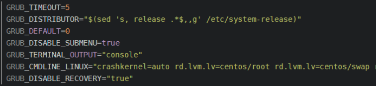

## 编译安装方式

##### 1.下载内核软件包

```
https://mirrors.tuna.tsinghua.edu.cn/kernel/v4.x/
```

##### 2.解包

```
[root@k8s-master1 software]# tar xf linux-4.19.100.tar.xz
```

##### 3.安装依赖

```
[root@k8s-master1 ~]# yum install ncurses-devel bison flex elfutils-libelf-devel groupinstall "Development Tools" -y
```

##### 4.配置

```
[root@k8s-master1 ~]# cd linux-4.19.100
[root@k8s-master1 linux-4.19.100]# make menuconfig
```

##### 5.编译

```
[root@k8s-master1 linux-linux-4.19.100]# make -j 4
```

##### 6.安装模块

```
[root@k8s-master1 linux-4.19.100]# make modules_install
[root@k8s-master1 linux-4.19.100]# make install
```

##### 7.更改默认启动核心

```
将GRUB_DEFAULT=saved 改成 GRUB_DEFAULT=0
[root@k8s-master1 ~]# vim /etc/default/grub 
GRUB_TIMEOUT=5
GRUB_DISTRIBUTOR="$(sed 's, release .*$,,g' /etc/system-release)"
GRUB_DEFAULT=0
GRUB_DISABLE_SUBMENU=true
GRUB_TERMINAL_OUTPUT="console"
GRUB_CMDLINE_LINUX="rd.lvm.lv=rhel/root rd.lvm.lv=rhel/swap rhgb quiet"
GRUB_DISABLE_RECOVERY="true"
```

##### 8.使配置文件生效

```
[root@k8s-master1 ~]# grub2-mkconfig -o /boot/grub2/grub.cfg 
```

##### 9.修改默认启动的内核

```
[root@k8s-master1 ~]# grub2-editenv list  //查看默认启动内核

saved_entry=CentOS Linux (3.10.0-1160.45.1.el7.x86_64) 7 (Core)

[root@k8s-master1 ~]# cat /boot/grub2/grub.cfg | grep menuentry 查看所有内核

'CentOS Linux (4.19.100) 7 (Core)'

'CentOS Linux (3.10.0-1160.59.1.el7.x86_64) 7 (Core)'

[root@k8s-master1 ~]# grub2-set-default 'CentOS Linux (4.19.100) 7 (Core)' //设置默认启动内核
```


## yum安装方式


#### 导入ELRepo仓库的公共密钥


```cobol
rpm --import https://www.elrepo.org/RPM-GPG-KEY-elrepo.org
```

安装ELRepo仓库的yum源

```cobol
rpm -Uvh http://www.elrepo.org/elrepo-release-7.0-3.el7.elrepo.noarch.rpm
```

#### 查询可用内核版本

```cobol
yum --disablerepo="*" --enablerepo="elrepo-kernel" list available
```


#### 安装最新的稳定版本内核

```perl
yum -y --enablerepo=elrepo-kernel install kernel-lt
```


#### 设置 grub2

内核安装好后，需要设置为默认启动选项并重启后才会生效

**查看系统上的所有可用内核：**

```shell
awk -F\' '$1=="menuentry " {print i++ " : " $2}' /etc/grub2.cfg
```

**方法1：通过 grub2-set-default 0 命令设置**


grub2-set-default 0


**方法2：编辑 `/etc/default/grub` 文件**

```shell
vim /etc/default/grub
```


编辑（e）将GRUB_DEFAULT设置为0，如下




修改完成后保存退出（：wq）


#### 生成 grub 配置文件并重启


grub2-mkconfig -o /boot/grub2/grub.cfg

重启虚拟机或物理机 


#### 删除旧内核（**可选**）

查看系统中的全部内核

```perl
rpm -qa | grep kernel
```

可选择删除3.10版本的内核

```csharp
yum remove kernel-*
```